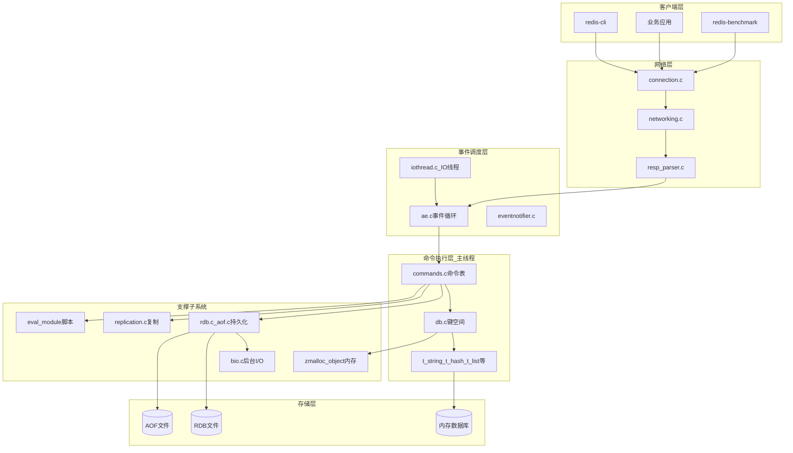
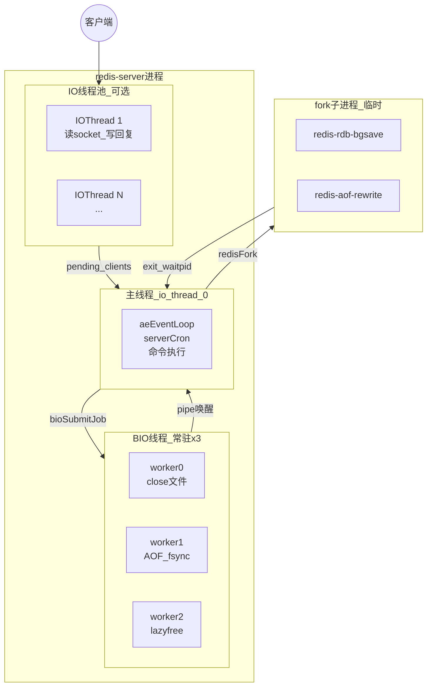
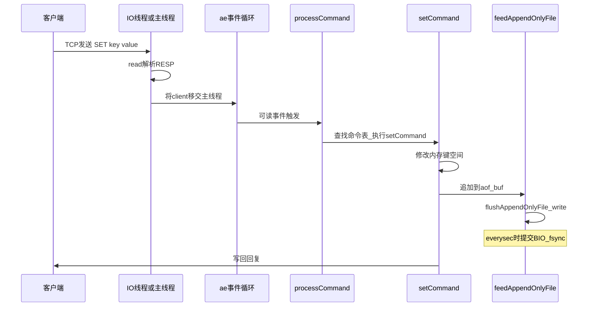
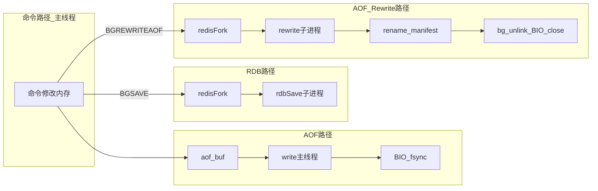
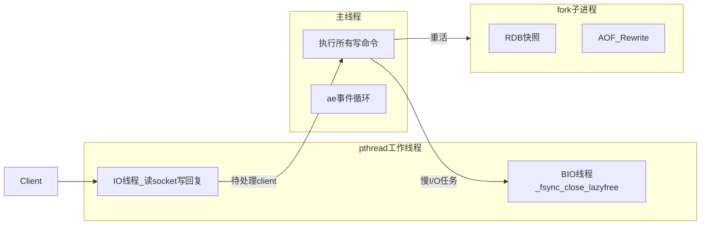
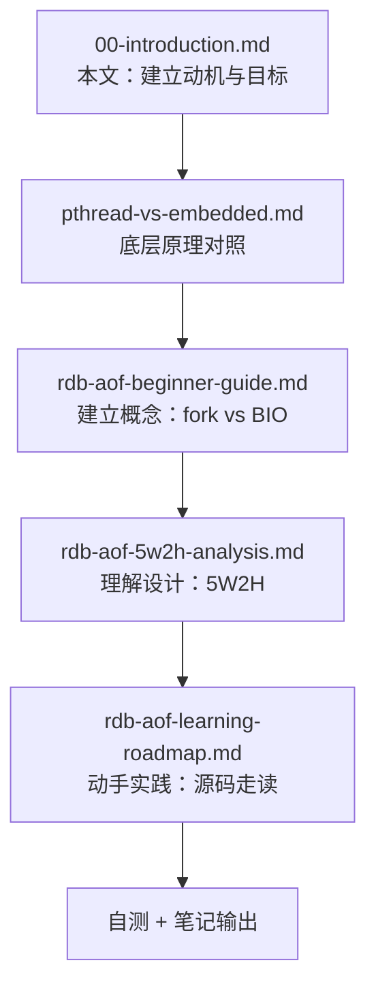

# Redis 学习导论：从「是什么」到「学什么、怎么学」

> 本文档是整个学习笔记的**起点**。先回答「Redis 是什么、用在哪、pthread 解决什么问题、我们为什么要学、学习目标是什么」，再进入后续专题文档。

---

## 一、Redis 是什么？

**Redis**（**RE**mote **DI**ctionary **S**erver）是一个开源的、基于内存的**键值存储系统**（Key-Value Store），通常被归类为 NoSQL 数据库。

可以把它理解为一个运行在服务器上的「超快字典」：

```
客户端:  SET  user:1001  "Alice"
Redis:   把 "Alice" 存到内存里的某个位置，key 是 user:1001

客户端:  GET  user:1001
Redis:   从内存读出 "Alice"，微秒级返回
```

和嵌入式里常见的数据结构不同，Redis 的特点在于：

| 特性 | 说明 |
|------|------|
| **数据在内存** | 读写极快（微秒级），但掉电会丢数据 → 需要持久化 |
| **单线程执行命令** | 核心命令路径无锁，设计简单、延迟可预测 |
| **丰富的数据类型** | 不仅是 string，还有 list、hash、set、zset、stream 等 |
| **网络服务** | 通过 TCP 对外提供 RESP 协议，多客户端并发访问 |
| **可持久化** | RDB 快照 + AOF 日志，重启后可恢复数据 |
| **可扩展** | 主从复制、哨兵、集群 |

**一句话**：Redis 是一个把数据放在内存里、通过网络提供高速读写、并具备持久化与复制能力的服务端程序。

---

## 二、项目框架与目录结构

在读源码之前，先建立对 **Redis 工程布局** 的整体认识。本仓库（Redis 7.4 分支）是典型的 C 语言服务端项目。

### 2.1 顶层目录一览

```
redis/                          # 项目根目录
├── src/                        # ★ 核心服务端源码（主要阅读区域）
├── deps/                       # 第三方依赖（jemalloc、lua、hiredis 等）
├── tests/                      # 集成测试与单元测试（Tcl 脚本）
├── utils/                      # 工具脚本（安装、基准测试辅助等）
├── docs/                       # 本学习笔记目录
├── redis.conf                  # 默认配置文件
├── sentinel.conf               # 哨兵模式配置
├── Makefile                    # 构建入口
├── runtest                     # 测试运行脚本
└── README.md                   # 官方快速入门
```

### 2.2 `src/` 核心模块分组

`src/` 下有约 100+ 个 `.c` 文件，可按职责分为以下模块（新人不必一次全记，先抓主干）：

| 模块分组 | 代表文件 | 职责 |
|----------|----------|------|
| **入口与生命周期** | `server.c`, `server.h` | `main()`、初始化、全局状态 `server`、事件循环驱动 |
| **事件循环** | `ae.c`, `ae_epoll.c`, `ae_kqueue.c` | 非阻塞 I/O 多路复用（Linux 用 epoll） |
| **网络与协议** | `networking.c`, `connection.c`, `resp_parser.c` | 客户端连接、RESP 协议解析与回复 |
| **命令与数据类型** | `commands.c`, `db.c`, `t_string.c`, `t_hash.c`, `t_list.c`, `t_set.c`, `t_zset.c` | 命令表、键空间、各类型实现 |
| **底层数据结构** | `dict.c`, `sds.c`, `quicklist.c`, `rax.c`, `intset.c` | 哈希表、动态字符串、压缩列表等 |
| **持久化** | `rdb.c`, `aof.c`, `bio.c`, `rio.c` | RDB 快照、AOF 日志、BIO 后台 I/O |
| **复制与高可用** | `replication.c`, `sentinel.c`, `cluster.c` | 主从复制、哨兵、集群 |
| **多线程** | `iothread.c`, `bio.c`, `threads_mngr.c`, `eventnotifier.c` | IO 线程、BIO 线程、跨线程唤醒 |
| **内存管理** | `zmalloc.c`, `object.c`, `lazyfree.c`, `evict.c` | 分配器封装、对象系统、惰性释放、淘汰 |
| **脚本与模块** | `eval.c`, `script.c`, `module.c` | Lua 脚本、Redis Module API |
| **客户端工具** | `redis-cli.c`, `redis-benchmark.c` | 命令行客户端、压测工具 |

### 2.3 `deps/` 依赖库

| 依赖 | 用途 |
|------|------|
| **jemalloc** | 默认内存分配器，减少碎片、提供 per-thread cache |
| **lua** | 内置 Lua 5.1，执行 `EVAL` / `EVALSHA` 脚本 |
| **hiredis** | C 客户端库（redis-cli 等使用） |
| **linenoise** | 命令行编辑（redis-cli 交互模式） |

### 2.4 构建产物

```bash
make          # 编译后生成
./src/redis-server    # 服务端主程序
./src/redis-cli       # 命令行客户端
./src/redis-benchmark # 性能压测
./src/redis-check-aof # AOF 文件校验工具
./src/redis-check-rdb # RDB 文件校验工具
```

---

## 三、系统整体架构

以下用 **Mermaid** 图描述 Redis 的逻辑架构（在 GitHub、Cursor、多数 Markdown 预览器中可直接渲染）。若你使用 PlantUML，可参考各图下方的注释说明，在 PlantUML 工具中绘制等价图。

### 3.1 逻辑分层架构



**读图要点**：

- **命令执行**集中在「命令执行层」，由主线程完成
- **网络 I/O** 可由 IO 线程分担，但最终命令仍在主线程执行
- **持久化**横跨命令层与存储层，通过 BIO / fork 异步写盘

### 3.2 运行时进程 / 线程模型



**读图要点**：

- 一个 `redis-server` **进程**内有多条执行路径
- **pthread 线程**（IO + BIO）在进程内常驻或按需启用
- **fork 子进程**与主进程共享地址空间快照，干完即退出

### 3.3 启动流程（`main()` → 对外服务）

```mermaid
sequenceDiagram
    participant Main as main
    participant Config as initServerConfig
    participant Init as initServer
    participant Load as loadDataFromDisk
    participant Last as InitServerLast
    participant Loop as aeMain循环

    Main->>Config: 解析redis.conf命令行参数
    Main->>Init: 创建事件循环_数据库_客户端列表
    Note over Init: server.main_thread_id = pthread_self
    Main->>Load: 加载RDB或AOF到内存
    Main->>Last: bioInit_创建3个BIO线程
    Note over Last: initThreadedIO_创建IO线程
    Main->>Loop: 进入事件循环_开始接受连接
```

对应源码路径（便于你对照阅读）：

| 步骤 | 函数 | 文件 |
|------|------|------|
| 入口 | `main()` | [src/server.c](../src/server.c) |
| 配置 | `initServerConfig()` | [src/server.c](../src/server.c) |
| 核心初始化 | `initServer()` | [src/server.c](../src/server.c) |
| 加载数据 | `loadDataFromDisk()` | [src/rdb.c](../src/rdb.c) / [src/aof.c](../src/aof.c) |
| 线程初始化 | `InitServerLast()` → `bioInit()` | [src/server.c](../src/server.c) / [src/bio.c](../src/bio.c) |
| 事件循环 | `aeMain()` | [src/ae.c](../src/ae.c) |

### 3.4 命令处理主路径（以 SET 为例）



### 3.5 持久化子系统在整体架构中的位置



> **本系列学习笔记聚焦上图中的持久化子系统**（AOF 路径、RDB 路径、Rewrite 路径及 BIO 线程）。

### 3.6 PlantUML 等价说明

若你更习惯 PlantUML，可在本地用以下方式渲染等价架构图：

```plantuml
@startuml redis-layered-arch
package "客户端层" { [redis-cli] [业务应用] }
package "网络层" { [networking.c] [resp_parser.c] }
package "事件层" { [ae.c] [iothread.c] }
package "命令层" { [commands.c] [db.c] }
package "持久化" { [rdb.c] [aof.c] [bio.c] }
database "内存" as mem
database "磁盘" as disk
[业务应用] --> [networking.c]
[networking.c] --> [ae.c]
[ae.c] --> [commands.c]
[commands.c] --> mem
[commands.c] --> [rdb.c]
[rdb.c] --> disk
[aof.c] --> [bio.c]
[bio.c] --> disk
@enduml
```

将上述代码保存为 `.puml` 文件，或直接使用 [diagrams/redis-architecture.md](diagrams/redis-architecture.md) 中的完整 PlantUML 源码，用 [PlantUML](https://plantuml.com/) 或 IDE 插件渲染。正文优先使用 Mermaid，便于在 Markdown 中直接预览。

---

## 四、Redis 用在什么场景？

Redis 不是传统意义上的「主数据库」，更多作为**加速层**或**专用存储**使用。

### 典型应用场景

| 场景 | 用法 | 为什么用 Redis |
|------|------|----------------|
| **缓存** | 把 MySQL/PostgreSQL 的热点数据缓存到 Redis | 内存读写比磁盘快几个数量级 |
| **Session 存储** | Web 应用的用户登录态 | 快速读写、支持过期时间（TTL） |
| **排行榜 / 计数器** | 游戏积分、文章阅读量 | `INCR` 原子递增，O(1) 复杂度 |
| **消息队列** | 简单任务分发 | List / Stream 支持生产者-消费者 |
| **分布式锁** | 多服务争抢资源 | `SET NX EX` 原子操作 |
| **限流** | API 访问频率控制 | 滑动窗口、令牌桶 |
| **实时数据** | 在线用户、实时排名 | 低延迟读写 |
| **主从复制** | 读写分离、高可用 | 内置 replication 机制 |

### 不适合的场景

- 数据量远超内存容量，且无法分片
- 需要复杂 SQL 查询、多表关联
- 强一致事务（Redis 事务模型较简单）

### 和嵌入式的关系

嵌入式工程师日常可能接触 SPI Flash、EEPROM、SQLite 等本地存储。Redis 是**服务器端**的内存数据库，运行环境是 Linux + 网络 + 多客户端。学习它的价值在于：

- 理解**高性能服务端**如何处理并发、I/O、持久化
- 把嵌入式里的「主循环 + 后台任务」经验，映射到 Linux 的「事件循环 + pthread + fork」
- 拓宽技术视野，理解工业级开源项目的工程实践

---

## 五、pthread 在 Redis 里解决什么问题？

### 5.1 先澄清：Redis 不是「全多线程」

很多人以为 Redis 用多线程处理所有命令——**这是错的**。

Redis 的核心设计是：

> **命令执行在单线程（主线程）完成；多线程只用于特定 I/O 和后台任务。**



### 5.2 pthread 解决的三类问题

| 问题 | 不用多线程的后果 | Redis 的 pthread 方案 |
|------|------------------|----------------------|
| **网络 I/O 慢** | 主线程阻塞在 `read()`/`write()`，无法处理其他客户端 | IO 线程（`iothread.c`）分担 socket 读写 |
| **磁盘 I/O 慢** | `fsync()`/`close()` 阻塞主线程，所有命令卡顿 | BIO 线程（`bio.c`）异步 fsync、close |
| **大对象释放慢** | `DEL` 一个大 key 阻塞主线程数毫秒~秒 | BIO lazyfree 线程后台释放内存 |

### 5.3 为什么不用 pthread 做 RDB/AOF Rewrite？

| 任务 | 机制 | 原因 |
|------|------|------|
| RDB 快照 | **fork 子进程** | 需要遍历整个数据库写盘，fork + COW 可拿到内存快照且几乎不用锁 |
| AOF Rewrite | **fork 子进程** | 同上，重写需要遍历全库 |
| AOF fsync | **BIO pthread** | 高频、短周期，常驻 worker 更合适 |
| 删旧 AOF 文件 | **BIO pthread** | `close()` 大文件可能慢 |

**本学习笔记的重点**：RDB/AOF 持久化中的 **BIO pthread**（fsync/close）和 **fork 子进程**（快照/Rewrite）两条后台路径。

### 5.4 和嵌入式 pthread 的对比（建立直觉）

> 详细 VxWorks 对照见 [pthread-vs-embedded.md 第二节](pthread-vs-embedded.md#二vxworks-工程师专题taskspawn--semtake-与-pthread)。

| 维度 | 嵌入式 RTOS Task | Redis pthread |
|------|------------------|---------------|
| 调度目标 | 确定性、可预测延迟 | 吞吐量、公平性 |
| 典型同步 | 关中断、mutex、消息队列 | futex mutex、cond、pipe/eventfd |
| 后台任务 | 低优先级 worker task | BIO worker 线程 |
| 重活 offload | DMA、双缓冲 | fork 子进程 + COW |
| 主上下文原则 | 只有主 task 改全局状态 | 只有主线程执行命令 |

---

## 六、我们为什么要学习 Redis？

### 6.1 对嵌入式工程师的价值

1. **拓宽并发模型视野**  
   从 RTOS 的「任务 + 中断」扩展到 Linux 的「事件循环 + pthread + fork + epoll」

2. **学习工业级工程实践**  
   Redis 源码简洁、注释清晰，是阅读高质量 C 项目的绝佳材料

3. **理解性能与正确性的权衡**  
   单线程命令路径、COW 快照、异步 fsync——每个设计都有明确的 Why

4. **为转型后端/系统开发打基础**  
   缓存、消息队列、分布式锁等概念在 Redis 中有直接对应

### 6.2 本系列笔记聚焦什么？

我们不打算覆盖 Redis 的全部功能，而是聚焦一条主线：

> **Redis 如何把慢的 I/O 和重的持久化工作挪出主线程，同时保证数据正确性和服务可用性。**

具体包括：

- BIO pthread 的创建、任务队列、资源回收
- fork 子进程做 RDB/AOF Rewrite 的完整生命周期
- 主线程如何协调、回收、处理异常

---

## 七、学习的主要目标是什么？

学完本系列笔记，你应达到以下目标：

### 目标 1：建立正确的心智模型

- [ ] 能说出 `src/` 各模块的职责（网络、命令、持久化、多线程）
- [ ] 能画出 Redis 逻辑分层架构图与运行时线程模型图
- [ ] 能画出 Redis 主线程、BIO 线程、fork 子进程三者的关系图
- [ ] 能明确回答：「BGSAVE 创建的是进程还是线程？」
- [ ] 能解释：为什么 fsync 用 BIO 而 RDB 用 fork

### 目标 2：读懂关键源码路径

- [ ] 能跟踪 `bioInit()` → `bioSubmitJob()` → `bioProcessBackgroundJobs()` 的完整流程
- [ ] 能跟踪 `rdbSaveBackground()` → `redisFork()` → `checkChildrenDone()` → handler 的完整流程
- [ ] 能跟踪 `rewriteAppendOnlyFileBackground()` → rename → `bg_unlink()` 的完整流程

### 目标 3：理解资源回收机制

- [ ] 知道 fork 子进程如何用 `waitpid(WNOHANG)` 回收
- [ ] 知道临时文件如何 rename 或 `bg_unlink`
- [ ] 知道 BIO job 执行完后如何释放、如何通知主线程

### 目标 4：能动手验证理解

- [ ] 能用 `redis-cli` 触发 BGSAVE/BGREWRITEAOF 并观察进程/线程
- [ ] 能用 gdb 在关键函数设断点跟踪调用链
- [ ] 能对比 `appendfsync always/everysec/no` 的行为差异

### 目标 5：能用 5W2H 分析设计决策

- [ ] 对 RDB、AOF 日常写入、AOF Rewrite 各能填一张 5W2H 表
- [ ] 能向他人解释「为什么这样设计」而不只是「代码怎么写」

---

## 八、问题 → 解决方案：文档导航

针对上面的学习目标，本仓库 `docs/` 提供以下对应文档：

| 你想解决的问题 | 对应文档 | 内容 |
|----------------|----------|------|
| Redis 持久化后台到底有几种机制？ | [rdb-aof-beginner-guide.md](rdb-aof-beginner-guide.md) | fork vs BIO 双机制、线程创建、资源回收全流程 |
| 为什么要这样设计？谁负责什么？ | [rdb-aof-5w2h-analysis.md](rdb-aof-5w2h-analysis.md) | Why/What/When/Where/Who/Whom/How 完整分析 |
| 怎么一步步读源码、动手验证？ | [rdb-aof-learning-roadmap.md](rdb-aof-learning-roadmap.md) | 6 阶段走读计划、gdb 断点、实验命令 |
| 从初始化读 BIO，带注释导读？ | [bio-source-walkthrough.md](bio-source-walkthrough.md) | 启动链、逐函数注释、调用关系图、自检表 |
| pthread 和嵌入式多线程有何不同？ | [pthread-vs-embedded.md](pthread-vs-embedded.md) | futex、cond、epoll、调度；**第二节 VxWorks taskSpawn/semTake 专题** |

### 推荐学习路径



### 核心结论（贯穿全系列）

> **重活用 fork（RDB / AOF Rewrite），慢 I/O 用 BIO（fsync / close），主线程只负责指挥和回收。**

---

## 九、关键源码速查

| 主题 | 文件 | 入口函数 |
|------|------|----------|
| BIO 线程创建 | [src/bio.c](../src/bio.c) | `bioInit()` |
| BIO 任务提交 | [src/bio.c](../src/bio.c) | `bioCreateFsyncJob()` |
| BIO worker 循环 | [src/bio.c](../src/bio.c) | `bioProcessBackgroundJobs()` |
| 启动时初始化 | [src/server.c](../src/server.c) | `InitServerLast()` |
| fork 封装 | [src/server.c](../src/server.c) | `redisFork()` |
| 子进程回收 | [src/server.c](../src/server.c) | `checkChildrenDone()` |
| RDB 后台保存 | [src/rdb.c](../src/rdb.c) | `rdbSaveBackground()` |
| AOF 写入 | [src/aof.c](../src/aof.c) | `flushAppendOnlyFile()` |
| AOF Rewrite | [src/aof.c](../src/aof.c) | `rewriteAppendOnlyFileBackground()` |
| 后台删文件 | [src/replication.c](../src/replication.c) | `bg_unlink()` |

---

## 十、下一步

阅读 [rdb-aof-beginner-guide.md](rdb-aof-beginner-guide.md)，从「两种后台机制」开始建立具体概念，再进入 5W2H 分析与源码走读。
