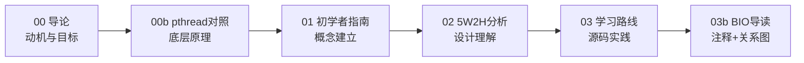

# Redis 持久化学习文档

面向**嵌入式背景、初学 Redis 源码**的读者，从「Redis 是什么、为什么学、pthread 解决什么问题」出发，系统学习 RDB/AOF 后台持久化中的线程创建与资源回收逻辑。

---

## 学习路径（按顺序阅读）

| 顺序 | 文档 | 回答什么问题 |
|------|------|--------------|
| **0** | [00-introduction.md](00-introduction.md) | Redis 是什么？**项目框架**？**系统架构图**？用在哪？学习目标？ |
| **0b** | [pthread-vs-embedded.md](pthread-vs-embedded.md) | pthread 与嵌入式对照；**含 VxWorks `taskSpawn`/`semTake` 专题** |
| **1** | [rdb-aof-beginner-guide.md](rdb-aof-beginner-guide.md) | 持久化后台有哪两种机制？线程/进程如何创建与回收？ |
| **2** | [rdb-aof-5w2h-analysis.md](rdb-aof-5w2h-analysis.md) | 从 Why/What/When/Where/Who/Whom/How 分析设计决策 |
| **3** | [rdb-aof-learning-roadmap.md](rdb-aof-learning-roadmap.md) | 如何分阶段走读源码、动手验证？ |
| **3b** | [bio-source-walkthrough.md](bio-source-walkthrough.md) | **BIO 专题**：初始化链 + 带注释导读 + 调用关系图 |

---

## 架构图资源

- **Mermaid 图**：内嵌于 [00-introduction.md 第三节](00-introduction.md#三系统整体架构)，Markdown 预览器可直接渲染
- **PlantUML 源文件**：[diagrams/redis-architecture.md](diagrams/redis-architecture.md)，含分层架构、线程模型、启动流程、持久化子系统四张图

---

> **重活用 fork（RDB / AOF Rewrite），慢 I/O 用 BIO（fsync / close），主线程只负责指挥和回收。**

- **fork 子进程**：`redisFork()` 按需创建，用于 BGSAVE、BGREWRITEAOF
- **BIO pthread 线程**：`bioInit()` 在启动时创建 3 个常驻 worker，用于 AOF fsync、文件 close、lazyfree

---

## 关键源码入口

| 主题 | 文件 |
|------|------|
| BIO 线程 | [src/bio.c](../src/bio.c) |
| RDB 后台保存 | [src/rdb.c](../src/rdb.c) |
| AOF 写入与 Rewrite | [src/aof.c](../src/aof.c) |
| fork 与子进程回收 | [src/server.c](../src/server.c) |
| 后台删文件 | [src/replication.c](../src/replication.c) |

---

## 学习目标速查

- [ ] 能区分 fork 子进程 vs BIO pthread 各自的职责
- [ ] 能跟踪 BGSAVE / BGREWRITEAOF 从创建到回收的完整路径
- [ ] 能解释 `appendfsync everysec` 时 fsync 在哪个线程执行
- [ ] 能用 gdb / redis-cli 动手验证理解

详细目标见 [00-introduction.md 第五节](00-introduction.md#五学习的主要目标是什么)。
