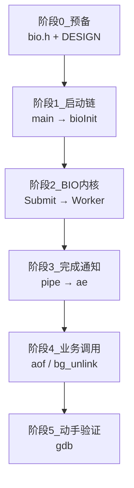
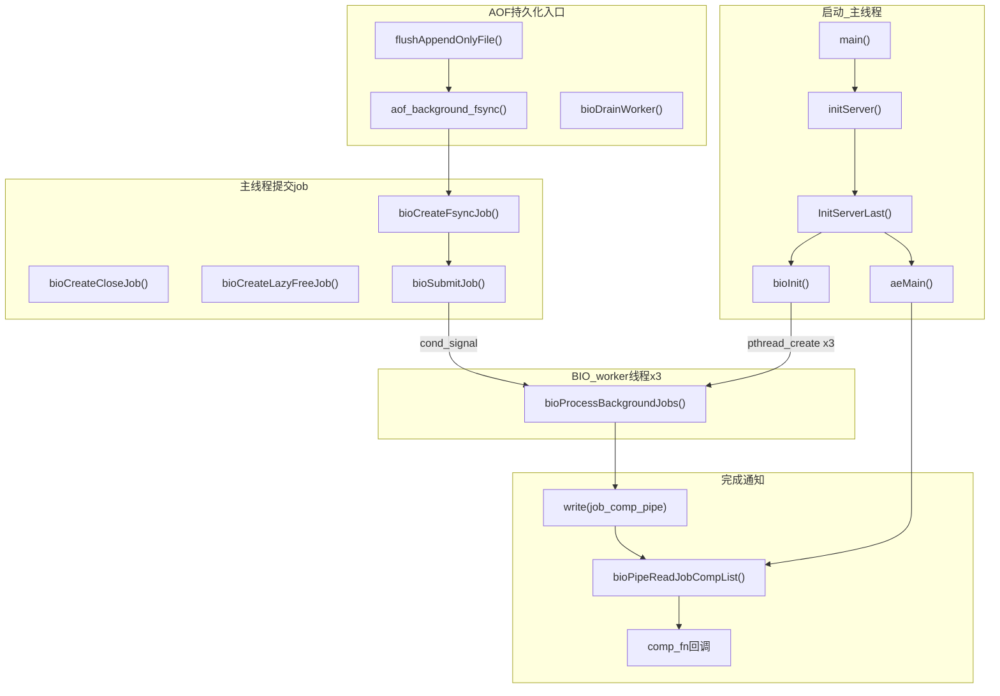
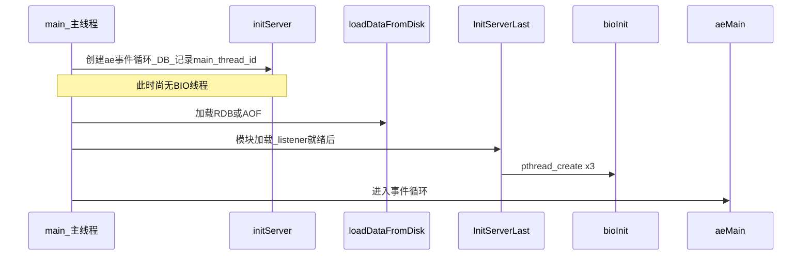
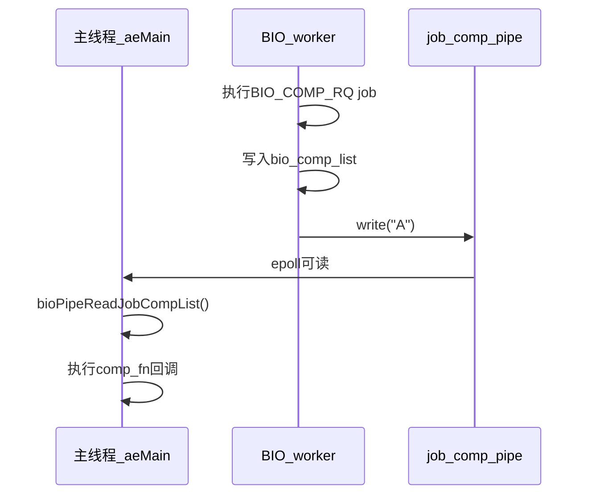
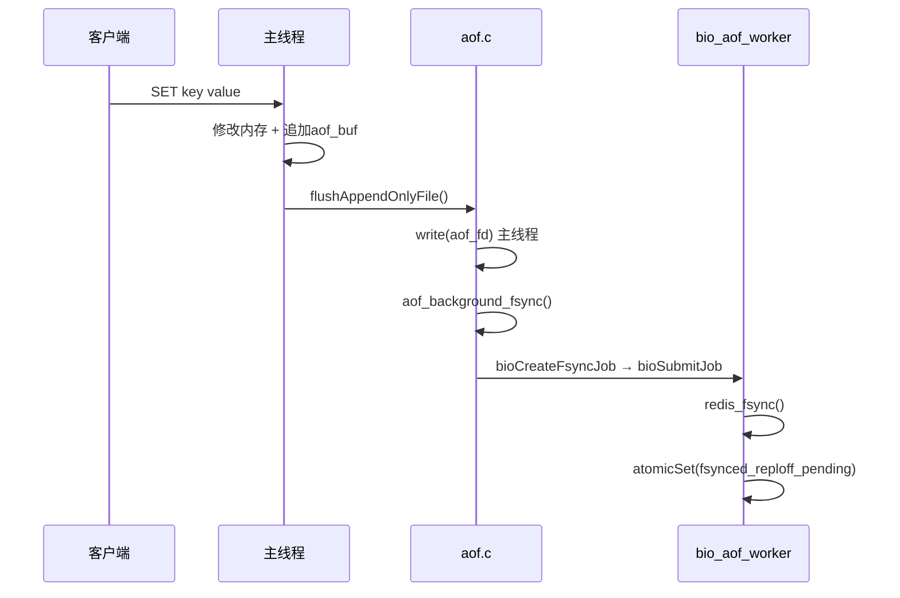

# BIO 源码导读：从 Redis 初始化到后台 I/O 线程

> 本文是 [rdb-aof-learning-roadmap.md](rdb-aof-learning-roadmap.md) **阶段 1** 的详细展开。  
> 建议配合 [pthread-vs-embedded.md](pthread-vs-embedded.md) 第二节阅读（mutex+cond 与 `taskSpawn`/`semTake` 对照）。

---

## 一、导读总览

### 1.1 五阶段阅读路线



### 1.2 全局调用关系图



### 1.3 精简阅读清单（可打印勾选）

```
[ ] bio.h                          — API 与 job 类型
[ ] bio.c:1-36                     — DESIGN 注释
[ ] bio.c:58-114                   — 路由表 + bio_job 结构
[ ] server.c:6909                  — main()
[ ] server.c:2592, 2612, 2658     — initServer：主线程ID、ae 事件循环
[ ] server.c:7181-7198             — InitServerLast 调用时机
[ ] server.c:2881                  — InitServerLast → bioInit
[ ] bio.c:124                      — bioInit（重点）
[ ] bio.c:178                      — bioSubmitJob
[ ] bio.c:244                      — bioCreateFsyncJob
[ ] bio.c:253                      — bioProcessBackgroundJobs（重点）
[ ] bio.c:410                      — bioPipeReadJobCompList
[ ] aof.c:905, 1045                — 业务入口
[ ] replication.c:78               — bg_unlink
```

---

## 二、阶段 0：预备

### 2.1 [bio.h](../src/bio.h) — 对外 API 一览

```c
/* 【导读】BIO 对外只暴露「创建 job」和「管理 worker」接口，不暴露 bio_job 内部结构 */

typedef enum bio_worker_t {
    BIO_WORKER_CLOSE_FILE = 0,   // worker0：后台 close 文件
    BIO_WORKER_AOF_FSYNC,        // worker1：AOF fsync / close AOF
    BIO_WORKER_LAZY_FREE,        // worker2：lazyfree 大对象
    BIO_WORKER_NUM
} bio_worker_t;

typedef enum bio_job_type_t {
    BIO_CLOSE_FILE = 0,
    BIO_AOF_FSYNC,
    BIO_LAZY_FREE,
    BIO_CLOSE_AOF,
    BIO_COMP_RQ_CLOSE_FILE,      // completion 请求：完成后通知主线程
    BIO_COMP_RQ_AOF_FSYNC,
    BIO_COMP_RQ_LAZY_FREE,
    BIO_NUM_OPS
} bio_job_type_t;

void bioInit(void);                              // 启动时创建 3 个线程
void bioCreateFsyncJob(...);                    // 持久化：AOF fsync
void bioCreateCloseJob(...);                     // 持久化：后台 close（bg_unlink）
void bioCreateLazyFreeJob(...);                  // 大 key 删除
void bioDrainWorker(int job_type);               // 阻塞直到某类 job 全部完成
```

**自检**：3 个 worker 与 7 种 job type 的对应关系，在 [bio.c:58–66](../src/bio.c) 的 `bio_job_to_worker[]` 查表。

### 2.2 DESIGN 注释（[bio.c:15–36](../src/bio.c)）要点

| 设计点 | 含义 |
|--------|------|
| 每种 job 类型路由到固定 worker | 同类型 job **FIFO** 串行执行，避免竞态 |
| completion job | 需要主线程回调时，额外提交 `BIO_COMP_RQ_*` |
| 主线程通过 pipe 被唤醒 | 因为主线程阻塞在 `epoll`，不能用 `cond_wait` |

---

## 三、阶段 1：从初始化跟到 bioInit

### 3.1 启动时序



### 3.2 main() 中的关键片段（[server.c](../src/server.c)）

```c
int main(int argc, char **argv) {
    // ... 配置解析 initServerConfig() ...

    initServer();          // 【导读】创建 server.el（ae 事件循环）、DB、客户端列表
                           // 【导读】server.main_thread_id = pthread_self()  ← 标记主线程

    // ... 模块加载、initListeners() ...

    InitServerLast();      // 【导读】★ BIO 线程在这里创建（故意放在最后，避免 TLS/dlopen 竞态）

    loadDataFromDisk();    // 【注意】7.4 分支中 load 在 InitServerLast 之后，BIO 已存在

    // ... 打开监听 ...

    aeSetBeforeSleepProc(beforeSleep);
    aeSetAfterSleepProc(afterSleep);
    aeMain(server.el);     // 【导读】主线程进入 epoll 循环；pipe 可读时调 bioPipeReadJobCompList
}
```

> **阅读提示**：以你本地 `server.c` 中 `InitServerLast()` 与 `loadDataFromDisk()` 的先后顺序为准（不同版本可能略有调整）。核心是：**BIO 在对外服务前创建，且依赖 `server.el` 已存在**。

### 3.3 initServer() 中与 BIO 相关的准备（[server.c:2592](../src/server.c)）

```c
void initServer(void) {
    ThreadsManager_init();           // 【导读】IO 线程信号协调，与 BIO 独立
    server.main_thread_id = pthread_self();  // 【导读】后续可用 pthread_equal 判断是否主线程

    server.el = aeCreateEventLoop(...);      // 【导读】★ bioInit 要把 pipe 注册到这个事件循环上
    // ... 创建 DB、客户端列表等 ...
}
```

### 3.4 InitServerLast()（[server.c:2881](../src/server.c)）

```c
void InitServerLast(void) {
    bioInit();              // 【导读】★ 创建 3 个 BIO pthread
    initThreadedIO();       // 【导读】IO 线程（网络读写），与 BIO 是另一套线程
    set_jemalloc_bg_thread(...);
    server.initial_memory_usage = zmalloc_used_memory();
}
```

**为何单独一个函数？** 注释说明：等模块 `dlopen` 完成后再创建线程，避免 TLS 初始化竞态（[server.c:2876–2880](../src/server.c)）。

---

## 四、阶段 2：bioInit 与 worker 内核（带注释导读）

### 4.1 bioInit() 逐步导读（[bio.c:124](../src/bio.c)）

```c
void bioInit(void) {
    // ━━━ 步骤1：每个 worker 一套「mutex + cond + 队列」━━━
    for (j = 0; j < BIO_WORKER_NUM; j++) {
        pthread_mutex_init(&bio_mutex[j], NULL);
        pthread_cond_init(&bio_newjob_cond[j], NULL);
        bio_jobs[j] = listCreate();
    }
    // 【嵌入式对照】≈ 为每个后台 Task 建一个 msgQ + 互斥锁

    // ━━━ 步骤2：completion 响应队列（主线程回调用）━━━
    bio_comp_list = listCreate();
    pthread_mutex_init(&bio_mutex_comp, NULL);

    // ━━━ 步骤3：pipe — 桥接 BIO 线程与主线程 ae 事件循环 ━━━
    anetPipe(job_comp_pipe, O_CLOEXEC|O_NONBLOCK, O_CLOEXEC|O_NONBLOCK);
    aeCreateFileEvent(server.el, job_comp_pipe[0], AE_READABLE,
                      bioPipeReadJobCompList, NULL);
    // 【导读】主线程 epoll 阻塞时，靠 pipe 可读事件唤醒，不能用 pthread_cond

    // ━━━ 步骤4：栈扩大到 4MB（lazyfree 深调用栈）━━━
    pthread_attr_setstacksize(&attr, stacksize);  // REDIS_THREAD_STACK_SIZE

    // ━━━ 步骤5：创建 3 个 worker 线程 ━━━
    for (j = 0; j < BIO_WORKER_NUM; j++) {
        pthread_create(&thread, &attr, bioProcessBackgroundJobs, (void*)j);
        bio_threads[j] = thread;
    }
}
```

### 4.2 job 路由表（[bio.c:58–66](../src/bio.c)）

```c
static unsigned int bio_job_to_worker[] = {
    [BIO_CLOSE_FILE]         = 0,   // → bio_close_file
    [BIO_AOF_FSYNC]          = 1,   // → bio_aof
    [BIO_CLOSE_AOF]          = 1,   // → bio_aof（与 fsync 同 worker，保证顺序）
    [BIO_LAZY_FREE]          = 2,   // → bio_lazy_free
    [BIO_COMP_RQ_CLOSE_FILE] = 0,
    [BIO_COMP_RQ_AOF_FSYNC]  = 1,
    [BIO_COMP_RQ_LAZY_FREE]  = 2,
};
```

**导读**：AOF 的 fsync 和 close 进**同一个 worker1**，避免同一 fd 上 fsync/close 乱序。

### 4.3 bioSubmitJob() — 生产者（[bio.c:178](../src/bio.c)）

```c
void bioSubmitJob(int type, bio_job *job) {
    job->header.type = type;
    unsigned long worker = bio_job_to_worker[type];

    pthread_mutex_lock(&bio_mutex[worker]);
    listAddNodeTail(bio_jobs[worker], job);   // 入队（FIFO）
    bio_jobs_counter[type]++;
    pthread_cond_signal(&bio_newjob_cond[worker]);  // 唤醒对应 worker
    pthread_mutex_unlock(&bio_mutex[worker]);
}
// 【嵌入式对照】≈ semTake(mtx); msgQSend(queue, job); semGive(mtx); 再唤醒 worker Task
```

**调用者**：仅 `bioCreate*` 系列函数（主线程路径），worker 自己不调用。

### 4.4 bioCreateFsyncJob() — 持久化最常用入口（[bio.c:244](../src/bio.c)）

```c
void bioCreateFsyncJob(int fd, long long offset, int need_reclaim_cache) {
    bio_job *job = zmalloc(sizeof(*job));
    job->fd_args.fd = fd;
    job->fd_args.offset = offset;       // fsync 成功后写入 fsynced_reploff_pending
    job->fd_args.need_reclaim_cache = need_reclaim_cache;
    bioSubmitJob(BIO_AOF_FSYNC, job);
}
```

**上游调用链**：

```
flushAppendOnlyFile()          [aof.c:1045]
  └─ aof_background_fsync()   [aof.c:905]
       └─ bioCreateFsyncJob()  [bio.c:244]
            └─ bioSubmitJob()
                 └─ worker1: bioProcessBackgroundJobs()
```

### 4.5 bioProcessBackgroundJobs() — 消费者（[bio.c:253](../src/bio.c)）

```c
void *bioProcessBackgroundJobs(void *arg) {
    unsigned long worker = (unsigned long) arg;  // 0/1/2

    redis_set_thread_title(bio_worker_title[worker]);  // 线程名：bio_aof 等
    pthread_sigmask(SIG_BLOCK, SIGALRM, ...);        // 只有主线程处理 watchdog

    pthread_mutex_lock(&bio_mutex[worker]);

    while (1) {
        // ─── 等待任务 ───
        if (listLength(bio_jobs[worker]) == 0) {
            pthread_cond_wait(&bio_newjob_cond[worker], &bio_mutex[worker]);
            continue;
        }

        ln = listFirst(bio_jobs[worker]);
        job = ln->value;
        pthread_mutex_unlock(&bio_mutex[worker]);  // 【导读】执行 job 时不持锁！

        // ─── 按类型执行 ───
        if (job_type == BIO_AOF_FSYNC || job_type == BIO_CLOSE_AOF) {
            redis_fsync(job->fd_args.fd);          // 【慢操作】在后台做
            atomicSet(server.fsynced_reploff_pending, job->fd_args.offset);
            atomicSet(server.aof_bio_fsync_status, C_OK);
            if (job_type == BIO_CLOSE_AOF) close(fd);
        } else if (job_type == BIO_CLOSE_FILE) {
            // 可选先 fsync，再 close
            close(job->fd_args.fd);
        } else if (job_type == BIO_LAZY_FREE) {
            job->free_args.free_fn(job->free_args.free_args);
        } else if (job_type == BIO_COMP_RQ_*) {
            // 写入 bio_comp_list，write(pipe) 唤醒主线程
            listAddNodeTail(bio_comp_list, comp_rsp);
            write(job_comp_pipe[1], "A", 1);
        }

        zfree(job);

        // ─── 从队列删除节点，重新加锁 ───
        pthread_mutex_lock(&bio_mutex[worker]);
        listDelNode(bio_jobs[worker], ln);
        bio_jobs_counter[job_type]--;
        pthread_cond_signal(&bio_newjob_cond[worker]);  // 唤醒 bioDrainWorker 等等待者
    }
}
```

**导读要点**：

| 要点 | 说明 |
|------|------|
| 持锁范围 | 只在「等队列 / 删节点」时持锁，**执行 job 时释放锁** |
| `bioDrainWorker` | 等的就是 `bio_jobs_counter` 变 0 + `cond_signal` |
| atomic 更新 | fsync 结果用 atomic 传给主线程，避免数据竞争 |

---

## 五、阶段 3：完成通知（pipe → ae）

### 5.1 为何需要 pipe？

```
主线程阻塞在：epoll_wait()  ← ae 事件循环
BIO 线程完成：需要通知主线程执行 comp_fn 回调

pthread_cond_signal(主线程)  ✗  主线程不在 cond_wait 上
write(pipe) → epoll 可读       ✓  集成进现有事件循环
```

### 5.2 bioPipeReadJobCompList()（[bio.c:412](../src/bio.c)）

```c
void bioPipeReadJobCompList(aeEventLoop *el, int fd, ...) {
    // 读空 pipe（非阻塞）
    while (read(fd, buf, sizeof(buf)) == sizeof(buf));

    // 原子「换走」completion 列表，减少持锁时间
    pthread_mutex_lock(&bio_mutex_comp);
    if (listLength(bio_comp_list)) {
        tmp_list = bio_comp_list;
        bio_comp_list = listCreate();   // 新列表给 worker 继续写
    }
    pthread_mutex_unlock(&bio_mutex_comp);

    // 在主线程执行所有回调
    while (listLength(tmp_list)) {
        rsp->func(rsp->arg);   // 【导读】例如 FLUSHALL 异步完成通知客户端
        zfree(rsp);
    }
}
```



---

## 六、阶段 4：持久化相关业务调用点

### 6.1 AOF everysec fsync 全链路



| 步骤 | 文件:函数 | 说明 |
|------|-----------|------|
| 1 | aof.c:`feedAppendOnlyFile` | 命令追加到 `server.aof_buf` |
| 2 | aof.c:`flushAppendOnlyFile` | `write()` 到 `server.aof_fd` |
| 3 | aof.c:`aof_background_fsync` | 仅 `appendfsync everysec` 走 BIO |
| 4 | bio.c:`bioCreateFsyncJob` | 提交到 worker1 |
| 5 | bio.c worker | `redis_fsync()` + 更新 atomic 状态 |

### 6.2 AOF Rewrite 前的 bioDrainWorker

```c
// aof.c: rewriteAppendOnlyFileBackground()
bioDrainWorker(BIO_AOF_FSYNC);   // 【导读】等 worker1 队列里所有 fsync job 执行完
redisFork(CHILD_TYPE_AOF);        // 然后才 fork，避免 repl offset 竞态
```

**自检**：为何必须排空？见 [aof.c:2457–2463](../src/aof.c) 注释（`fsynced_reploff_pending` 与新旧 AOF 切换）。

### 6.3 bg_unlink → BIO close

```c
// replication.c: bg_unlink()
fd = open(filename, O_RDONLY);
unlink(filename);                  // 【导读】主线程：只删目录项（文件名）
bioCreateCloseJob(fd, 0, 0);       // 【导读】BIO worker0：close(fd) 真正释放 inode
```

---

## 七、阶段 5：动手验证

### 7.1 编译与启动

```bash
make CFLAGS="-g -O0"
./src/redis-server --appendonly yes --appendfsync everysec
```

### 7.2 gdb 推荐断点顺序

```gdb
break bioInit
break bioCreateFsyncJob
break bioSubmitJob
break bioProcessBackgroundJobs
break bioPipeReadJobCompList
run
```

在另一个终端：`redis-cli SET foo bar` 或 `redis-benchmark -t set -n 1000 -q`

### 7.3 每遍阅读的自检问题

| 遍次 | 问题 | 答案要点 |
|------|------|----------|
| 第 1 遍 | BIO 何时创建？ | `InitServerLast()` → `bioInit()`，3 个 pthread |
| 第 2 遍 | job 怎么提交与取出？ | `bioSubmitJob`：lock→入队→signal；worker：`cond_wait`→取队首 |
| 第 3 遍 | fsync 在哪个 worker？ | worker1 `bio_aof` |
| 第 4 遍 | 主线程如何被唤醒？ | `job_comp_pipe` → `ae` 可读 → `bioPipeReadJobCompList` |
| 第 5 遍 | Rewrite 前为何 drain？ | 等旧 AOF 的 fsync 全部完成，防 repl offset 竞态 |

---

## 八、函数关系速查表

| 函数 | 角色 | 直接调用者 | 直接调用 |
|------|------|------------|----------|
| `bioInit` | 初始化 | `InitServerLast` | `pthread_create`×3, `aeCreateFileEvent` |
| `bioSubmitJob` | 入队 | 所有 `bioCreate*` | `pthread_mutex/cond` |
| `bioCreateFsyncJob` | 创建 fsync job | `aof_background_fsync` | `bioSubmitJob` |
| `bioCreateCloseJob` | 创建 close job | `bg_unlink` 等 | `bioSubmitJob` |
| `bioCreateLazyFreeJob` | 创建 free job | `lazyfree.c` | `bioSubmitJob` |
| `bioProcessBackgroundJobs` | worker 循环 | `pthread` 入口 | `redis_fsync`, `close`, `write(pipe)` |
| `bioPipeReadJobCompList` | 主线程回调 | `ae` 事件循环 | `comp_fn` |
| `bioDrainWorker` | 同步等待 | `rewriteAppendOnlyFileBackground` | `cond_wait` |
| `bioPendingJobsOfType` | 查询队列深度 | `aofFsyncInProgress` 等 | — |
| `bioKillThreads` | 强制结束 | `debug.c`（crash） | `pthread_cancel` |

---

## 相关文档

- [rdb-aof-learning-roadmap.md](rdb-aof-learning-roadmap.md) — 阶段 1 概要
- [rdb-aof-beginner-guide.md](rdb-aof-beginner-guide.md) — BIO 与 fork 双机制
- [pthread-vs-embedded.md](pthread-vs-embedded.md) — mutex+cond 对照
