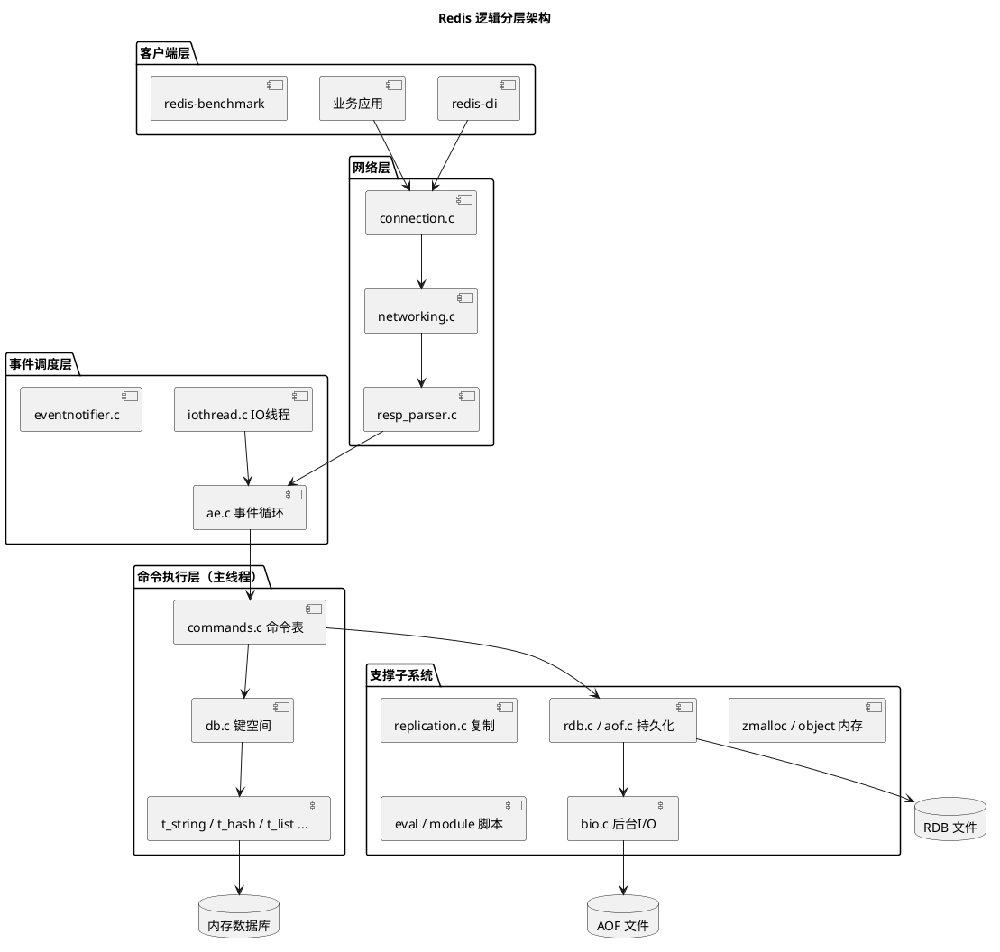
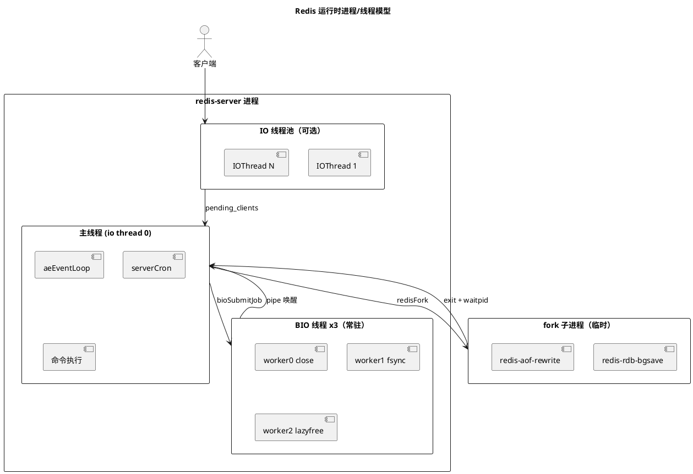
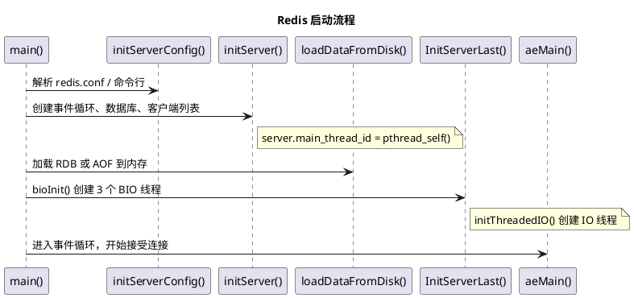
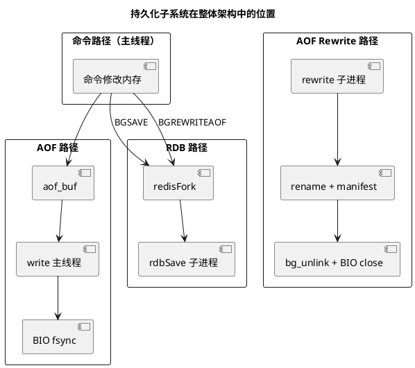

# Redis 架构图（PlantUML 源文件）

与 [00-introduction.md](../00-introduction.md) 第三节中的 Mermaid 图对应。  
将下方代码复制到 [PlantUML 在线编辑器](https://www.plantuml.com/plantuml) 或 IDE PlantUML 插件中渲染。

---

## 1. 逻辑分层架构

---

## 2. 运行时进程/线程模型

---

## 3. 启动流程

---

## 4. 持久化子系统

