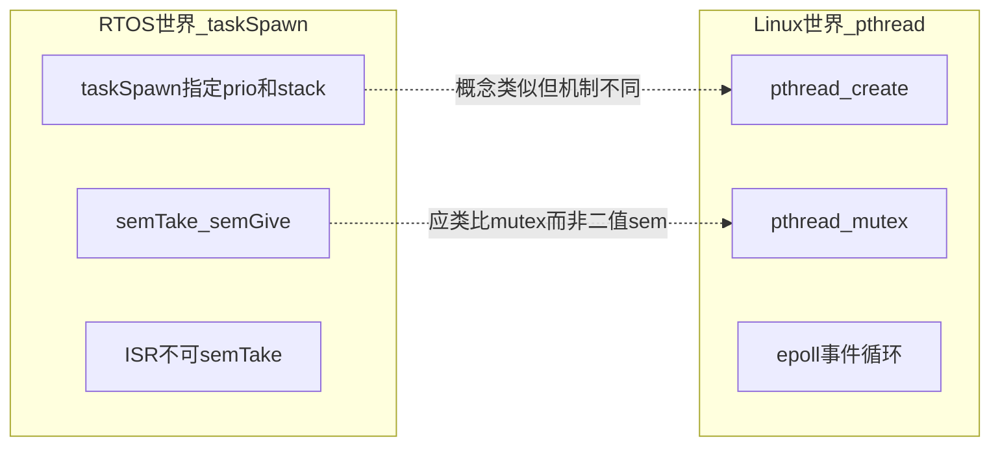
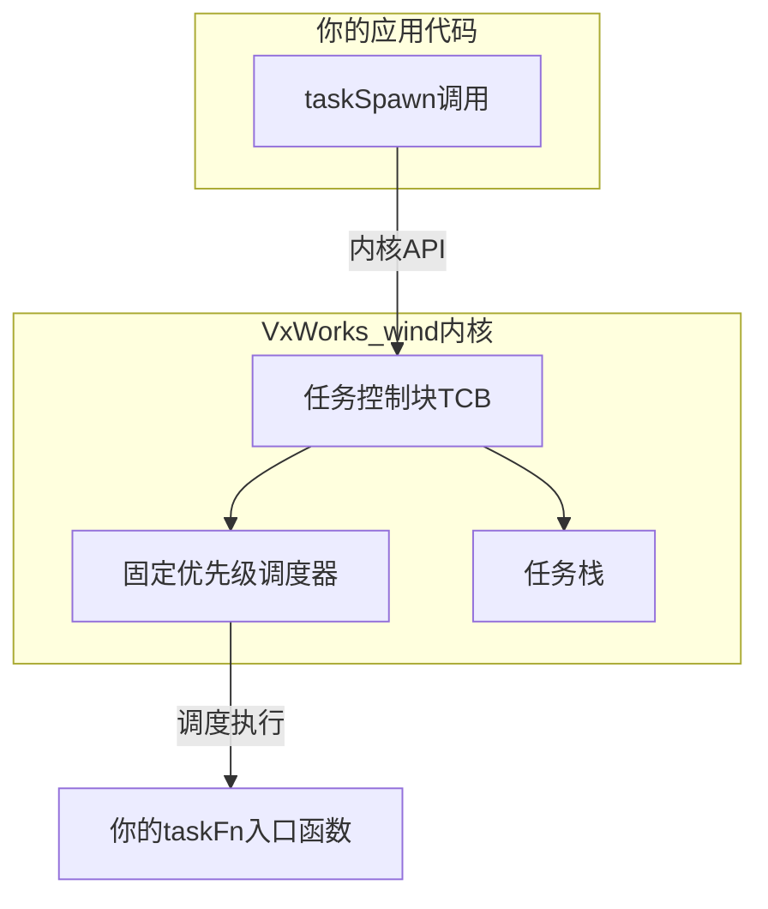
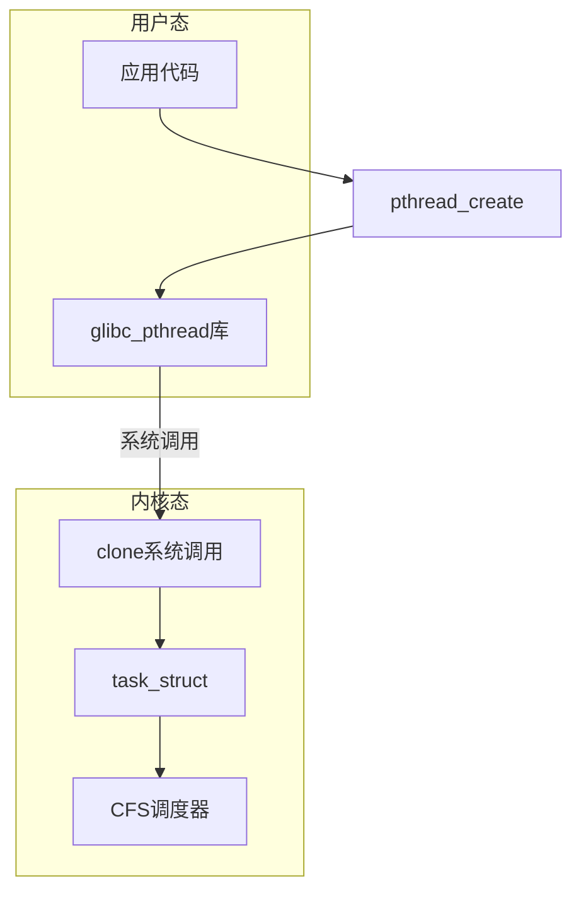

# pthread 与嵌入式多线程：底层原理对照

> 建议先阅读 [00-introduction.md](00-introduction.md)。本文从**实现机制**出发，对比 Linux pthread 和典型 RTOS/裸机多任务，并穿插 Redis 里的实际用法。**第二节**专为 VxWorks `taskSpawn`/`semTake` 背景读者编写，含用户态/内核态辨析与 FAQ。

---

## 一、根本模型差异：谁在调度、调度目标是什么

### 嵌入式（RTOS / 裸机）

```
┌─────────────────────────────────────────┐
│  硬件中断 (ISR)  — 最高优先级，不可阻塞   │
├─────────────────────────────────────────┤
│  Task 0 (prio 5)  ← 抢占式或协作式       │
│  Task 1 (prio 3)                         │
│  Task 2 (prio 1)  ← Idle                 │
├─────────────────────────────────────────┤
│  调度器：固定优先级 / 时间片 / 协作 yield  │
│  目标：可预测性、确定性延迟 (WCET)        │
└─────────────────────────────────────────┘
```

- 任务由**你或 RTOS 内核**调度，优先级通常**显式配置**
- ISR 与 Task 是**两套执行上下文**，规则不同（ISR 不能 malloc、不能阻塞）
- 单核上，「互斥」有时就是**关中断**或**调度器锁**

### Linux pthread

```
┌─────────────────────────────────────────┐
│  硬件中断 → 内核 top/bottom half         │
├─────────────────────────────────────────┤
│  内核线程 (kthread)                        │
│  用户线程 1, 2, 3 ... (pthread)          │
│  全部映射到 1~N 个 CPU 核心               │
├─────────────────────────────────────────┤
│  调度器：CFS（完全公平调度）等             │
│  目标：吞吐量、公平性，非硬实时            │
└─────────────────────────────────────────┘
```

- `pthread` 是**用户态线程 API**，底层由内核调度（Linux 上通常 1:1 模型：1 个 pthread ≈ 1 个内核 task）
- **没有 ISR 概念**——用户代码不能直接写中断服务程序；异步 I/O 由内核 + fd 事件机制完成
- 调度目标是**公平与吞吐**，不保证「这个线程在 X μs 内一定运行」

**Redis 体现**：主线程、IO 线程、BIO 线程都是普通 pthread，**不设 RT 优先级**（除非用 `setcpuaffinity` 绑核），延迟由 OS 调度决定。

---

## 二、VxWorks 工程师专题：taskSpawn / semTake 与 pthread

> 本节面向实际工程中使用 **`taskSpawn` + `semTake/semGive`** 的嵌入式开发者（典型于 VxWorks 及类似 RTOS），说明与 pthread 的差异、为何不能照搬、以及在 Redis 源码中如何「翻译」。

### 2.1 你现在的模型 vs pthread 模型

#### 嵌入式 RTOS 典型写法

```c
/* 创建任务 */
taskId = taskSpawn("myTask", priority, VX_FP_TASK, stackSize,
                   (FUNCPTR)taskFn, arg1, arg2, 0, 0, 0, 0, 0, 0, 0);

/* 互斥（二值信号量） */
semTake(mySem, WAIT_FOREVER);
/* 临界区 */
semGive(mySem);
```

| 概念 | 你的实现 | 本质 |
|------|----------|------|
| 执行单元 | `taskSpawn` 创建的 **Task** | 内核调度任务，固定优先级、固定栈 |
| 互斥 | `semTake` / `semGive` | 信号量（二值或计数） |
| 调度 | 固定优先级抢占 | 高优先级 Task 可立刻打断低优先级 |
| 运行环境 | 裸机 / RTOS，通常**无 Linux** | 直接管理硬件 |

#### Linux pthread 写法

```c
pthread_create(&tid, &attr, thread_fn, arg);

pthread_mutex_lock(&mtx);
/* 临界区 */
pthread_mutex_unlock(&mtx);
```

| 概念 | pthread 实现 | 本质 |
|------|--------------|------|
| 执行单元 | `pthread_create` 创建的 **线程** | 跑在 Linux 内核之上，由 CFS 等调度 |
| 互斥 | `pthread_mutex_lock/unlock` | 带**所有权**的互斥锁（底层常为 futex） |
| 调度 | 公平调度，**非硬实时** | 不保证「X μs 内一定运行」 |
| 运行环境 | **必须有 OS（通常 Linux）** | POSIX 用户态 API |



### 2.2 核心差异对照表

| 维度 | `taskSpawn` + `semTake/Give` | `pthread` + `pthread_mutex` |
|------|------------------------------|-----------------------------|
| **所属世界** | RTOS 内核 API（VxWorks 等） | Linux POSIX 用户态 API |
| **优先级** | 创建时显式指定（如 50、100） | 默认不设 RT 优先级，CFS 公平竞争 |
| **栈** | 创建时指定（如 8KB、64KB） | 默认常 MB 级（虚拟内存按需映射） |
| **创建开销** | 小，可估算 | 较大，涉及 `clone()`、TLS 等 |
| **互斥语义** | 二值信号量**无严格所有权** | mutex **必须由加锁线程解锁** |
| **优先级反转** | mutex 型 sem 常有继承/天花板 | 标准 Linux 默认 mutex **无**继承 |
| **阻塞方式** | `semTake` 挂起当前 Task | 竞争失败 → futex 睡眠 |
| **与中断关系** | ISR 里**不能** `semTake`（会阻塞） | 用户态无 ISR；中断由内核处理 |
| **实时性** | 可硬实时（配合 RTOS） | 标准 Linux 为软实时 |

### 2.3 semTake/semGive 和 pthread_mutex 差在哪？

#### 信号量 ≠ 互斥锁（常见误区）

用**二值信号量**当锁在 RTOS 里很常见，但与 mutex 有关键区别：

| | 二值信号量 (`semTake/Give`) | 互斥锁 (`pthread_mutex` / `semMCreate`) |
|---|---------------------------|----------------------------------------|
| **所有权** | 谁 `Give` 都行，不必是 `Take` 的 Task | 必须**谁 lock 谁 unlock** |
| **误用风险** | A 加锁、B 解锁 → 逻辑混乱 | 其他线程 unlock 会报错或未定义行为 |
| **递归重入** | 一般不支持同 Task 重入 | 可配置 `PTHREAD_MUTEX_RECURSIVE` |
| **优先级反转** | 普通二值 sem **不**解决 | RTOS mutex sem 常有优先级继承 |

**工程含义**：

- `semTake/Give` 更像「**通行证**」——谁都可以归还
- `pthread_mutex` 更像「**带主人标签的锁**」——只有持有者能释放

#### Redis 用的是 mutex + cond，不是信号量

[src/bio.c](../src/bio.c) 中 BIO 线程模型：

```c
pthread_mutex_lock(&bio_mutex[j]);
listAddNodeTail(bio_jobs[j], job);
pthread_cond_signal(&bio_newjob_cond[j]);
pthread_mutex_unlock(&bio_mutex[j]);
```

| 你的习惯 | Redis / pthread | 说明 |
|----------|-----------------|------|
| `semTake/Give` 保护队列 | `pthread_mutex` | 应类比 **mutex semaphore**（`semMCreate`），不是二值 sem |
| `msgQSend/Receive` 阻塞收消息 | `pthread_cond_wait` + 自建队列 | cond 绑定 mutex，需防虚假唤醒（`while` 循环） |
| 后台 Task 循环等活 | `bioProcessBackgroundJobs` | `cond_wait` → 取 job → 执行 → 循环 |

### 2.4 taskSpawn 和 pthread_create 差在哪？

#### 创建时你在指定什么

```c
// VxWorks：每个参数都很「嵌入式」
taskSpawn(name, priority, VX_FP_TASK, stackSize, entry, arg1, ...);

// pthread：很多用默认即可
pthread_create(&tid, NULL, entry, arg);
```

| 创建时指定 | 为什么 RTOS 要指定 | pthread 为何不强调 |
|------------|-------------------|-------------------|
| **priority** | 硬实时，数字决定抢占顺序 | Linux 追求吞吐，不靠应用设 RT 优先级 |
| **stackSize** | RAM 有限，必须事先估算 | 虚拟内存 + _guard page，默认很大 |
| **options** | 浮点、分离栈等硬件相关 | 由 ABI / glibc 处理 |

#### 调度行为差异（最关键）

```
RTOS (taskSpawn):
  高优先级 Task 就绪 → 立刻抢占低优先级 Task

Linux (pthread):
  线程按 CFS vruntime 轮换 → 延迟不可严格保证
```

Redis **不设 RT 优先级**的原因：它是吞吐型服务，靠架构（主线程不阻塞、BIO offload）控制延迟，而非把 fsync 线程设为最高优先级。

**Redis BIO 显式设置栈大小**（嵌入式工程师会感同身受）：

```c
#define REDIS_THREAD_STACK_SIZE (1024*1024*4)
pthread_attr_setstacksize(&attr, stacksize);
pthread_create(&thread, &attr, bioProcessBackgroundJobs, (void*) j);
```

#### 2.4.1 taskSpawn 能在「用户代码」里用吗？创建的是内核线程吗？

这是 VxWorks 背景读者最常见的追问之一。

**Q：应用代码（用户写的 `.c`）里可以正常调用 `taskSpawn` 吗？**

| 环境 | 能否使用 `taskSpawn` |
|------|---------------------|
| **VxWorks 应用代码** | **可以**，这就是标准多任务创建方式 |
| **VxWorks 6+ RTP（用户态进程）** | RTP 内可用，但与内核驱动任务有内存隔离 |
| **嵌入式 Linux / 普通 Linux** | **不能**，无此 API，须用 `pthread_create` |

注意：VxWorks 里的「用户代码」≠ Linux 里的「用户态」，后文说明。

**Q：创建出来的是不是「内核态线程」？**

部分正确，但不宜与 Linux 的「用户线程 / 内核线程」一一对应。更准确的说法是：

> `taskSpawn` 通过**内核 API** 创建一个由 **wind 内核调度器管理的 Task**；  
> 你的 `taskFn` 是普通 C 函数，但 TCB、栈、优先级等执行上下文由内核建立和维护。

**VxWorks 模型（简化）**：



**Linux pthread 模型（对比）**：



**关键差异**：

| 维度 | VxWorks `taskSpawn` | Linux `pthread_create` |
|------|---------------------|------------------------|
| API 层次 | 内核/系统库 API，应用直接调用 | **用户态** glibc API |
| 创建物 | wind **Task** | **pthread**（通常 1:1 内核线程） |
| 地址空间 | 经典模式常与内核**共享平坦地址空间** | 用户态虚拟地址空间，syscall 进内核 |
| 特权级 | 经典配置下应用 Task 常在 **supervisor 模式** | 应用代码在**用户态**，内核在内核态 |
| 是否「内核线程」 | 由内核调度管理，**语义类似**内核线程 | 底层即内核 `task_struct` |

**经典 VxWorks vs VxWorks 6+ RTP**：

| 模式 | 说明 |
|------|------|
| **经典 VxWorks** | 应用与内核常同地址空间、同特权级，边界模糊；`taskSpawn` 不是「用户在用户态创建一个纯用户线程」 |
| **VxWorks 6+ RTP** | 用户应用跑在 RTP（类似进程）里，有用户/内核隔离；`taskSpawn` 在 RTP 内创建的任务仍由 wind 内核调度 |

**两句话总结**：

1. **在 VxWorks 应用里**：`taskSpawn` 完全正常使用；在 **Linux 上不存在**此 API。
2. **创建的是内核管理的 Task**，不是 Linux 意义上「用户态库自己 spawn 的轻量线程」；读 Redis 时把 `pthread_create` 当作「另一种 OS 下的任务创建」，但调度语义、栈、同步原语均不同。

**与 Redis 的映射**：

| 你的习惯 | Redis（Linux） |
|----------|----------------|
| `taskSpawn` 创建后台 I/O Task | `pthread_create` → BIO / IO worker |
| `taskSpawn` 做重活（遍历写盘） | **`fork` 子进程**，不是 Task 也不是 pthread |
| 应用里直接调内核 API 建 Task | 应用调 glibc → `clone()`  syscall 建线程 |

### 2.5 为什么嵌入式往往不能直接用 pthread？

不是 pthread 「不好」，而是**很多嵌入式场景根本没有 POSIX / Linux**。

#### 三类典型环境

| 环境 | 有没有 pthread | 常用 API |
|------|----------------|----------|
| **MCU 裸机 / FreeRTOS** | 无 | `xTaskCreate`、`xSemaphoreTake` |
| **VxWorks / QNX 等 RTOS** | 部分支持 POSIX，但主推原生 API | `taskSpawn`、`semTake`、`semMCreate` |
| **嵌入式 Linux（ARM Linux）** | **有** | `pthread`、`sem_open` 等 |

#### 不用 pthread 的五条常见原因

1. **没有 Linux 内核** — `pthread_create` 依赖 `clone()`、MMU、虚拟地址空间；STM32 等 MCU 上不存在
2. **资源极其有限** — pthread 默认栈 + TLS + glibc 对 64KB RAM 的 MCU 不现实
3. **需要硬实时** — 要求可分析 WCET；标准 Linux + pthread 做不到（除非 RT-Preempt）
4. **启动链与确定性** — RTOS 从复位到 Task 运行路径短；Linux 因素多、难严格预测
5. **历史与认证** — 航电、工控长期基于 VxWorks；换 pthread = 换整套 OS 栈，认证成本极高

### 2.6 什么时候可以用 pthread？有什么坏处？

#### 可以用：嵌入式 Linux

板子跑 **Yocto / Buildroot / OpenWrt / ARM Linux** 时，可以且经常用 pthread，开发方式接近服务器端。

Redis 本身就运行在这种环境（Linux 服务器），因此全面使用 pthread + fork。

#### 强行使用 pthread 的坏处（即便在嵌入式 Linux 上）

| 坏处 | 说明 |
|------|------|
| **栈默认过大** | glibc 默认 8MB 虚拟栈；须 `pthread_attr_setstacksize` 手动收紧 |
| **延迟不可预测** | 页 fault、其他进程、内存分配器导致抖动 |
| **优先级反转** | 默认 mutex 无继承，高优先级线程可能被间接阻塞 |
| **调试更复杂** | 线程多、堆栈深、与内核交互多 |
| **功耗更高** | 多线程 + 内核调度通常比 superloop 耗电 |
| **移植性假象** | 代码依赖 pthread，换到无 Linux 的 MCU 立刻失效 |

在**标准 Linux 服务器**（Redis 场景）上，这些代价通常可接受，换来标准 API 与 epoll/jemalloc 生态集成。

### 2.7 VxWorks → pthread → Redis 翻译表

| 你的习惯 (VxWorks) | Linux pthread | Redis 源码 |
|--------------------|---------------|------------|
| `taskSpawn(..., prio, stack, fn)` | `pthread_create` + 可选 `sched_param` | `bioInit()` → `pthread_create` |
| 二值 `semTake/Give` 当锁 | **应改用** `pthread_mutex` | `bio_mutex[j]` |
| `semMCreate` mutex sem | `pthread_mutex` | `bio_mutex[j]` |
| `msgQSend` / `msgQReceive` | mutex + cond，或 pipe/eventfd | BIO：mutex+list+cond |
| 高优先级 Task 做后台 I/O | 无直接等价；靠架构 offload | BIO worker1 做 fsync |
| ISR 置 flag，主循环 poll | pipe/eventfd → epoll | `job_comp_pipe` 唤醒主线程 |
| 双缓冲 / 内存快照 | `fork()` + COW | RDB / AOF Rewrite |
| `taskDelay(n)` | `usleep` / `nanosleep`（不保证准时） | `serverCron` 定时检查 |
| `taskDelete` | `pthread_cancel` / `pthread_join` | `bioKillThreads()`（极少路径） |

### 2.8 常见问题 FAQ（读者追问汇总）

**Q1：`semTake/semGive` 和 `pthread_mutex` 可以互换理解吗？**

不可以。二值信号量当锁用时，应和 **`semMCreate`（mutex semaphore）** 或 **`pthread_mutex`** 对比。Redis [bio.c](../src/bio.c) 用的是后者，不是信号量。

**Q2：为什么嵌入式不用 pthread，而用 `taskSpawn`？**

- MCU / 经典 RTOS **没有 Linux/POSIX**，pthread 不存在
- 需要**固定优先级、小栈、硬实时**，RTOS 原生 API 更合适
- 既有项目（VxWorks 航电/工控）有认证与历史包袱

**Q3：嵌入式 Linux 上能用 pthread 吗？有什么坏处？**

能用。坏处包括：默认栈过大、延迟不可预测、无优先级继承、功耗更高、换到 MCU 无法移植。详见 [2.6 节](#26-什么时候可以用-pthread有什么坏处)。

**Q4：`taskSpawn` 在用户代码里能用，是不是只创建了「内核线程」？**

在 VxWorks 里应用代码调用 `taskSpawn` 是**正常用法**；创建的是**内核调度器管理的 Task**，经典模式下应用与内核边界与 Linux 不同。详见 [2.4.1 节](#241-taskspawn-能在用户代码里用吗创建的是内核线程吗)。

**Q5：读 Redis 时如何快速映射自己的经验？**

| 你的想法 | Redis 实际 |
|----------|------------|
| 再 `taskSpawn` 一个 Task 写 RDB | `fork()` 子进程 |
| 低优先级 Task 做 fsync | BIO pthread worker1 |
| `semTake` 保护队列 | `pthread_mutex` + `pthread_cond` |
| ISR 通知主循环 | pipe/eventfd → epoll |

**Q6：为什么不能把 Redis 的 pthread 代码直接搬到 VxWorks？**

API 不同（无 `pthread_cond`、无 `fork`、无 `epoll`）、调度语义不同、持久化依赖 Linux COW 语义。需按 RTOS 能力重写同步与后台机制，而非简单替换函数名。

### 2.9 本节结论（给 VxWorks 背景读者）

1. **`taskSpawn` + `semTake/Give` 不是 pthread 的「低配版」**，而是 RTOS 世界另一套抽象，为**固定优先级、小栈、可预测性**而设计。

2. **当锁用时**，应将 `semTake/Give` 与 **`semMCreate` / `pthread_mutex`** 对比，而不是与普通 counting sem 划等号。

3. **MCU / VxWorks 上往往没有 pthread**；在**嵌入式 Linux** 上可以用，但需自行管理栈、实时性和优先级。

4. **读 Redis 时**：BIO worker ≈ 一个没有固定 RT 优先级、用 **mutex+cond** 的后台 Task；RDB ≈ **fork 快照**，不是再 `taskSpawn` 一个写盘 Task。

5. **`taskSpawn` 在 VxWorks 应用里正常可用**，创建的是内核管理的 Task；**Linux 上没有 `taskSpawn`**，Redis 用 `pthread_create` + `fork` 完成同类分工。

---

## 三、线程创建：底层发生了什么

### 嵌入式

```c
// FreeRTOS 典型
xTaskCreate(task_fn, "name", STACK_SIZE, param, PRIORITY, &handle);
```

底层通常是：

1. 从静态/堆池分配 **TCB（任务控制块）** + **固定大小栈**
2. 初始化栈帧，PC 指向 `task_fn`
3. 加入就绪队列
4. 成本：**微秒级、可估算**，栈大小**编译期或创建时确定**

### Linux pthread

```c
pthread_create(&tid, &attr, thread_fn, arg);
```

底层（Linux/glibc）大致是：

1. `clone(CLONE_VM | CLONE_FILES | ...)` — 与主线程**共享地址空间**，但**独立栈**
2. glibc 分配线程描述符（TLS、`pthread_t` 元数据）
3. 默认栈 often **8 MB**（虚拟内存，按需物理页分配）
4. 向内核注册新的 schedulable entity
5. 成本：**较高**，且栈默认值远大于嵌入式

**Redis 体现**（[src/bio.c](../src/bio.c)）：

```c
#define REDIS_THREAD_STACK_SIZE (1024*1024*4)  // 显式设为 4MB
pthread_attr_setstacksize(&attr, stacksize);
```

这说明作者知道：**BIO 线程可能有大递归/深调用栈**（lazyfree 释放复杂对象），嵌入式 2–4 KB 栈在这里会直接 overflow。

| 维度 | 嵌入式 Task | pthread |
|------|-------------|---------|
| 栈大小 | 512B–8KB，手动估算 | 默认 MB 级，可配置 |
| 内存 | 常静态分配 | mmap/堆 |
| 创建开销 | 低、确定 | 较高、不确定 |
| 失败模式 | stack overflow 踩内存 | 同上 + OOM |

---

## 四、互斥锁：底层实现完全不同

### 嵌入式 mutex / 关中断

**单核 + 关中断**（最简单）：

```c
void lock(void)   { __disable_irq(); }
void unlock(void) { __enable_irq();  }
```

- 原理：阻止 ISR 和当前 task 并发访问共享数据
- 持锁时**中断延迟增加**——嵌入式要严格控制持锁时间
- **不能**在多核上使用（除非配合 spinlock）

**RTOS mutex**（如 FreeRTOS）：

```c
xSemaphoreTake(mutex, portMAX_DELAY);
// 临界区
xSemaphoreGive(mutex);
```

底层通常：

- 单核：关调度 / 关中断 + 等待队列
- 多核：spinlock + 阻塞队列
- 常有**优先级继承**（防止优先级反转）

### Linux pthread_mutex

Linux glibc 的 mutex 典型是 **futex（Fast Userspace muTEX）** 两阶段：

```
尝试 lock:
  1. 用户态 CAS 抢锁 → 成功则返回（无系统调用，极快）
  2. 失败 → futex_wait() 陷入内核睡眠，加入等待队列
  3. unlock 时 → futex_wake() 唤醒一个等待者
```

特点：

- **无竞争时纯用户态**，和嵌入式 spinlock + 短临界区类似
- **有竞争时陷入内核**，涉及调度器，延迟**不可预测**
- **默认无优先级继承**（Linux 有 `PTHREAD_PRIO_INHERIT` 但 Redis 未用）
- 持锁时**不会**关中断——其他线程/核仍可运行

**Redis 用的变体**（[src/iothread.c](../src/iothread.c)）：

```c
pthread_mutexattr_settype(attr, PTHREAD_MUTEX_ADAPTIVE_NP);
```

Adaptive mutex：锁被持有时，等待者**自旋若干次**再 sleep——适合**极短临界区**（移动 list 节点），减少上下文切换。类似嵌入式里的「spin then block」策略。

| 维度 | 嵌入式 mutex | pthread_mutex |
|------|--------------|---------------|
| 无竞争路径 | 关中断 / 原子操作 | 用户态 CAS |
| 有竞争路径 | 挂起 task | futex 睡眠 |
| 优先级反转 | RTOS 常处理 | 默认不处理 |
| 持锁影响 | 可能阻塞 ISR | 不影响中断 |
| 适用场景 | μs 级短临界区 | 同样要求短，但更宽容 |

---

## 五、条件变量：嵌入式里没有直接对应物

### pthread_cond

```c
// 消费者
pthread_mutex_lock(&mtx);
while (queue_empty)
    pthread_cond_wait(&cond, &mtx);  // 原子：释放 mtx + 睡眠
item = dequeue();
pthread_mutex_unlock(&mtx);

// 生产者
pthread_mutex_lock(&mtx);
enqueue(item);
pthread_cond_signal(&cond);
pthread_mutex_unlock(&mtx);
```

底层原理：

1. `cond_wait` 必须在 **mutex 保护下**调用
2. 内核里：**释放 mutex → 当前线程入 sleep 队列 → 被 signal 唤醒 → 重新抢 mutex**
3. 必须用 `while` 而非 `if`（**虚假唤醒 spurious wakeup**）

这是 **Mesa 语义**：`signal` 不保证唤醒后立即持有锁，被唤醒线程要重新竞争 mutex。

### 嵌入式等价物

通常用 **消息队列** 代替 mutex+cond 组合：

```c
// FreeRTOS
xQueueSend(queue, &item, 0);      // 生产者
xQueueReceive(queue, &item, portMAX_DELAY);  // 消费者阻塞
```

或 **Task Notification / Event Group**。

| | pthread_cond | RTOS Queue |
|---|-------------|------------|
| 数据结构 | 你自己维护 | 队列内置 |
| 等待机制 | 条件 + mutex 绑定 | 独立原语 |
| 虚假唤醒 | 可能有，需 while | 通常无 |
| 批量通知 | signal/broadcast | 多次 send |

**Redis BIO 线程**（[src/bio.c](../src/bio.c)）是 textbook 级 cond 用法——嵌入式背景者读这段代码，等价于理解「RTOS queue 拆开成 mutex + list + cond 三部分」。

---

## 六、原子操作与内存屏障

### 嵌入式

单核常见模式：

```c
volatile int flag;  // + 关中断保护读写
```

多核 / 带 DMA：

```c
__DMB();  // Data Memory Barrier
__DSB();  // Data Synchronization Barrier
```

ARM 上 `LDREX/STREX` 或 `atomic` 指令。

### Linux / pthread 世界

`volatile` **不等于** 线程安全（Redis 的 [src/atomicvar.h](../src/atomicvar.h) 注释也强调这点）。

Redis 用 C11 风格：

```c
atomicGetWithSync(var, value);   // load + memory barrier
atomicSetWithSync(var, value);   // store + memory barrier
```

底层映射到：

```c
__atomic_load_n(&var, __ATOMIC_SEQ_CST);
__atomic_store_n(&var, value, __ATOMIC_SEQ_CST);
```

| 场景 | 嵌入式 | Linux pthread |
|------|--------|---------------|
| 单核 | 关中断往往足够 | 仍需要 atomic（编译器优化会破坏） |
| 多核 | 必须硬件 barrier | 必须 atomic + barrier |
| False sharing | 较少关注 | 必须关注（Redis IO 线程的 shadow field 就是为这个） |

**Redis 例子**：`IOThread.running` 用 atomic 而非 mutex——因为只是 0/1 状态 flag，读多写少，mutex 太重。

---

## 七、并发模型：ISR vs 事件循环

这是嵌入式背景和 Linux 服务器背景**最大的思维差异**。

### 嵌入式经典模型

```
ISR:  收 UART 字节 → 入 ring buffer → 置 flag
Main: while(1) { if(flag) process_buffer(); do_other(); }
```

- ISR **极短**，只搬运数据
- 主循环 **唯一** 修改复杂状态
- 同步靠 flag + 关中断 / queue

### Linux / Redis 模型

```
内核: socket 数据到达 → 软中断 → 数据进 socket buffer
IO线程: epoll 可读 → read() → 解析协议 → 入队
主线程: epoll(eventfd) 可读 → 取 client → 执行命令
```

- **没有用户态 ISR**
- 跨线程通信用 **fd 可读事件**（[src/eventnotifier.c](../src/eventnotifier.c) 的 eventfd/pipe）
- 等价于嵌入式的「ISR 置 flag 唤醒主循环」，但实现是：

```c
// 工作线程
triggerEventNotifier(en);  // write(eventfd) → 内核标记 fd 可读

// 主线程 ae 事件循环
epoll_wait(...) → handleEventNotifier() → 处理队列
```

**为什么不用 pthread_cond 唤醒主线程？**

因为主线程阻塞在 `epoll_wait`，不是 `cond_wait`。cond 和 epoll 是两套等待机制，**无法合并**。所以 Redis 用 pipe/eventfd 把「线程通知」**桥接**进事件循环——这是 Linux 特有的集成模式，嵌入式里没有 direct 对应。

---

## 八、信号（Signal）：嵌入式没有的东西

Redis 多处用到信号：

| 用途 | 文件 | 信号 |
|------|------|------|
| 定时 / watchdog | 主线程 | SIGALRM |
| BIO 线程屏蔽闹钟 | bio.c | `pthread_sigmask(SIG_BLOCK, SIGALRM)` |
| 跨线程回调 | threads_mngr.c | SIGUSR2 |

```c
// threads_mngr.c：向各 IO 线程发信号
syscall(SYS_tgkill, pid, tid, SIGUSR2);
// 各线程 signal handler 执行 callback
```

原理：

- 信号是 **内核向线程投递的异步通知**
- handler 运行在**异步上下文**，只能调用 async-signal-safe 函数
- 类似嵌入式 **软件中断**，但语义更复杂（可打断任意系统调用 → EINTR）

嵌入式背景者要注意：

- **不要在 signal handler 里 malloc、加 mutex**（可能死锁）
- Redis 的 handler 只做 atomic 计数 + 简单 callback

---

## 九、调度与实时性

### 嵌入式 RTOS

```
Task A (prio 10) ──抢占──> Task B (prio 5)
```

- 高优先级 **立即** 抢占（preemptive）
- 可分析 WCET（最坏执行时间）
- `vTaskDelay(1)` 延迟**可预期**（tick 粒度）

### Linux pthread

```
Thread A ──CFS 时间片/vruntime──> Thread B
```

- **公平调度**，高负载线程不会「饿死」低负载，但**低优先级可能延迟很大**
- `usleep(0)` / `sched_yield()` 只是**让出 CPU hint**，不保证何时再运行
- 延迟受 **页 fault、GC（jemalloc）、其他进程** 影响

**对 Redis 的含义**：

- P99 延迟靠**架构设计**（主线程不阻塞、lazyfree offload），不靠 RT 调度
- 不是硬实时系统

---

## 十、栈、TLS、线程局部存储

### 嵌入式

- 栈 **静态分配**，编译/link 时确定
- 常用 `__thread` 或手动 per-task 结构体
- stack overflow 用 canary / MPU 检测

### pthread

- 每个线程独立栈（虚拟地址空间内）
- **TLS（Thread Local Storage）**：`__thread`、`pthread_key_create`
- glibc 用 **mmap guard page** 检测 stack overflow（触发 SIGSEGV）
- jemalloc 有 **per-thread cache**（`thread.tcache`）——Redis lazyfree 后会 `je_mallctl("thread.tcache.flush")`

---

## 十一、多核与缓存：pthread 必须考虑、嵌入式单核可忽略

### False Sharing（伪共享）

两个线程写**同一 cache line** 的不同变量 → 核间 cache 反复 invalidation。

Redis 的应对（[src/iothread.c](../src/iothread.c)）：

```c
// 主线程字段
c->repl_ack_time

// IO 线程写字段（独立 cache line 更好）
c->io_repl_ack_time

// 回到主线程时合并
updateClientDataFromIOThread(c);
```

嵌入式单核无此问题；SMP RTOS（如 AMP 双核）才需要类似考虑。

### CPU 亲和性

Redis [src/setcpuaffinity.c](../src/setcpuaffinity.c)：

```c
pthread_setaffinity_np(pthread_self(), ...);
```

把 IO 线程绑到特定核 → 减少 cache migration，**类似**嵌入式里把 ISR 绑到某个核，但 Linux 上只是 hint/约束，不如 RTOS 硬绑核严格。

---

## 十二、概念对照总表

| 概念 | 嵌入式 (VxWorks/RTOS) | Linux pthread |
|------|----------------------|---------------|
| 执行单元 | Task (`taskSpawn`) / ISR | pthread / kernel thread |
| 创建 | `taskSpawn(prio, stack, fn)` | `pthread_create` → `clone()` |
| 互斥 | `semTake/Give` 或 `semMCreate` | futex mutex (`pthread_mutex`) |
| 阻塞等待 | `msgQReceive` / `semTake` | cond / futex / epoll |
| 异步通知 | ISR + flag | signal / eventfd / pipe |
| 原子 | 关中断 + volatile / LDREX | C11 atomic / futex |
| 调度 | 固定优先级 | CFS，公平非实时 |
| 栈 | 固定小栈 | MB 级默认 |
| 优先级反转 | RTOS 常解决 | 默认不解决 |
| 跨线程唤醒主循环 | flag polling | eventfd → epoll |
| 硬实时 | 可设计为硬 RT | 软实时，不保证 |

---

## 十三、读 Redis 源码时的「翻译器」

当你看到 Redis 代码时，可以这样在脑子里翻译：

| Redis 代码 | 嵌入式等价理解 |
|------------|----------------|
| `pthread_create` + worker loop | `taskSpawn` + 后台 Task |
| `bioSubmitJob` + cond_signal | `msgQSend` 或 semGive 唤醒 worker |
| `job_comp_pipe` write | ISR 置 flag，通知主循环 |
| `aeCreateFileEvent(pipe_fd)` | 主循环 `poll()` 里检查 flag |
| `pthread_mutex_lock` 移动 list | `semMCreate` / 短临界区 `semTake` |
| `pthread_mutex`（非二值 sem） | **mutex semaphore**，不是普通 `semTake/Give` |
| `atomicGetWithSync(t->running)` | 读 volatile flag + DMB |
| `io_repl_ack_time` shadow copy | 双缓冲 / per-ISR 副本 |
| `pthread_sigmask(SIG_BLOCK, SIGALRM)` | 某 task 屏蔽特定中断源 |
| `ThreadsManager` + SIGUSR2 | 软件中断广播到各 task |
| 命令只在主线程执行 | **只有主 task 改全局状态** |
| `redisFork` + COW | 双缓冲快照，子进程只读 |
| `waitpid(WNOHANG)` | 主循环 poll 子任务完成 flag |
| `bg_unlink` + BIO close | 标记删除 + 后台任务真正擦除 |

---

## 十四、核心结论

1. **pthread 不是「更高级的 RTOS task」**，而是跑在 **Linux 内核调度** 上的用户态线程，设计目标是**吞吐和编程便利性**，不是确定性延迟。

2. **最大思维转变**：嵌入式用 **ISR + 主循环 + 关中断**；Linux 用 **内核中断 + epoll 事件循环 + futex/pipe**，用户态**没有 ISR**，也**不能关中断**。

3. **同步原则相通**：短临界区、少锁、单 writer、数据拷贝避免共享——Redis IO 线程设计就是 server 版的最佳实践。

4. **Redis 选 pthread 的原因**：它是 Linux 服务器程序，需要标准 API、与 epoll/jemalloc/OpenSSL 集成；不是 RTOS 场景。

5. **你已有的嵌入式经验直接适用**：看 Redis 多线程代码时，始终问三个问题：
   - 谁是 **single writer**？
   - 临界区是否 **足够短**？
   - 跨线程通信用的是 **cond 还是 fd 事件**（能否和主循环集成）？

---

## 十五、与持久化学习的关联

本对照文档为 [rdb-aof-beginner-guide.md](rdb-aof-beginner-guide.md) 和 [rdb-aof-learning-roadmap.md](rdb-aof-learning-roadmap.md) 提供底层背景：

| 持久化机制 | pthread 相关 | 嵌入式类比 |
|------------|--------------|------------|
| BIO fsync/close | `pthread_mutex` + `pthread_cond` + worker | 低优先级 Flash 刷写 task |
| BIO 完成通知 | pipe → epoll | ISR 置 flag → 主循环 poll |
| RDB/AOF Rewrite | `fork()`（非 pthread） | 双缓冲快照 |
| 子进程回收 | `waitpid(WNOHANG)` | 主循环检查完成 flag |

---

## 相关文档

- [00-introduction.md](00-introduction.md) — Redis 是什么、学习动机与目标
- [rdb-aof-beginner-guide.md](rdb-aof-beginner-guide.md) — 持久化线程创建与资源回收
- [rdb-aof-learning-roadmap.md](rdb-aof-learning-roadmap.md) — 源码走读计划
