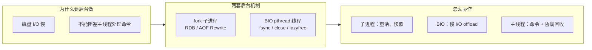
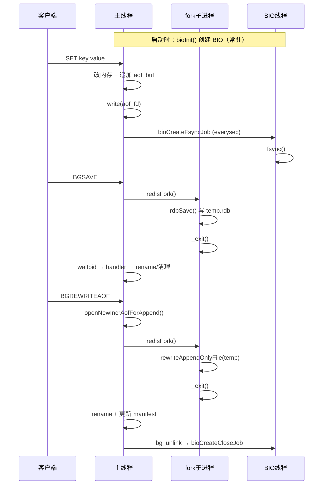

# Redis RDB/AOF 持久化：5W2H 分析

> 建议先阅读 [00-introduction.md](00-introduction.md)，了解 Redis 是什么、应用场景、pthread 解决的问题、学习动机与目标。

面向刚入门 Redis 的读者。先把最容易混淆的一点说清楚：

> **RDB 快照和 AOF Rewrite 用的是 `fork()` 子进程，不是临时创建的 pthread 线程。**  
> **真正用 pthread 的是 BIO 后台线程**（负责 AOF fsync、慢速 close、lazyfree 等）。

持久化里的「后台」其实有**两套机制**，后面所有 Why/What/How 都围绕这一点展开。

---

## 一、先建立一张「地图」



| 机制 | 创建方式 | 生命周期 | 典型任务 |
|------|----------|----------|----------|
| **fork 子进程** | `redisFork()` | 临时，干完就 exit | 写 RDB、AOF Rewrite |
| **BIO 线程** | `bioInit()` → `pthread_create` × 3 | 进程启动后常驻 | AOF fsync、文件 close、lazyfree |

---

## 二、5W2H 完整分析

### 1. Why — 为什么要这样设计？

#### 1.1 为什么要「后台」持久化？

Redis 是内存数据库，数据在 RAM 里。如果每次写盘都在主线程同步完成：

- `write()` / `fsync()` 可能阻塞**毫秒到秒级**
- 所有客户端命令都会被拖慢
- 高 QPS 下延迟会急剧上升

所以必须把**慢操作**挪出主线程的执行路径。

#### 1.2 为什么 RDB/AOF Rewrite 用 fork，而不是 pthread？

| 方案 | 问题 |
|------|------|
| 多线程共享内存写 RDB | 要对整个 DB 加锁，复杂且慢 |
| **fork + COW** | 子进程看到 fork 时刻的内存快照，遍历写文件时**几乎不用锁** |

fork 的核心价值：**用 OS 的 Copy-On-Write，以较低成本拿到一份「逻辑快照」**。

#### 1.3 为什么 AOF 常态 fsync 用 BIO 线程，而不是 fork？

- fsync 是**高频、短周期**操作（everysec 每秒一次）
- 为每次 fsync fork 一个进程，开销太大
- 一个**常驻 worker 线程** + 任务队列更合适

#### 1.4 为什么删旧 AOF 文件也要「后台 close」？

Linux 上 `unlink()` 只删文件名；文件内容要等**最后一个 fd close** 才真正释放。  
close 大文件可能很慢 → 交给 BIO 线程。

---

### 2. What — 涉及哪些概念和组件？

#### 2.1 角色

| 角色 | 是什么 | 职责 |
|------|--------|------|
| **主线程** | Redis 主事件循环 | 处理命令、AOF buffer write、触发 fork、提交 BIO 任务、回收子进程 |
| **fork 子进程** | `redis-rdb-bgsave` / `redis-aof-rewrite` | 遍历内存写 RDB 或 Rewrite AOF |
| **BIO worker 0** | pthread `bio_close_file` | 后台 close 文件（unlink 后的真正释放） |
| **BIO worker 1** | pthread `bio_aof` | AOF `fsync()`、close 旧 AOF fd |
| **BIO worker 2** | pthread `bio_lazy_free` | 大对象/大库 lazyfree |

#### 2.2 关键文件

| 文件 | 内容 |
|------|------|
| [src/bio.c](../src/bio.c) | BIO 线程创建、任务队列、fsync/close 执行 |
| [src/rdb.c](../src/rdb.c) | BGSAVE、`backgroundSaveDoneHandler` |
| [src/aof.c](../src/aof.c) | AOF 写入、Rewrite、`backgroundRewriteDoneHandler` |
| [src/server.c](../src/server.c) | `redisFork`、`checkChildrenDone`、`InitServerLast` |
| [src/replication.c](../src/replication.c) | `bg_unlink`（后台删文件） |

#### 2.3 关键状态变量

| 变量 | 含义 |
|------|------|
| `server.child_pid` | 当前 fork 子进程 PID，`-1` 表示没有 |
| `server.child_type` | `CHILD_TYPE_RDB` / `CHILD_TYPE_AOF` / `NONE` |
| `server.aof_fd` | 当前 INCR AOF 文件描述符 |
| `server.aof_buf` | 主线程 AOF 写缓冲 |
| `server.aof_bio_fsync_status` | BIO fsync 是否出错（atomic） |
| `server.lastbgsave_status` | 最近一次 BGSAVE 结果 |

#### 2.4 互斥规则

RDB、AOF Rewrite、Module fork **三者互斥**——同一时刻最多一个 `hasActiveChildProcess()`。

---

### 3. When — 什么时候创建？什么时候回收？

#### 3.1 BIO 线程

| 时机 | 动作 |
|------|------|
| **Redis 启动后** `InitServerLast()` | `bioInit()` 创建 3 个 pthread，**常驻到进程退出** |
| **每次 AOF everysec** | 主线程提交 fsync job，**不创建新线程** |
| **删旧 AOF / bg_unlink** | 主线程提交 close job |
| **进程 crash** | `bioKillThreads()` 强制结束（极少路径） |

#### 3.2 RDB 子进程

| 时机 | 动作 |
|------|------|
| `BGSAVE` 命令 | `rdbSaveBackground()` → fork |
| `save 900 1` 等条件满足 | `serverCron` 自动触发 |
| 主从复制 SYNC | 需要 RDB 时 fork |
| **子进程写完** | `_exit(0/1)` |
| **父进程** `serverCron` | `checkChildrenDone()` → `waitpid` → handler → `resetChildState()` |

#### 3.3 AOF Rewrite 子进程

| 时机 | 动作 |
|------|------|
| `BGREWRITEAOF` | `rewriteAppendOnlyFileBackground()` → fork |
| AOF 文件过大自动 rewrite | `serverCron` 调度 |
| 首次 `appendonly yes` | `startAppendOnly()` 触发 |
| **Rewrite 前** | `bioDrainWorker(BIO_AOF_FSYNC)` 等旧 fsync 全部完成 |
| **子进程完成** | `_exit()` |
| **父进程** | `backgroundRewriteDoneHandler()` → rename → 删旧文件 |

#### 3.4 主动取消

| 场景 | 方式 |
|------|------|
| 取消 BGSAVE | `killRDBChild()` → `SIGUSR1` |
| 取消 AOF Rewrite | `killAppendOnlyChild()` → `SIGUSR1` + 同步 `waitpid` |

`SIGUSR1` 是「白名单信号」——表示主动取消，不算持久化失败。

---

### 4. Where — 逻辑在代码哪里？

#### 4.1 启动入口

```
main()
  → initServer()
  → ... 加载配置、模块 ...
  → InitServerLast()
       → bioInit()          // BIO 线程在这里创建
       → initThreadedIO()   // IO 线程（与持久化无直接关系）
```

#### 4.2 RDB 路径

```
BGSAVE / serverCron
  → rdbSaveBackground()          [rdb.c]
       → redisFork(CHILD_TYPE_RDB) [server.c]
            子进程: rdbSave() → exitFromChild()
            父进程: 记录 child_pid

serverCron (每 100ms)
  → checkChildrenDone()          [server.c]
       → backgroundSaveDoneHandler() [rdb.c]
       → resetChildState()
```

#### 4.3 AOF 常态写入路径

```
命令执行 → 追加到 aof_buf
  → flushAppendOnlyFile()        [aof.c]
       → write(aof_fd)            // 主线程
       → aof_background_fsync()   // everysec
            → bioCreateFsyncJob() [bio.c]
                 → BIO worker1 执行 fsync
```

#### 4.4 AOF Rewrite 路径

```
BGREWRITEAOF / serverCron
  → rewriteAppendOnlyFileBackground() [aof.c]
       → flushAppendOnlyFile()
       → openNewIncrAofForAppend()    // 父进程开新 INCR AOF
       → bioDrainWorker(BIO_AOF_FSYNC)
       → redisFork(CHILD_TYPE_AOF)
            子进程: rewriteAppendOnlyFile(temp) → exit
            父进程: 继续写新 INCR AOF

  → checkChildrenDone()
       → backgroundRewriteDoneHandler() [aof.c]
            rename temp → BASE
            aofDelHistoryFiles() → bg_unlink() → bioCreateCloseJob()
```

---

### 5. Who — 谁在做？谁负责什么？



**职责边界（新人必记）**：

| 谁 | 做什么 | 不做什么 |
|----|--------|----------|
| 主线程 | 命令、AOF write、触发 fork、提交 BIO、waitpid | 不做 fsync（everysec）、不做慢 close |
| fork 子进程 | 读内存快照写 RDB/Rewrite AOF | 不处理客户端、不改共享数据结构 |
| BIO 线程 | fsync、close、lazyfree | 不执行 Redis 命令、不 fork |

---

### 6. Whom — 影响谁？为谁服务？

| 设计决策 | 受益者 | 影响 |
|----------|--------|------|
| fork 写 RDB | 所有需要快照的场景（重启恢复、复制） | 父进程内存可能 COW 膨胀 |
| BIO 异步 fsync | 使用 `appendfsync everysec` 的用户 | 最多丢 1 秒数据 |
| AOF Rewrite | 磁盘空间、重启加载速度 | Rewrite 期间 fork 有短暂开销 |
| `bg_unlink` | 主线程延迟 | 磁盘释放稍延后 |
| 子进程互斥 | 系统稳定性 | 不能同时 BGSAVE + BGREWRITEAOF |

**对不同角色的意义**：

- **业务开发者**：默认 everysec，知道「最多丢 1 秒」
- **运维**：关注 `lastbgsave_status`、AOF rewrite 是否成功、磁盘空间
- **源码阅读者**：先分清 fork 路径和 BIO 路径，再读 handler

---

### 7. How — 具体怎么实现？

#### 7.1 BIO 线程怎么创建？

`bioInit()` 做四件事：

1. 每个 worker：`pthread_mutex` + `pthread_cond` + 任务队列
2. 创建 `job_comp_pipe`，BIO 完成后唤醒主线程事件循环
3. 设置栈 4MB，`pthread_create` 启动 3 个 worker
4. worker 循环：`cond_wait` 等任务 → 执行 → 继续等

任务提交（主线程）：`lock → 入队 → cond_signal → unlock`

#### 7.2 fork 子进程怎么创建？

`redisFork(purpose)` 统一封装：

**父进程**：记录 `child_pid`、`child_type`；打开 `child_info_pipe`；统计 fork 耗时

**子进程**：设置 signal handler、OOM score；关闭不需要的 fd；执行具体任务后 `exitFromChild()` → `_exit()`

#### 7.3 资源怎么回收？

**fork 子进程**：

```
子进程 _exit()
  → 父进程 checkChildrenDone()
       → waitpid(-1, WNOHANG)
       → backgroundXxxDoneHandler()
       → resetChildState()
       → closeChildInfoPipe()
```

**临时文件**：

| 场景 | 处理方式 |
|------|----------|
| RDB 成功 | rename `temp-<pid>.rdb` → 正式 RDB |
| RDB 失败/被杀 | `rdbRemoveTempFile()` / `bg_unlink` |
| AOF Rewrite 成功 | rename `temp-rewriteaof-bg-<pid>.aof` → 新 BASE |
| AOF Rewrite 失败 | `aofRemoveTempFile()` |

**旧 AOF 文件**：

```
aofDelHistoryFiles()
  → bg_unlink(filepath)
       → open() + unlink()        // 主线程：删名字
       → bioCreateCloseJob(fd)    // BIO：close 释放 inode
```

---

## 三、两条主线串讲

### 主线 A：BGSAVE（RDB）

```
1. 触发：BGSAVE / 定时 save / 复制需要
2. 检查：hasActiveChildProcess() 必须为 false
3. fork：
   - 子：rdbSave() 写 temp-<pid>.rdb
   - 父：记录 child_pid，继续服务
4. 回收：
   - waitpid → backgroundSaveDoneHandler
   - 成功：更新 lastsave
   - 失败：删 temp 文件
   - resetChildState()
```

### 主线 B：AOF 日常 + Rewrite

**日常写入**：

```
命令 → aof_buf → flushAppendOnlyFile()
  → write() 主线程
  → everysec: bioCreateFsyncJob → BIO fsync
```

**Rewrite**：

```
1. flush 现有 buffer
2. openNewIncrAofForAppend()   // 父进程换新 INCR 继续写
3. bioDrainWorker(AOF_FSYNC)   // 等旧 fsync 完成
4. fork：
   - 子：rewriteAppendOnlyFile(temp)  // 写 BASE
   - 父：新命令写新 INCR
5. 回收：
   - rename temp → BASE
   - 旧 INCR → HISTORY
   - 更新 manifest
   - bg_unlink 删 HISTORY → BIO close
```

---

## 四、新人常见问题（FAQ）

**Q1：持久化用的是线程还是进程？**  
A：Rewrite/RDB 用 **fork 子进程**；AOF fsync 和慢 close 用 **BIO pthread 线程**。

**Q2：BIO 线程是每次 BGSAVE 才创建吗？**  
A：不是。启动时 `bioInit()` 创建一次，常驻运行。

**Q3：`appendfsync always` 会用 BIO 吗？**  
A：不会。fsync 在主线程同步执行，最安全也最慢。

**Q4：Rewrite 时新命令写哪里？**  
A：父进程写**新的 INCR AOF**；子进程写**临时 BASE 文件**，互不干扰。

**Q5：怎么知道 BGSAVE 是否成功？**  
A：`INFO persistence` 看 `rdb_last_bgsave_status`；或日志 `Background saving terminated with success`。

**Q6：SIGUSR1 是干什么的？**  
A：主动取消子进程的信号，handler 里不算错误。

---

## 五、5W2H 速查总表

| 维度 | RDB (BGSAVE) | AOF 日常写入 | AOF Rewrite |
|------|--------------|--------------|-------------|
| **Why** | 快照恢复、复制 | 记录每条写命令 | 压缩 AOF、加快加载 |
| **What** | fork 子进程写 RDB | 主线程 write + BIO fsync | fork 子进程写 BASE |
| **When 创建** | 命令/定时/复制 | 每条写命令 | BGREWRITEAOF/自动 |
| **When 回收** | 子进程 exit + waitpid | BIO job 执行完 | exit + rename + bg_unlink |
| **Where** | rdb.c | aof.c + bio.c | aof.c |
| **Who 执行** | fork 子进程 | 主线程 + BIO | fork 子进程 + 主线程 |
| **Whom 影响** | 重启恢复、slave 同步 | 数据 durability | 磁盘占用、加载速度 |
| **How** | fork → rdbSave → handler | buffer → write → bio fsync | fork → rewrite → rename |

---

## 六、一句话记忆

> **重活用 fork（RDB/Rewrite），慢 I/O 用 BIO（fsync/close），主线程只负责指挥和回收。**
