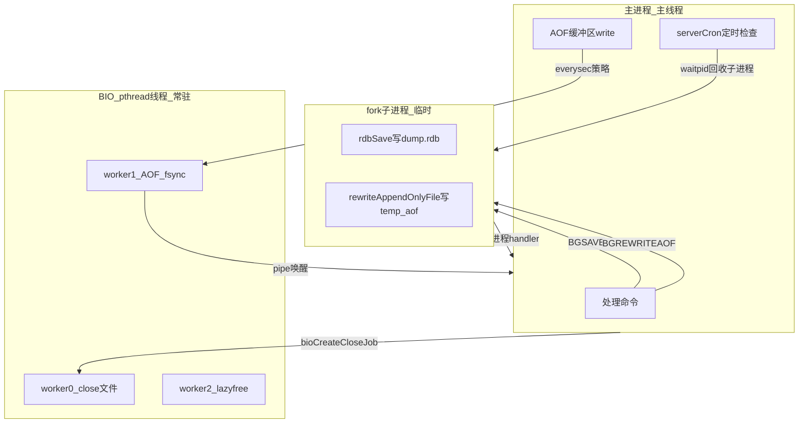

# Redis RDB/AOF 后台持久化：初学者指南

> 建议先阅读 [00-introduction.md](00-introduction.md)，了解 Redis 是什么、应用场景、pthread 解决的问题、学习动机与目标。

先说一个初学者最容易混淆的点：

> **RDB 快照 和 AOF Rewrite 用的是 `fork()` 子进程，不是 `pthread_create()` 线程。**  
> **真正用 pthread 的是 BIO 后台线程**，负责 AOF fsync、慢速 close/unlink、lazyfree 等。

把这两条线分开理解，后面就不会乱。

---

## 1. 两种「后台」机制

| 机制 | 创建方式 | 典型用途 | 核心文件 |
|------|----------|----------|----------|
| **子进程 (fork)** | `redisFork()` → `fork()` | RDB 落盘、AOF Rewrite | rdb.c, aof.c, server.c |
| **BIO 线程 (pthread)** | `bioInit()` → `pthread_create` × 3 | AOF fsync、文件 close、内存 lazyfree | bio.c |

**为什么 RDB/AOF Rewrite 用 fork 而不是 pthread？**

- 子进程通过 **Copy-On-Write (COW)** 共享父进程内存快照
- 子进程只读遍历数据库写文件，**不需要加锁**
- 主进程继续处理命令，改动的页才复制

这类似嵌入式里「拍一张内存快照给后台 DMA 传」，而不是「开线程共享同一份可变数据」。

---

## 2. 整体架构



---

## 3. BIO 线程：唯一与持久化相关的 pthread

### 3.1 何时创建？

Redis 启动后期，在 `InitServerLast()` 里调用：

```c
void InitServerLast(void) {
    bioInit();
    initThreadedIO();
    // ...
}
```

**注意**：BIO 线程在服务器整个生命周期内**常驻**，不是每次 BGSAVE 才创建。

### 3.2 创建几个？干什么？

`bio.c` 文件头写得很清楚：

```c
/* Currently there are 3 operations:
 * 1) a background close(2) system call.
 * 2) AOF fsync
 * 3) lazyfree of memory
 */
```

| Worker | 线程名 | 任务类型 |
|--------|--------|----------|
| 0 | `bio_close_file` | 后台 close 文件（unlink 后的真正释放） |
| 1 | `bio_aof` | AOF `fsync()` + close 旧 AOF fd |
| 2 | `bio_lazy_free` | 大对象/大库 lazyfree |

### 3.3 Worker 怎么工作？

经典 **生产者-消费者** 模型：

```c
// 主线程提交任务
bioSubmitJob(type, job):
    lock(mutex)
    入队
    cond_signal   // 唤醒 worker
    unlock

// BIO worker 循环
bioProcessBackgroundJobs():
    lock(mutex)
    while (队列为空) cond_wait   // 没活干就睡眠
    取队首 job
    unlock
    执行 job（fsync / close / free）
    lock
    删节点
    unlock
```

Worker 1 处理 AOF fsync 的核心逻辑：

```c
} else if (job_type == BIO_AOF_FSYNC || job_type == BIO_CLOSE_AOF) {
    redis_fsync(job->fd_args.fd);   // 可能很慢，所以在后台做
    atomicSet(server.fsynced_reploff_pending, job->fd_args.offset);
    if (job_type == BIO_CLOSE_AOF)
        close(job->fd_args.fd);     // 关闭旧 AOF 文件
}
```

---

## 4. RDB 后台保存 (BGSAVE)：fork 全流程

### 4.1 触发方式

- 用户命令：`BGSAVE`
- 自动：`serverCron` 检测到 `save 900 1` 等条件满足
- 复制：从节点 SYNC 需要 RDB

### 4.2 创建子进程

```c
int rdbSaveBackground(...) {
    if (hasActiveChildProcess()) return C_ERR;  // 同时只能有一个 RDB/AOF/Module fork

    server.dirty_before_bgsave = server.dirty;

    if ((childpid = redisFork(CHILD_TYPE_RDB)) == 0) {
        /* 子进程 */
        redisSetProcTitle("redis-rdb-bgsave");
        retval = rdbSave(req, filename, rsi, rdbflags);  // 遍历 DB 写 RDB
        exitFromChild((retval == C_OK) ? 0 : 1);         // _exit()，不能 return
    } else {
        /* 父进程 */
        serverLog(..., "Background saving started by pid %ld", childpid);
        server.rdb_child_type = RDB_CHILD_TYPE_DISK;
        return C_OK;
    }
}
```

**`redisFork()` 父进程侧还会**：

- 记录 `server.child_pid` / `server.child_type`
- 打开 `child_info_pipe`（子进程汇报 COW 内存等进度）
- 调用 `dismissMemoryInChild()` 等优化 COW

**子进程侧还会**：

- 关闭不需要的 fd（监听 socket 等）
- 设置独立 signal handler
- 降低 OOM score

### 4.3 子进程退出 → 父进程回收

主线程在 `serverCron` 里周期性调用：

```c
if (hasActiveChildProcess() || ldbPendingChildren()) {
    run_with_period(1000) receiveChildInfo();
    checkChildrenDone();
}
```

`checkChildrenDone()` 用 **非阻塞** `waitpid`：

```c
void checkChildrenDone(void) {
    if ((pid = waitpid(-1, &statloc, WNOHANG)) != 0) {
        if (pid == server.child_pid) {
            if (server.child_type == CHILD_TYPE_RDB)
                backgroundSaveDoneHandler(exitcode, bysignal);
            else if (server.child_type == CHILD_TYPE_AOF)
                backgroundRewriteDoneHandler(exitcode, bysignal);
            resetChildState();   // child_pid = -1, child_type = NONE
        }
    }
}
```

### 4.4 RDB 成功/失败后的资源处理

- **成功**：更新 `lastsave`，rename temp 文件
- **被信号杀死**：`rdbRemoveTempFile()` 删 `temp-<pid>.rdb`
- **SIGUSR1**：主动取消，不算错误

**资源回收清单（RDB）**：

| 资源 | 谁创建 | 谁回收 | 怎么回收 |
|------|--------|--------|----------|
| 子进程 | `fork()` | 父进程 | `waitpid` → `resetChildState()` |
| 临时 RDB 文件 | 子进程写 `temp-<pid>.rdb` | 父进程 handler | 成功则 rename；失败则 `bg_unlink` |
| `child_info_pipe` | `redisFork` | `resetChildState()` | `closeChildInfoPipe()` |
| 子进程内存 | fork COW | 内核 | 子进程 `_exit()` 后自动释放 |

---

## 5. AOF 常态写入：主线程 + BIO 配合

AOF 分两层理解：

### 5.1 主线程：攒 buffer → write()

命令执行时，Redis 把写操作格式化成 RESP 追加到 `server.aof_buf`。  
定时或缓冲区满时，`flushAppendOnlyFile()` 把 buffer **write()** 到 AOF 文件。

### 5.2 fsync 策略决定要不要 BIO

| 配置 | 行为 |
|------|------|
| `appendfsync always` | 主线程每次 write 后**同步 fsync**（阻塞） |
| `appendfsync everysec` | 主线程 write，**BIO 线程异步 fsync**（默认） |
| `appendfsync no` | 只 write，不 fsync，由 OS 刷盘 |

`everysec` 的关键路径：

```c
} else if (server.aof_fsync == AOF_FSYNC_EVERYSEC &&
           server.mstime - server.aof_last_fsync >= 1000) {
    if (!sync_in_progress) {
        aof_background_fsync(server.aof_fd);  // → bioCreateFsyncJob
    }
}
```

**为什么 fsync 要 offload 到 BIO？**  
`fsync()` 可能阻塞数毫秒到数秒（磁盘忙），放在主线程会卡住所有命令。

### 5.3 如果 fsync 还在进行中

主线程会**推迟**下一次 write（最多 2 秒），避免 write 被 fsync 拖住。

---

## 6. AOF Rewrite (BGREWRITEAOF)：fork + BIO 组合

### 6.1 为什么需要 Rewrite？

AOF 是追加写，文件会越来越大。Rewrite 相当于**用当前内存数据重新生成一份紧凑的 AOF**。

### 6.2 完整流程（源码注释）

```
1) 用户调用 BGREWRITEAOF
2) fork():
   2a) 子进程在 temp 文件里 rewrite
   2b) 父进程打开新的 INCR AOF 继续写新命令
3) 子进程完成并 exit
4) 父进程:
   4a) rename temp → 新 BASE 文件
   4b) 旧 INCR 标记为 HISTORY
   4c) 更新 manifest
   4d) 后台删除 HISTORY 文件
```

### 6.3 创建前的前置工作（父进程）

```c
int rewriteAppendOnlyFileBackground(void) {
    flushAppendOnlyFile(1);           // 先把现有 buffer 刷盘
    openNewIncrAofForAppend();        // 打开新 INCR AOF 给父进程继续写

    bioDrainWorker(BIO_AOF_FSYNC);    // 等旧 AOF 的 fsync 任务全部完成（防竞态）

    if ((childpid = redisFork(CHILD_TYPE_AOF)) == 0) {
        snprintf(tmpfile, "temp-rewriteaof-bg-%d.aof", getpid());
        rewriteAppendOnlyFile(tmpfile);
        exitFromChild(0, 0);
    }
    // 父进程记录 child_pid，继续服务
}
```

**关键设计**：fork 之后

- **子进程**：读内存快照，写 `temp-rewriteaof-bg-<pid>.aof`（BASE 文件）
- **父进程**：新命令写入**新的 INCR AOF**，互不干扰

### 6.4 Rewrite 完成后的资源回收

`backgroundRewriteDoneHandler()` 成功路径：

1. `rename(tempfile → 新 BASE 文件)` — 原子替换
2. rename 临时 INCR → 正式 INCR
3. 旧 INCR 移入 `history_aof_list`
4. 持久化 `manifest` 文件
5. `aofDelHistoryFiles()` — **后台删除**旧 AOF

删除旧文件走 `bg_unlink()`：

```c
int bg_unlink(const char *filename) {
    fd = open(filename, O_RDONLY);
    unlink(filename);              // 先删目录项（名字）
    bioCreateCloseJob(fd, 0, 0);   // BIO 线程 close(fd) 才真正释放磁盘空间
}
```

**为什么 unlink 还要 BIO close？**  
Linux 上 `unlink` 只删文件名；文件 inode 要等**最后一个 fd close** 才释放。  
`close()` 大文件可能慢，所以交给 BIO worker0。

---

## 7. 主动取消子进程

### kill RDB 子进程

```c
void killRDBChild(void) {
    kill(server.child_pid, SIGUSR1);  // 发 SIGUSR1
    server.bgsave_aborted = 1;        // 标记为主动取消
    // 实际 waitpid + cleanup 由 checkChildrenDone 异步完成
}
```

### kill AOF Rewrite 子进程

```c
void killAppendOnlyChild(void) {
    kill(server.child_pid, SIGUSR1);
    while (waitpid(-1, &statloc, 0) != server.child_pid);  // 同步等待
    aofRemoveTempFile(server.child_pid);
    resetChildState();
}
```

**SIGUSR1 是「白名单信号」**：handler 里不算错误，避免误报 `lastbgsave_status = C_ERR`。

---

## 8. 资源回收总表（初学者速查）

| 资源 | 创建 | 回收触发 | 回收方式 |
|------|------|----------|----------|
| fork 子进程 | `redisFork` | 子进程 exit | `waitpid(WNOHANG)` → handler → `resetChildState` |
| 临时 RDB/AOF 文件 | 子进程写 temp-* | handler | rename 或 `bg_unlink` |
| 旧 AOF 文件 | rewrite 后标记 HISTORY | `aofDelHistoryFiles` | `bg_unlink` → BIO close |
| AOF fsync 任务 | everysec | BIO worker 执行完 | fsync 完成，更新 atomic 状态 |
| BIO 线程 | `bioInit`（启动一次） | 进程 exit | `bioKillThreads`（仅 crash 时） |
| child_info_pipe | `redisFork` | `resetChildState` | close pipe |

---

## 9. 关键全局状态

| 变量 | 含义 |
|------|------|
| `server.child_pid` | 当前 fork 子进程 PID，-1 表示无 |
| `server.child_type` | `CHILD_TYPE_RDB` / `CHILD_TYPE_AOF` / `NONE` |
| `server.aof_fd` | 当前正在写的 INCR AOF 文件描述符 |
| `server.aof_buf` | 主线程 AOF 写缓冲 |
| `server.aof_bio_fsync_status` | BIO fsync 是否出错（atomic） |
| `server.lastbgsave_status` | 最近一次 BGSAVE 成功/失败 |
| `bio_jobs_counter[]` | 各类型 BIO 待处理任务数 |

**互斥规则**：RDB、AOF Rewrite、Module fork **三者互斥**，同一时刻最多一个 `hasActiveChildProcess()`。

---

## 10. 初学者推荐阅读顺序

| 步骤 | 文件 | 问题 |
|------|------|------|
| 1 | bio.c 文件头 DESIGN | BIO 线程干什么？ |
| 2 | bio.c:bioInit | pthread 怎么创建？ |
| 3 | bio.c:bioProcessBackgroundJobs | worker 怎么取任务、执行、回收 job？ |
| 4 | server.c:InitServerLast | BIO 何时启动？ |
| 5 | server.c:redisFork | fork 前后父/子各做什么？ |
| 6 | rdb.c:rdbSaveBackground | BGSAVE 怎么 fork？ |
| 7 | server.c:checkChildrenDone | 子进程怎么回收？ |
| 8 | rdb.c:backgroundSaveDoneHandler | RDB 成功后处理什么？ |
| 9 | aof.c 注释 + rewriteAppendOnlyFileBackground | AOF Rewrite 全流程 |
| 10 | aof.c:flushAppendOnlyFile | 常态 AOF write + fsync 策略 |
| 11 | aof.c:backgroundRewriteDoneHandler | Rewrite 成功后 rename + 删旧文件 |
| 12 | replication.c:bg_unlink | 文件删除如何 offload 到 BIO |

---

## 11. 和嵌入式的类比（帮助记忆）

| Redis 持久化 | 嵌入式类比 |
|--------------|------------|
| fork 子进程写 RDB | 双缓冲：快照区只读，主区继续写 |
| BIO 线程 fsync | 低优先级 task 做 Flash 刷写 |
| `bg_unlink` + BIO close | 标记删除 + 后台任务真正擦除 |
| `waitpid(WNOHANG)` | 主循环 poll 子任务完成 flag |
| `job_comp_pipe` 唤醒主线程 | ISR 置位 + 通知主循环 |
| `bioDrainWorker` 等待 fsync 完成 | 阻塞直到队列空 |
| temp 文件 + rename | 写备份区 → 校验 OK → 原子切换指针 |

---

## 12. 一句话总结

1. **BIO 线程**：服务器启动时 `bioInit()` 创建 3 个**常驻** pthread，负责慢的 I/O（fsync/close/free）。
2. **RDB / AOF Rewrite**：按需 `fork()` **临时子进程**做重活，完成后 `waitpid` + handler 回收。
3. **资源回收**：子进程用 `waitpid`；临时/旧文件用 `rename` 或 `bg_unlink` → BIO close；fsync 任务在 BIO worker 里执行完即释放。

---

## 相关文档

- [学习路线图](rdb-aof-learning-roadmap.md) — 分阶段源码走读与动手验证
- [5W2H 分析](rdb-aof-5w2h-analysis.md) — 设计动机与职责边界
