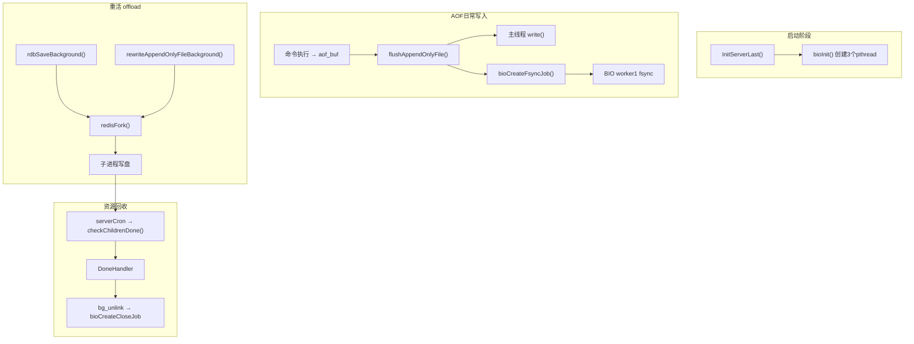
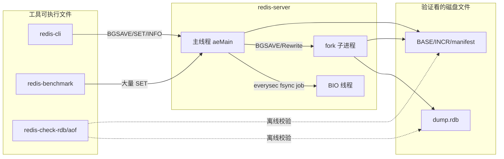
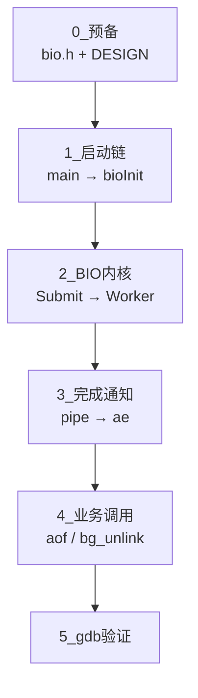
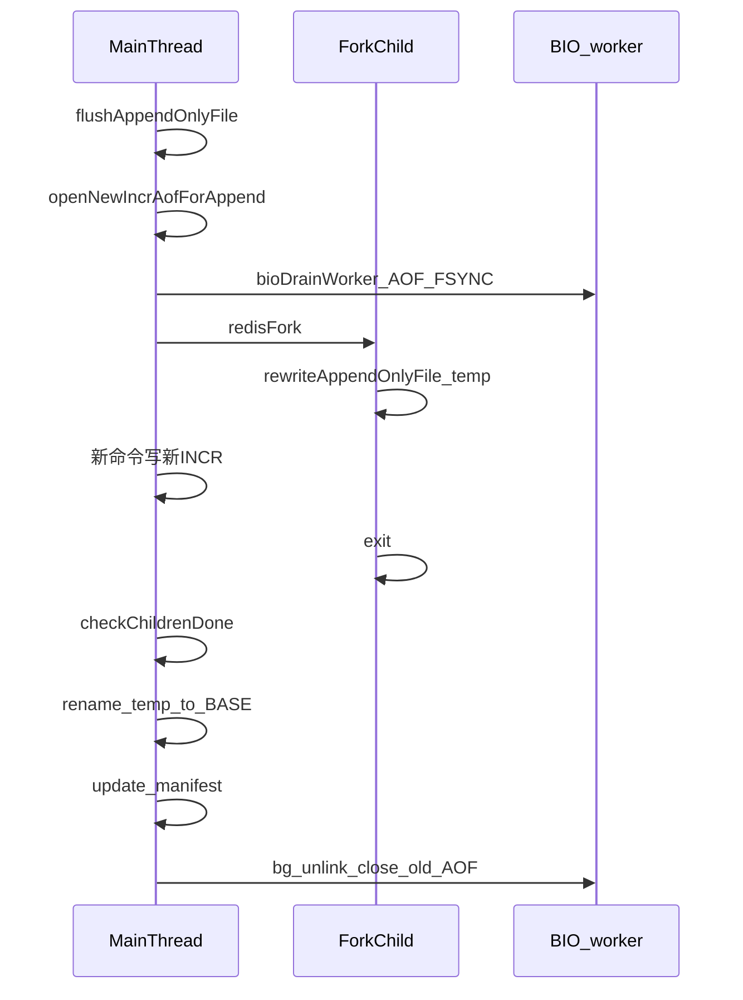

# Redis RDB/AOF 持久化：源码走读 + 动手验证计划

> 建议先阅读 [00-introduction.md](00-introduction.md)，了解 Redis 是什么、应用场景、pthread 解决的问题、学习动机与目标。  
> **动手实验默认用命令行**（`redis-server` / `cli` / `benchmark` / `ps` / `ls`）。CLion、gdb 仅作可选加深，不是完成本计划的前提。

## 学习目标

读完本计划后，你应能独立回答三个问题：

1. **哪些用 pthread，哪些用 fork？** — BIO 常驻线程 vs RDB/AOF Rewrite 临时子进程
2. **谁创建、谁执行、谁回收？** — 主线程、BIO worker、fork 子进程的职责边界
3. **失败/取消时资源怎么清理？** — `waitpid`、rename、`bg_unlink`、BIO close 的触发链



---

## 阶段 0：预备知识（约 0.5 天）

**目的**：避免新人最常见混淆——「持久化后台」不是同一种机制。

| 机制 | 创建 API | 生命周期 | 核心文件 |
|------|----------|----------|----------|
| BIO pthread | `bioInit()` | 启动后常驻 | [src/bio.c](../src/bio.c) |
| fork 子进程 | `redisFork()` | 按需创建，干完 exit | [src/server.c](../src/server.c), [src/rdb.c](../src/rdb.c), [src/aof.c](../src/aof.c) |

**必读**：[src/bio.c](../src/bio.c) 第 1–36 行 DESIGN 注释 — Redis 官方对 BIO 线程模型的说明。

**对照 5W2H**：先填一张空白表（Why/What/When/Where/Who/How/Whom），后续每阶段补一行，最后合成速查表。模板见 [rdb-aof-5w2h-analysis.md](rdb-aof-5w2h-analysis.md)。

### 动手验证（阶段 0）

**目的**：确认本机已能编译，并亲手区分「常驻线程」与「临时子进程」这两种后台形态。

#### 实验 0-A：编译并确认产物

**前置条件**：已安装 Xcode Command Line Tools / 编译器；位于仓库根目录。

| 步骤 | 操作 | 预期 |
|------|------|------|
| 1 | `cd ~/Downloads/redis` | — |
| 2 | `make OPTIMIZATION=-O0 MALLOC=libc -j` | 编译成功，无 error |
| 3 | `ls -l src/redis-server src/redis-cli src/redis-benchmark src/redis-check-rdb src/redis-check-aof` | 五个文件均为可执行（`x` 位） |

**通过标准**：五个二进制都存在。

#### 实验 0-B：BIO 是线程，BGSAVE 是子进程

| 步骤 | 操作 | 预期 |
|------|------|------|
| 1 | 终端 A：`mkdir -p /tmp/redis-lab0 && ./src/redis-server --port 6379 --dir /tmp/redis-lab0 --appendonly yes --appendfsync everysec` | 日志出现 `Ready to accept connections` |
| 2 | 终端 B：`PID=$(pgrep -n redis-server); echo PID=$PID; ps -M $PID`（Linux 用 `ps -T -p $PID`） | **同一 PID** 下约有 **主线程 + 至少 3 条线程**（macOS 上线程 COMMAND 常为空，属正常） |
| 3 | 终端 B：`./src/redis-cli CONFIG SET save ""` | `OK`（关掉自动 BGSAVE，避免干扰） |
| 4 | 终端 B：`./src/redis-cli SET k0 v0` 然后 `./src/redis-cli BGSAVE` | 返回 `Background saving started` |
| 5 | 立刻执行：`ps aux \| grep -E 'redis-rdb-bgsave\|redis-server' \| grep -v grep` | 短暂出现标题含 **`redis-rdb-bgsave`** 的**另一进程**（PID ≠ server） |
| 6 | 等几秒后：`./src/redis-cli INFO persistence \| grep rdb_last_bgsave` | `rdb_last_bgsave_status:ok` |
| 7 | `ls -la /tmp/redis-lab0/` | 出现 `dump.rdb` |
| 8 | 停服：终端 A 里 `Ctrl+C`，或 `./src/redis-cli SHUTDOWN NOSAVE` | 进程退出 |

**通过标准**：能口头说出——BIO = 同 PID 多线程；BGSAVE = 另起子进程（不同 PID）。

---

## 实验工具：可执行文件与验证对象

动手验证前先分清三类东西：**编译产物**、**运行时进程/线程名**（不是独立程序）、**验证看的磁盘文件与脚本**。

### 编译产物（`make` 后在 `src/`）

| 可执行文件 | 作用 | 本路线怎么用 |
|------------|------|--------------|
| **`redis-server`** | 服务端本体：事件循环、命令、BIO、fork 持久化 | **命令行主程序**；也可作 gdb/CLion 调试目标 |
| **`redis-cli`** | 交互/脚本客户端 | `SET` / `BGSAVE` / `BGREWRITEAOF` / `INFO persistence` / `CONFIG SET` |
| **`redis-benchmark`** | 压测，短时间大量写 | 触发 everysec 的 BIO fsync，方便命中断点 |
| **`redis-check-rdb`** | 离线检查 RDB 是否损坏 | BGSAVE 后校验 `dump.rdb` |
| **`redis-check-aof`** | 离线检查/修复 AOF | Rewrite 或异常后校验 AOF 目录 |
| **`redis-sentinel`** | 哨兵模式入口（实为 server 变体） | 本持久化路线基本不用 |

关系一句话：**`server` 被测；`cli` / `benchmark` 负责触发；`check-*` 负责事后验盘上文件。**

### 运行时「看起来像可执行文件」的名字

这些**不是**单独编出来的程序，而是 `redis-server` fork 后改的进程标题（或线程名）：

| 名字 | 本质 | 验证时看什么 |
|------|------|--------------|
| **`redis-rdb-bgsave`** | BGSAVE 子进程 | `ps` 短暂出现；写临时 RDB，exit 后父进程 rename |
| **`redis-aof-rewrite`** | BGREWRITEAOF 子进程 | 写临时 BASE；父进程继续写新 INCR |
| **`bio_aof` / `bio_close_file` / `bio_lazy_free`** | BIO 常驻 pthread | 优先 `ps -M`（macOS）看线程数；名称可用 CLion Threads（可选） |

### 验证看的磁盘文件（实验观察对象）

建议各阶段用 `--dir /tmp/redis-...`，在临时目录 `ls`，避免污染仓库。

| 文件/目录 | 作用 | 典型阶段 |
|-----------|------|----------|
| **`dump.rdb`**（或配置的 RDB 名） | BGSAVE/SAVE 快照；验证「子进程写完 → 父进程 rename」 | 阶段 2 |
| **AOF 目录**（如 `appendonlydir/`） | multi-part：`BASE` + `INCR` + 可选 `HISTORY` | 阶段 3–4 |
| **manifest** | 记录当前 BASE/INCR 序列；Rewrite 成功后更新 | 阶段 4 |
| **`temp-*.rdb` / `temp-rewriteaof-bg-*.aof`** | 子进程写盘中的临时文件；成功才 rename，失败应清理 | 阶段 2、4、5 |

### 运行时状态与官方测试脚本

| 手段 | 作用 |
|------|------|
| **`INFO persistence`** | 看 `aof_last_fsync`、`rdb_bgsave_in_progress`、`aof_rewrite_in_progress` 等 |
| **`ps` / `INFO persistence`** | 确认子进程标题、BIO 线程数、持久化状态 |
| [tests/integration/aof.tcl](../tests/integration/aof.tcl) | AOF 基本行为自动化回归 |
| [tests/integration/aof-multi-part.tcl](../tests/integration/aof-multi-part.tcl) | 多分片 AOF / manifest |
| [tests/unit/aofrw.tcl](../tests/unit/aofrw.tcl) | AOF Rewrite 单元场景 |

本地手调优先：**命令行** `redis-server` + `redis-cli` + `ls` / `ps`；CLion/gdb **不是必须**。要对齐官方行为再跑 tcl（如 `./runtest --single integration/aof`）。

### 总览：谁触发、谁干活、谁验



**记忆口诀**：`server` 是本体；`cli`/`benchmark` 是遥控器；`check-*` 是验伤工具；`dump.rdb`/AOF/manifest 是验伤对象；`redis-rdb-bgsave` 只是子进程换了个显示名。

---

## 实验环境：命令行优先；CLion 可选

> **默认用命令行完成全部动手实验即可。**  
> CLion / gdb 只在你想单步看调用栈、切换线程时再用，**不是完成本路线的前提**。

各阶段实验以终端操作为准：起 `redis-server`，另开终端用 `redis-cli` / `redis-benchmark` / `ps` / `ls` 验证。

### （可选）CLion 图形化调试配置

若已安装 CLion，可用图形界面跟调用链（线程、栈、变量更直观）。Redis 主工程是 **Makefile**，用「打开目录 + Custom Build Target」即可。未装 CLion 可整节跳过。

### 打开工程

1. **File → Open**，选择仓库根目录（含 `Makefile`、`src/`）。
2. 若提示项目模型：选 **Makefile**。
3. 首次打开等索引完成；之后可在源码中搜索 `【导读】`、对函数名跳转定义。

生成 Compilation Database（改善跳转/补全，可选）：

```bash
make clean
bear -- make CFLAGS="-g -O0" -j
# 生成 compile_commands.json 后，CLion 可 reload CompDB
```

也可只保证 Debug 编译：

```bash
make OPTIMIZATION=-O0 MALLOC=libc redis-server
```

产物：`src/redis-server`（带符号，可下断点）。

### 配置 Custom Build Target（一键编译）

若仓库没有现成配置，手建如下：

1. **Settings → Tools → External Tools** → `+`
   - Name：`redis-build`
   - Program：`/usr/bin/make`（或 `make`）
   - Arguments：`OPTIMIZATION=-O0 MALLOC=libc redis-server`
   - Working directory：`$ProjectFileDir$`
2. **Settings → Build, Execution, Deployment → Custom Build Targets** → `+`
   - Name：`redis-server-debug`
   - Build：选上面的 `redis-build`
   - Clean：可选 `make distclean`

### 配置 Run/Debug Configuration

1. 右上角 **Add Configuration…** → **Native Application**（或 **Custom Build Application**）
2. 建议字段：

| 项 | 建议值 |
|----|--------|
| Name | `redis-server BIO` |
| Target / Executable | `$ProjectFileDir$/src/redis-server` |
| Program arguments | `--appendonly yes --appendfsync everysec --port 6379` |
| Working directory | `$ProjectFileDir$` |
| Before launch | Build `redis-server-debug`（或先手动 `make`） |

可选：`--dir /tmp/redis-bio-debug`，避免污染仓库目录下的 dump/AOF。

macOS 若 LLDB 附加受限：在 **System Settings → Privacy & Security → Developer Tools** 允许终端/CLion，或以调试签名运行（按本机策略）。

### 常用调试操作

| 操作 | 快捷键 |
|------|--------|
| 下/取消断点 | `⌘F8` / `Ctrl+F8` |
| Debug 启动 | 绿色虫子图标 |
| Step Over | `F8` |
| Step Into | `F7` |
| Step Out | `⇧F8` / `Shift+F8` |
| Resume | `⌥⌘R` / `F9` |
| 查看线程 | Debugger → Threads |
| 查看调用栈 | Debugger → Frames |
| 查看变量 | Debugger → Variables |

### 与命令行 gdb 的对应关系

| CLion | gdb 等价 |
|-------|----------|
| 行断点 | `break <函数>` |
| Debug 启动 | `gdb --args ./src/redis-server ...` + `run` |
| Threads 面板 | `info threads` / `thread N` |
| Frames | `bt` |
| Variables | `p var` |
| Resume / Step | `c` / `n` / `s` |

### 各阶段动手实验通用约定

后续每个阶段的「动手验证」都按同一模板写：

1. **前置条件** → 2. **命令行逐步操作** → 3. **预期结果 / 通过标准** → 4. **（可选）CLion/gdb 深挖**

**每次开新实验前建议做一遍：**

```bash
cd ~/Downloads/redis

# 1) 编译（带符号便于以后可选调试；命令行验证不强制 -O0）
make OPTIMIZATION=-O0 MALLOC=libc -j

# 2) 确认端口空闲（若 6379 被占用，先停旧进程或换 --port）
lsof -i :6379 || true

# 3) 为该阶段准备干净数据目录（示例，各阶段会指定具体路径）
rm -rf /tmp/redis-lab && mkdir -p /tmp/redis-lab
```

**开两个终端（命令行标配）：**

| 终端 | 用途 |
|------|------|
| A | 跑 `./src/redis-server ...` |
| B | 跑 `redis-cli` / `redis-benchmark` / `ps` / `ls` |

下文默认在仓库根目录执行 `./src/redis-server`、`./src/redis-cli`、`./src/redis-benchmark`。

---

## 阶段 1：BIO 线程 — pthread 唯一入口（约 1–2 天）

> **详细导读（带注释 + 调用关系图）**：[bio-source-walkthrough.md](bio-source-walkthrough.md)  
> 本节为概要；完整五阶段走读、逐函数注释、时序图见该文档。

**Why**：`fsync()`、`close()` 大文件可能阻塞毫秒~秒级，不能放在主事件循环。

### 五阶段走读路线



### 走读顺序（概要表）

| 阶段 | 步骤 | 函数 | 文件:行号 | 要回答的问题 |
|------|------|------|-----------|--------------|
| 0 | 1 | `bio.h` + DESIGN | bio.c:1–36 | 几个 worker？几种 job？ |
| 1 | 2 | `main()` → `initServer()` | server.c:6909, 2592 | ae 事件循环何时创建？ |
| 1 | 3 | `InitServerLast()` → `bioInit()` | server.c:2881, bio.c:124 | BIO 为何放在最后创建？ |
| 2 | 4 | `bioSubmitJob()` | bio.c:178 | 生产者：lock→入队→signal？ |
| 2 | 5 | `bioProcessBackgroundJobs()` | bio.c:253 | 消费者：cond_wait→执行→回收？ |
| 2 | 6 | `bioCreateFsyncJob()` | bio.c:244 | AOF fsync 如何提交？ |
| 3 | 7 | `bioPipeReadJobCompList()` | bio.c:412 | pipe 如何桥接 ae 事件循环？ |
| 4 | 8 | `flushAppendOnlyFile()` → `aof_background_fsync()` | aof.c:1045, 905 | everysec 完整链路？ |
| 4 | 9 | `bioDrainWorker()` | bio.c:377, aof.c:2463 | Rewrite 前为何排空 fsync？ |
| 4 | 10 | `bg_unlink()` → `bioCreateCloseJob()` | replication.c:78 | 删文件为何还要 BIO close？ |

### 启动链关键顺序（必记）

```
initServer()           → 创建 server.el（ae）、记录 main_thread_id
    ↓
InitServerLast()
    → bioInit()        → ★ 3 个 BIO pthread + pipe 注册到 ae
    → initThreadedIO()
    ↓
aeMain()               → 主循环；pipe 可读时调用 bioPipeReadJobCompList
```

### 三个 worker 职责

- worker0 `bio_close_file`：后台 close（配合 `bg_unlink`）
- worker1 `bio_aof`：AOF fsync + close 旧 AOF fd
- worker2 `bio_lazy_free`：大对象释放（与持久化间接相关）

### 动手验证（阶段 1）

**目的**：确认 BIO 三线程常驻；everysec 下 fsync 路径可用命令行验证（INFO / 压测 / 对照源码）。

#### 实验 1-A：确认 BIO 三线程（命令行）

**前置条件**：已按「通用约定」编译；端口 6379 空闲。

| 步骤 | 操作 | 预期 |
|------|------|------|
| 1 | `rm -rf /tmp/redis-lab1 && mkdir -p /tmp/redis-lab1` | 干净目录 |
| 2 | 终端 A：`./src/redis-server --port 6379 --dir /tmp/redis-lab1 --appendonly yes --appendfsync everysec` | Ready |
| 3 | 终端 B：`PID=$(pgrep -n redis-server); ps -M $PID` | 主线程 + **3** 条线程行（同 PID） |
| 4 | （可选）`sample $PID 1 2>&1 \| head -100` | 采样报告中可见多线程活动 |
| 5 | `./src/redis-cli PING` | `PONG` |

**通过标准**：`ps -M` 看到同 PID 下至少 4 行（1 主 + 3 BIO）。macOS 线程名可能为空，见上文说明。

#### 实验 1-B：压测触发 everysec fsync，观察 persistence

| 步骤 | 操作 | 预期 |
|------|------|------|
| 1 | 保持 1-A 的 server 在跑 | — |
| 2 | `./src/redis-benchmark -p 6379 -t set -n 5000 -q` | 压测结束有吞吐数字 |
| 3 | `./src/redis-cli INFO persistence \| grep -E 'aof_|loading'` | `aof_enabled:1`；`aof_last_fsync` 有时间戳；可留意 `aof_pending_bio_fsync` |
| 4 | `ls -la /tmp/redis-lab1/` | 有 AOF 相关目录/文件（如 `appendonlydir`） |
| 5 | `./src/redis-cli SHUTDOWN NOSAVE` | 干净退出 |

**通过标准**：AOF 已启用，且压测后 `aof_last_fsync` 有更新（相对启动时刻前进）。

#### 实验 1-C：（可选）lldb 跟 BIO fsync 全路径

> **不是必做。** 1-A / 1-B 用命令行已够阶段通过。  
> 本节用于看清「主线程提交 → BIO worker 执行」。macOS 用 **lldb**（无 gdb 时不要硬装）。

##### 先弄清两段停顿分别证明什么

```text
停顿① 主线程：bioCreateFsyncJob / bioSubmitJob
       → 证明：everysec 路径在主线程「投递」fsync job（type=1, worker=1）

停顿② BIO 线程：bio.c 里 BIO_AOF_FSYNC 分支的「行断点」
       → 证明：真正刷盘发生在 worker 循环内部（不是主线程）
```

##### 原理：三个易错点（必读）

| 易错做法 | 为什么不行 |
|----------|------------|
| 对 `bioProcessBackgroundJobs` **函数入口**下断 | 线程在 `bioInit` 时已进入该函数，并卡在 `cond_wait`；之后一直在 `while(1)` **内部**循环，不会再次「进入」函数 |
| `b redis_fsync` | macOS 上 `redis_fsync` 是 **宏**（`fcntl(F_FULLFSYNC)`），不是函数，符号断点无效 |
| 命中 Submit 后立刻只 `c`，且不断开 Create/Submit | 会反复停在主线程；或 worker 在你停顿期间已做完 job，行断点扑空 |

**正确抓消费者**：对 `bio.c` 中 `BIO_AOF_FSYNC` 分支里 `if (redis_fsync(job->fd_args.fd)` **那一行**下断（约 `bio.c:323`，以本地为准）。

##### 完整步骤（每步含原因）

**阶段 P0 — 准备**

| 步骤 | 操作 | 原因 |
|------|------|------|
| P0.1 | `make OPTIMIZATION=-O0 MALLOC=libc -j` | `-O0` 保证行号/变量可跟；符号完整 |
| P0.2 | `rm -rf /tmp/redis-lab1 && mkdir -p /tmp/redis-lab1`；确认 6379 空闲 | 干净数据目录，避免脏状态干扰 |
| P0.3 | 编辑器打开 `src/bio.c`，搜索 `BIO_AOF_FSYNC`，记住 `redis_fsync(job->fd_args.fd)` 的**行号**（下称 L） | 后面要下**行断点**，不能靠函数名 |

**阶段 P1 — 启动 lldb 并下「生产者」断点**

| 步骤 | 操作 | 原因 |
|------|------|------|
| P1.1 | `lldb -- ./src/redis-server --port 6379 --dir /tmp/redis-lab1 --appendonly yes --appendfsync everysec` | 用 everysec 才会走 BIO fsync |
| P1.2 | `(lldb) b bioInit` | 确认启动时创建 BIO（可选看一眼） |
| P1.3 | `(lldb) b bioCreateFsyncJob` | 抓「主线程创建 fsync job」 |
| P1.4 | `(lldb) b bioSubmitJob` | 抓入队，便于 `p type` / 看 `worker` |
| P1.5 | `(lldb) b bio.c:L`（把 L 换成你的行号，如 `b bio.c:323`） | **预先**挂上消费者行断点，避免 Submit 之后才挂来不及 |
| P1.6 | `(lldb) run` | 启动 server |

**阶段 P2 — 启动期（bioInit）**

| 步骤 | 操作 | 原因 |
|------|------|------|
| P2.1 | 若停在 `bioInit`：`(lldb) thread list`，再 `(lldb) c` | 确认已有多线程；然后让主线程进入 `aeMain` 才能接客户端 |
| P2.2 | 另开终端：`./src/redis-cli PING` → `PONG` | 确认调试中的 server 已可服务 |

**阶段 P3 — 触发 everysec，停在生产者**

| 步骤 | 操作 | 原因 |
|------|------|------|
| P3.1 | 另开终端：`./src/redis-benchmark -p 6379 -t set -n 2000 -q` | 制造写入；约 ≥1s 后 everysec 才会提交 fsync |
| P3.2 | 应停在 `bioCreateFsyncJob` 或 `bioSubmitJob`；看提示为 `thread #1` / `main-thread` | **生产者必须在主线程**；若已在 Submit，直接做 P3.4 |
| P3.3 | 若在 Create：`(lldb) bt`；`(lldb) p fd`；`(lldb) p offset`；再 `c` 或 `s`/`n` 到 Submit | `bt` 应含 `aof_background_fsync`←`flushAppendOnlyFile`，证明 everysec 调用链 |
| P3.4 | 停在 `bioSubmitJob` 入口时：`(lldb) p type` → 应为 **1**（`BIO_AOF_FSYNC`）；单步到 `worker = bio_job_to_worker[type]` 后 `(lldb) p worker` → 应为 **1** | `type=1` + `worker=1` 证明路由到 `bio_aof`，不是 close/lazyfree |
| P3.5 | （可选）再 `n` 几次，越过 `listAddNodeTail`、`pthread_cond_signal` | 看清「只入队+唤醒」，主线程此处**不** fsync |

**阶段 P4 — 切换到消费者（关键）**

| 步骤 | 操作 | 原因 |
|------|------|------|
| P4.1 | `(lldb) breakpoint list` | 看清各断点编号 |
| P4.2 | `(lldb) breakpoint disable <Create编号>`；`breakpoint disable <Submit编号>` | **必须关掉**，否则 `c` 后压测会疯狂停在主线程，抢在行断点前 |
| P4.3 | 确认 `bio.c:L` 行断点仍为 enabled | 消费者全靠这一行 |
| P4.4 | `(lldb) c` | 放行当前这次 Submit；worker 可能立刻执行 |
| P4.5 | 若未停下：再跑 `./src/redis-benchmark -p 6379 -t set -n 2000 -q` | 再触发一轮 everysec fsync，命中行断点 |
| P4.6 | 停下后：`(lldb) thread list`；`(lldb) bt` | 当前应是 **非 #1** 线程；`bt` 里已有 `bioProcessBackgroundJobs`（表示在循环内执行到 L，不是重新进入函数） |

**阶段 P5 — 收尾**

| 步骤 | 操作 | 原因 |
|------|------|------|
| P5.1 | `(lldb) process interrupt` 或另开终端 `./src/redis-cli SHUTDOWN NOSAVE` 后结束 lldb | 干净结束实验 |
| P5.2 | 在笔记写下三句话：谁提交、`worker`、谁执行 fsync | 固化 1-C 结论 |

##### 对照：你在 lldb 里可能看到的「成功」样例

**生产者（正常）：**

```text
thread #1, queue = 'com.apple.main-thread'
frame #0: ... bioSubmitJob(type=1, job=...) at bio.c:186
```

→ `type=1` 正确；此时还在主线程，**不要以为失败**。

**消费者（正常）：**

```text
thread #N   (N != 1)
frame #0: ... at bio.c:323   # BIO_AOF_FSYNC 行
... bioProcessBackgroundJobs ...
```

##### CLion 等价（可选）

1. 对 `bioCreateFsyncJob`、`bioSubmitJob` 下符号断点；对 `bio.c` L 行点行断点。  
2. Debug 启动 → benchmark → 在 Submit 看 `type`/`worker`。  
3. Disable 前两个断点 → Resume → 再 benchmark → 在 L 行看 Threads 非主线程。  
4. **不要**对 `bioProcessBackgroundJobs` 入口下断。

**阶段产出**：笔记含 P3.4（`type`/`worker`）与 P4.6（非主线程 + 行号）两处截图或手抄。

### 阶段 1 知识固化（过关后再进阶段 2）

> 先读 **总结短答**；能默写后再读 **细节解释**。1-A / 1-B 命令行通过即可进入阶段 2；1-C 可选。

#### 一、总结说明（标准短答）

**一句话**  
慢 I/O（fsync / close / 大块 free）不堵 `aeMain`：启动时 `bioInit` 建 3 个常驻 pthread；主线程只 `bioSubmitJob` 入队唤醒；各 worker 消费**自己的** FIFO 队列。

**三个 worker**

| worker | 名称 | 主要 job |
|--------|------|----------|
| 0 | `bio_close_file` | `BIO_CLOSE_FILE`（如 `bg_unlink` 后 close） |
| 1 | `bio_aof` | `BIO_AOF_FSYNC`、`BIO_CLOSE_AOF` |
| 2 | `bio_lazy_free` | `BIO_LAZY_FREE` |

**六题标准短答**

| # | 问题 | 短答 |
|---|------|------|
| 1 | BIO 何时创建？几次？ | **`InitServerLast()` → `bioInit()`**，进程内**一次**；在 **`aeMain` 之前**（不是在 aeMain 里创建） |
| 2 | everysec 时 write / fsync 各在哪？ | **`write` = 主线程**；**`fsync` = worker1（`bio_aof`）** |
| 3 | 谁决定进哪个 worker？ | **`bioSubmitJob(type, …)`** 用 `bio_job_to_worker[type]` 选队列；`bioCreate*` 负责分配 job |
| 4 | 为何 fsync 与 close-AOF 共用 worker1？ | **同一 AOF fd 要保序**；同队列 FIFO，先入队先执行 |
| 5 | cli 能否直接调 BIO？ | **不能**；cli 只跟主线程通信，主线程再 `bioCreateFsyncJob` 等 |
| 6 | everysec fsync 是否必经 pipe / `bio_comp_list`？ | **否**；everysec 用 atomic 汇报；pipe 给要在主线程跑回调的 `BIO_COMP_RQ_*` |

**everysec 是什么**  
配置项 `appendfsync everysec`：约每秒由主线程检查后提交一次 **`BIO_AOF_FSYNC`** 任务，不是第四个 worker，也不是独立定时进程。

**与阶段 2 的对比（必须分清）**

| | BIO（阶段 1） | BGSAVE（阶段 2） |
|--|---------------|------------------|
| 形态 | 同进程 **线程** | **另一进程**（fork） |
| 生命周期 | 启动常驻 | 干完 exit |
| 谁创建 | `bioInit` 一次 | 每次 `BGSAVE` |

---

#### 二、细节解释

##### 2.1 启动与「没有 BIO 总调度线程」

```text
initServer()            → 创建 server.el
InitServerLast()
  └─ bioInit()          → pthread_create ×3，各跑 bioProcessBackgroundJobs
aeMain(server.el)       → 主事件循环（此后才接客户端）
```

常见误解纠正：

- 不是 `bioInitLast`，而是 **`InitServerLast` 里调 `bioInit`**。  
- **没有**单独的「BIO 主任务再分发」：路由在 **Submit 时**完成，每个 worker 只扫自己的 `bio_jobs[worker]`。

```text
cli / benchmark → 命令 → 主线程 aeMain
                      ↓ 业务需要时
                 bioCreate* → bioSubmitJob(type)
                      ↓
            worker = bio_job_to_worker[type]
            入队 + cond_signal(该 worker)
```

##### 2.2 everysec 最短链（write vs fsync）

```text
SET → aof_buf
  → beforeSleep → flushAppendOnlyFile
      → write(aof_fd)                 // 主线程：尽快把数据交给内核
      → （距上次 fsync ≥ ~1s 且无进行中的 fsync）
      → aof_background_fsync
          → bioCreateFsyncJob
          → bioSubmitJob(BIO_AOF_FSYNC)  // worker == 1
          → bio_aof: redis_fsync(fd)     // macOS 上为宏 → fcntl(F_FULLFSYNC)
```

- **always**：主线程 `write` 后自己 `fsync`（不走 BIO）。  
- **no**：不主动 `fsync`。  
- everysec 名字表示策略「大约每秒刷一次」，实现是 flush 时看时间差，不是另起定时器线程。

##### 2.3 问题 4 细化：如何保证 FSYNC 在 CLOSE_AOF「之前」？

Redis **不靠运行时检测「还有 fsync 没做完」再推迟 close**，而是：

1. **机制**：`BIO_AOF_FSYNC` 与 `BIO_CLOSE_AOF` 都映射到 **worker1**，单线程 + **FIFO** → 先入队的一定先执行。  
2. **约定**：主线程必须按正确顺序 Submit（先仍需刷盘的 fsync，再 close）。  
3. **CLOSE_AOF 自身**：该 job 内也会先 `redis_fsync` 再 `close`（关之前再刷一次）。  
4. **部分场景更硬**：`bioDrainWorker(BIO_AOF_FSYNC)` 让主线程阻塞到 worker1 队列空（如 Rewrite 前）。

若主线程先 Submit CLOSE、再 Submit FSYNC，FIFO 也会先 close——那是调用错误。保序 = **同队列串行 + 正确入队顺序**。

**关旧开新后新数据怎么办？**  
切换 AOF 时：先对**旧 fd** 提交 `aof_background_fsync_and_close`，再立刻 `server.aof_fd = newfd`。之后 write/fsync 都走**新 fd**；旧 fd 只在 BIO 里收尾。不会「文件已关还往同一 fd 写再 sync」。

##### 2.4 问题 6 细化：pipe / `bio_comp_list` 干什么？

| 路径 | 完成后如何通知 | 用 pipe？ |
|------|----------------|----------|
| everysec `BIO_AOF_FSYNC` | 更新 atomic（如 `fsynced_reploff_pending`） | **否** |
| `bioCreateCompRq` / `BIO_COMP_RQ_*` | 写入 `bio_comp_list`，`write(pipe)` 唤醒主线程执行 `comp_fn` | **是** |

pipe 是为了主线程堵在 `epoll_wait` 时仍能被叫醒并**在主线程跑回调**（如 FLUSHALL ASYNC）。普通 everysec fsync 不需要回调，atomic 足够。

##### 2.5 实验与结论对照

| 实验 | 固化哪一句 |
|------|------------|
| 1-A `ps -M` | 同 PID 多线程 = BIO 已常驻 |
| 1-B INFO + 压测 | AOF 在动、`aof_last_fsync` 更新 |
| 1-C（可选） | Submit 在主线程 `type=1`；真正 fsync 在另一线程的 `bio.c` 行上 |

##### 2.6 阶段 1 过关自检

能不看笔记答出上面六题短答，并分清「BIO 线程 vs BGSAVE 子进程」，即可进入阶段 2。lldb 是否抓到 BIO 行断点**不挡**进度。

---

## 阶段 2：RDB 后台保存 BGSAVE（约 2 天）

**Why**：遍历全库写 RDB 是重活；fork + COW 让子进程读快照、父进程继续服务，几乎不用锁。

### 走读顺序

| 步骤 | 函数 | 文件:行号 | 要回答的问题 |
|------|------|-----------|--------------|
| 1 | `bgsaveCommand` | rdb.c | 用户命令如何触发？ |
| 2 | `rdbSaveBackground()` | rdb.c:1636 | fork 前后父/子各做什么？ |
| 3 | `redisFork(CHILD_TYPE_RDB)` | server.c:6460 | 统一封装了哪些父子准备工作？ |
| 4 | 子进程 `rdbSave()` | rdb.c | 临时文件命名规则？ |
| 5 | `exitFromChild()` | server.c | 为什么子进程必须 `_exit` 不能 `return`？ |
| 6 | `checkChildrenDone()` | server.c:1161 | 非阻塞 `waitpid(WNOHANG)` 如何调度 handler？ |
| 7 | `backgroundSaveDoneHandler()` | rdb.c:3804 | 成功 rename / 失败删 temp 的分支？ |
| 8 | `killRDBChild()` | rdb.c | SIGUSR1 取消语义？ |

### 关键状态变量

- `server.child_pid` / `server.child_type`
- `server.lastbgsave_status` / `server.dirty_before_bgsave`

### 动手验证（阶段 2）

**目的**：走完 BGSAVE：触发 → fork → 子进程写 temp → exit → 父进程 waitpid → rename；并用 `redis-check-rdb` 验文件。

#### 实验 2-A：命令行完整 BGSAVE

**前置条件**：已编译；6379 空闲。本实验可先**关掉 AOF**，减少目录干扰。

| 步骤 | 操作 | 预期 |
|------|------|------|
| 1 | `rm -rf /tmp/redis-lab2 && mkdir -p /tmp/redis-lab2` | — |
| 2 | 终端 A：`./src/redis-server --port 6379 --dir /tmp/redis-lab2 --appendonly no --save ""` | Ready（禁用自动 save） |
| 3 | `./src/redis-cli CONFIG GET save` | 确认 `save` 为空或你关掉了自动 BGSAVE |
| 4 | `./src/redis-cli SET foo bar` | `OK` |
| 5 | `ls -la /tmp/redis-lab2/` | 此时可能还**没有** `dump.rdb` |
| 6 | `./src/redis-cli BGSAVE` | `Background saving started` |
| 7 | **立刻**（1 秒内）：`ps aux \| grep redis-rdb-bgsave \| grep -v grep` | 短暂看到子进程；若太快结束可多试几次或加大数据量 |
| 8 | `./src/redis-cli INFO persistence \| grep -E 'rdb_bgsave_in_progress\|rdb_last_bgsave'` | 进行中为 `1`，结束后 `rdb_last_bgsave_status:ok`、`in_progress:0` |
| 9 | `ls -la /tmp/redis-lab2/dump.rdb` | 文件存在且 size > 0 |
| 10 | `./src/redis-check-rdb /tmp/redis-lab2/dump.rdb` | 校验通过（无 fatal error） |
| 11 | `./src/redis-cli SHUTDOWN NOSAVE` | 退出 |

**加大数据方便抓子进程（可选）**：

```bash
./src/redis-benchmark -p 6379 -t set -n 100000 -q
./src/redis-cli BGSAVE
# 另开窗口立刻 ps
```

**通过标准**：有 `dump.rdb`；`rdb_last_bgsave_status:ok`；`redis-check-rdb` 通过。

#### 实验 2-B：SIGUSR1 取消 BGSAVE（不标失败）

| 步骤 | 操作 | 预期 |
|------|------|------|
| 1 | 同 2-A 启动 server，并 `redis-benchmark` 写入较多数据 | — |
| 2 | 命令行：`BGSAVE` 后立刻 `ps aux \| grep redis-rdb-bgsave`，记下 **child pid**（不必开 CLion） | 拿到子进程 PID |
| 3 | `kill -USR1 <child_pid>` | 子进程退出 |
| 4 | `./src/redis-cli INFO persistence \| grep rdb_last_bgsave_status` | **主动取消不应变成 error**（与真正写盘失败区分；对照源码 `killRDBChild` 注释） |
| 5 | 看 `/tmp/redis-lab2/` 是否残留无用 `temp-*.rdb` | 正常路径应被清理 |

#### 实验 2-C：（可选）CLion/gdb 跟 fork / waitpid

**跳过不影响通过。** 命令行 gdb 示例：`break redisFork` / `break backgroundSaveDoneHandler`。

| 步骤 | 操作 | 预期 |
|------|------|------|
| 1 | Debug 启动，断点就绪 | — |
| 2 | 终端：`./src/redis-cli SET foo bar` 再 `./src/redis-cli BGSAVE` | 命中 `bgsaveCommand` |
| 3 | Step Into 到 `redisFork` | 父：`child_pid`/`child_type=CHILD_TYPE_RDB`；子返回 0 |
| 4 | 子进程侧命中 `rdbSave`（父进程不会进） | 可见临时文件路径 |
| 5 | 命中 `backgroundSaveDoneHandler` | 成功分支 `rename` + `resetChildState` |
| 6 | Variables 看 `exitcode`、`server.lastbgsave_status` | 成功为 OK |

**阶段产出**：BGSAVE 时序图（触发 → fork → 子写 temp → exit → waitpid → handler → rename/清理）。

**集成测试参考**：[tests/integration/rdb.tcl](../tests/integration/rdb.tcl)

---

## 阶段 3：AOF 日常写入 + fsync 策略（约 1–2 天）

**Why**：AOF 记录每条写命令；write 在主线程，fsync 策略决定是否 offload 到 BIO。

### 走读顺序

| 步骤 | 函数 | 文件:行号 | 要回答的问题 |
|------|------|-----------|--------------|
| 1 | `feedAppendOnlyFile()` | aof.c | 命令如何进入 `aof_buf`？ |
| 2 | `flushAppendOnlyFile()` | aof.c:1045 | write / 推迟 write / 触发 fsync 三条分支？ |
| 3 | `aof_background_fsync()` | aof.c | everysec 如何调用 `bioCreateFsyncJob`？ |
| 4 | `aofFsyncInProgress()` | aof.c | 主线程如何知道 BIO fsync 还在跑？ |
| 5 | 推迟 write 逻辑 | aof.c:1084–1098 | 为何 fsync 进行中最多推迟 2 秒？ |

### 三种 appendfsync 对照实验

| 策略 | 执行 fsync 的线程 | 延迟 | 数据安全 |
|------|-------------------|------|----------|
| always | 主线程（同步） | 最高 | 最强 |
| everysec | BIO worker1 | 低 | 最多丢 1 秒 |
| no | 无（OS 刷盘） | 最低 | 最弱 |

### 动手验证（阶段 3）

**目的**：用同一套写入，对比 `always` / `everysec` / `no` 的行为差异；fsync 落在哪个线程以**读源码**为准（everysec → `aof_background_fsync` → BIO），命令行用吞吐与 `INFO` 侧面验证。

#### 实验 3-A：三种 appendfsync 对照（命令行）

**前置条件**：已编译；6379 空闲。

| 步骤 | 操作 | 预期 |
|------|------|------|
| 1 | `rm -rf /tmp/redis-lab3 && mkdir -p /tmp/redis-lab3` | — |
| 2 | 终端 A：`./src/redis-server --port 6379 --dir /tmp/redis-lab3 --appendonly yes --appendfsync everysec --save ""` | Ready |
| 3 | `./src/redis-cli CONFIG GET appendfsync` | 显示 `everysec` |
| 4 | `./src/redis-benchmark -p 6379 -t set -n 10000 -q` | 完成 |
| 5 | `./src/redis-cli INFO persistence \| grep -E 'aof_current_size\|aof_last_fsync\|aof_pending_bio'` | AOF 有增长；everysec 下可能短暂看到 pending |
| 6 | `./src/redis-cli CONFIG SET appendfsync always` | `OK` |
| 7 | 再跑一遍 benchmark（次数可改为 2000） | 吞吐通常**低于** everysec（主线程同步 fsync） |
| 8 | `./src/redis-cli CONFIG SET appendfsync no` | `OK` |
| 9 | 再跑一遍 benchmark | 吞吐通常最高 |
| 10 | `find /tmp/redis-lab3 -type f`；对 manifest 或某个 `.aof` 执行：`./src/redis-check-aof /path/to/file.manifest`（或 `.aof`） | 工具打印检查结果；Usage 见：`redis-check-aof` 无参时的提示 |
| 11 | `./src/redis-cli SHUTDOWN NOSAVE` | 退出 |

**通过标准**：能填表——三种策略各自 Who 执行 fsync、对延迟的影响。

#### 实验 3-B：（可选）CLion/gdb 看「谁在调 redis_fsync」

**跳过不影响通过。** 命令行对照已够：对比三种策略下 benchmark 延迟差异 + 读 `flushAppendOnlyFile` 源码分支。若调试：

| 步骤 | 操作 | 预期 |
|------|------|------|
| 1 | Debug 启动，断点在 `flushAppendOnlyFile` | — |
| 2 | `./src/redis-cli SET foo1 bar1` | 命中 flush；主线程 `write(aof_fd)` |
| 3 | 若距上次 fsync ≥1s，应进入 `aof_background_fsync` | Frames：`beforeSleep` → `flush` → `aof_background_fsync` |
| 4 | 在 `bioProcessBackgroundJobs` 命中后切 `bio_aof` | **everysec**：`redis_fsync` 在 BIO 线程 |
| 5 | Resume；终端：`./src/redis-cli CONFIG SET appendfsync always` | — |
| 6 | 再 `SET`；在 `redis_fsync` / flush 的 always 分支看 Threads | **always**：仍在**主线程** |
| 7 | `CONFIG SET appendfsync no` 后再 `SET` | 不应再走 `aof_background_fsync` / BIO fsync |
| 8 | （进阶）`appendfsync everysec` + benchmark，断点 `aofFsyncInProgress` / 推迟 write（约 aof.c 1084–1098） | pending 时可能推迟 write；`aof_flush_postponed_start` 有值 |

**阶段产出**：三种策略 Who/When/How 对照表（命令行观察即可；调用栈截图可选）。

---

## 阶段 4：AOF Rewrite BGREWRITEAOF（约 2–3 天）

**Why**：AOF 追加写会膨胀；Rewrite 用当前内存重新生成紧凑 BASE 文件。

### 走读顺序

| 步骤 | 函数 | 要回答的问题 |
|------|------|--------------|
| 1 | `rewriteAppendOnlyFileBackground()` (aof.c:2436) | fork 前为何 `flush` + `openNewIncrAofForAppend`？ |
| 2 | `bioDrainWorker(BIO_AOF_FSYNC)` (aof.c:2463) | 为何必须等旧 fsync 排空？ |
| 3 | 子进程 `rewriteAppendOnlyFile(temp)` | 子写什么文件？ |
| 4 | 父进程继续服务 | 新命令写哪个 INCR AOF？ |
| 5 | `backgroundRewriteDoneHandler()` (aof.c:2593) | rename BASE / INCR / 更新 manifest / 删 HISTORY 的顺序？ |
| 6 | `aofDelHistoryFiles()` → `bg_unlink()` | 为何 unlink 后还要 BIO close？ |



### 动手验证（阶段 4）

**目的**：Rewrite 前后对比目录；确认 fork 期间新写入进新 INCR；观察 HISTORY + `bg_unlink` → BIO close。

#### 实验 4-A：命令行观察 Rewrite 目录变化

| 步骤 | 操作 | 预期 |
|------|------|------|
| 1 | `rm -rf /tmp/redis-lab4 && mkdir -p /tmp/redis-lab4` | — |
| 2 | 终端 A：`./src/redis-server --port 6379 --dir /tmp/redis-lab4 --appendonly yes --appendfsync everysec --save ""` | Ready |
| 3 | `./src/redis-benchmark -p 6379 -t set -n 5000 -q` | 产生一定 AOF 增量 |
| 4 | `ls -laR /tmp/redis-lab4/` | 记录 Rewrite **前**文件列表（manifest、incr 等）；可截屏或 `tee /tmp/before-aofrw.txt` |
| 5 | `./src/redis-cli INFO persistence \| grep aof_` | 记下 `aof_current_size` |
| 6 | `./src/redis-cli BGREWRITEAOF` | `Background append only file rewriting started` |
| 7 | 立刻：`ps aux \| grep redis-aof-rewrite \| grep -v grep` | 短暂出现子进程 |
| 8 | Rewrite 进行中：`./src/redis-cli SET during_rewrite 1` | `OK`（父进程继续服务） |
| 9 | 轮询：`./src/redis-cli INFO persistence \| grep -E 'aof_rewrite_in_progress\|aof_last_rewrite'` | `in_progress` 从 1→0；`aof_last_bgrewrite_status:ok` |
| 10 | `ls -laR /tmp/redis-lab4/ \| tee /tmp/after-aofrw.txt` | 出现新 BASE；旧文件可能变 HISTORY 后被删；对比 before |
| 11 | 查看 manifest 内容：`find /tmp/redis-lab4 -name '*manifest*' -exec cat {} \;` | 序列与 BASE/INCR 对应关系可读 |
| 12 | （可选）对 BASE/INCR 跑 `redis-check-aof` | 无致命错误 |
| 13 | `./src/redis-cli SHUTDOWN NOSAVE` | 退出 |

**通过标准**：能指出 Rewrite 前/后目录差异；知道 Rewrite 期间 `SET` 写的是**新 INCR**，不是子进程正在写的 temp。

#### 实验 4-B：（可选）CLion/gdb 跟 Rewrite + BIO close

**跳过不影响通过。** 命令行已通过 `ls`/manifest/`ps` 验证分工；若调试，断点顺序：

| 步骤 | 操作 | 预期 |
|------|------|------|
| 1 | Debug 启动；先 benchmark 或多次 SET 造一点 AOF | — |
| 2 | 断点就绪后：`./src/redis-cli BGREWRITEAOF` | 命中 `rewriteAppendOnlyFileBackground` |
| 3 | 单步确认：`flushAppendOnlyFile` → `openNewIncrAofForAppend` → `bioDrainWorker(BIO_AOF_FSYNC)` | drain 等待旧 fsync 排空 |
| 4 | `redisFork`：`child_type = CHILD_TYPE_AOF` | 子进 `rewriteAppendOnlyFile` 写 `temp-rewriteaof-bg-*` |
| 5 | 父进程 Resume；终端再 `SET x 1`，同时 `ls` 目录 | 父写新 INCR；子写 temp |
| 6 | 命中 `backgroundRewriteDoneHandler` | `rename` temp→BASE；更新 manifest |
| 7 | 命中 `bg_unlink` / `bioCreateCloseJob` | unlink 名字后，close 交给 `bio_close_file` |

**阶段产出**：Rewrite 前后目录对比 + manifest 注释。

**集成测试参考**：

- [tests/integration/aof.tcl](../tests/integration/aof.tcl)
- [tests/integration/aof-multi-part.tcl](../tests/integration/aof-multi-part.tcl)
- [tests/unit/aofrw.tcl](../tests/unit/aofrw.tcl)

---

## 阶段 5：资源回收与异常路径（约 1–2 天）

### 回收总表

| 资源 | 创建 | 回收触发 | 回收函数 |
|------|------|----------|----------|
| fork 子进程 | `redisFork` | 子进程 exit | `checkChildrenDone` → `resetChildState` |
| temp RDB/AOF | 子进程写盘 | DoneHandler / kill | `rdbRemoveTempFile` / `aofRemoveTempFile` |
| 旧 AOF HISTORY | Rewrite 成功 | `aofDelHistoryFiles` | `bg_unlink` → `bioCreateCloseJob` |
| BIO fsync job | `bioCreateFsyncJob` | worker 执行完 | `zfree(job)` + atomic 状态更新 |
| child_info_pipe | `redisFork` | `resetChildState` | `closeChildInfoPipe` |

### 动手验证（阶段 5）

**目的**：主动制造异常/互斥，确认回收与拒绝逻辑，而不是只走 happy path。

#### 实验 5-A：SIGUSR1 取消 BGSAVE（详版）

| 步骤 | 操作 | 预期 |
|------|------|------|
| 1 | `rm -rf /tmp/redis-lab5 && mkdir -p /tmp/redis-lab5` | — |
| 2 | `./src/redis-server --port 6379 --dir /tmp/redis-lab5 --appendonly no --save ""` | Ready |
| 3 | `./src/redis-benchmark -p 6379 -t set -n 200000 -q` | 数据量够大，子进程不会瞬间结束 |
| 4 | 终端 B 准备好命令：`./src/redis-cli BGSAVE` 后立刻 `ps aux \| grep redis-rdb-bgsave` | 抄下 **child PID** |
| 5 | `kill -USR1 <child_pid>` | 子进程消失 |
| 6 | `./src/redis-cli INFO persistence \| grep -E 'rdb_last_bgsave_status\|rdb_bgsave_in_progress'` | `in_progress:0`；status **不是**因取消而变成写失败那一套（对照 `killRDBChild`） |
| 7 | `ls /tmp/redis-lab5/` | 不应长期残留未清理的 `temp-*.rdb` |
| 8 | （可选）gdb/CLion 断点：`killRDBChild`、`backgroundSaveDoneHandler`、`rdbRemoveTempFile` | 走取消/清理分支 |

#### 实验 5-B：无写权限导致失败清理

| 步骤 | 操作 | 预期 |
|------|------|------|
| 1 | `rm -rf /tmp/redis-lab5ro && mkdir -p /tmp/redis-lab5ro && chmod 555 /tmp/redis-lab5ro` | 目录只读 |
| 2 | 尝试：`./src/redis-server --port 6380 --dir /tmp/redis-lab5ro --appendonly no --save ""` | 可能启动失败或后续 BGSAVE 失败（视权限与 umask） |
| 3 | 若 server 能起但写 RDB 失败：`BGSAVE` 后看日志与 `rdb_last_bgsave_status` | status 失败；temp 应清理 |
| 4 | `chmod 755 /tmp/redis-lab5ro` 恢复，避免留下只读坑 | — |

> 若本机 macOS 对只读 dir 行为与预期不符，可改为：对已存在的 `dump.rdb` `chmod 000` 再 BGSAVE，观察失败分支。

#### 实验 5-C：BGSAVE 进行中拒绝 BGREWRITEAOF

| 步骤 | 操作 | 预期 |
|------|------|------|
| 1 | 正常启动：`--port 6379 --dir /tmp/redis-lab5 --appendonly yes --save ""` | — |
| 2 | 大数据：`./src/redis-benchmark -p 6379 -t set -n 200000 -q` | — |
| 3 | `./src/redis-cli BGSAVE` | started |
| 4 | **立刻**：`./src/redis-cli BGREWRITEAOF` | 应被拒绝（提示已有后台子进程 / ERR）；**不应**同时两个 child |
| 5 | 读源码 `hasActiveChildProcess` / `bgrewriteaofCommand`（可选再下断点） | 互斥检查逻辑 |
| 6 | 等 BGSAVE 结束后再 `BGREWRITEAOF` | 这次应成功 started |

**通过标准**：能说明「同一时刻只能有一个 fork 类子进程」；取消与失败路径都会收 temp / 清 `child_pid`。

**阶段产出**：在回收总表旁批注「你实际观察到的清理函数」。

---

## 阶段 6：综合验证与 5W2H 闭环（约 1 天）

### 动手验证（阶段 6）

**目的**：不翻笔记也能回答自测题；三条主调用链各跟一遍；可选跑官方 tcl。

#### 实验 6-A：自测清单（每题对应可执行验证）

| # | 自测问题 | 建议操作（验证方式） | 期望答案要点 |
|---|----------|----------------------|--------------|
| 1 | BIO 是启动时创建还是每次 BGSAVE 创建？ | 启动后 `ps -M`；再 BGSAVE 看 PID 是否新增「线程」 | 启动时 `bioInit` 一次；BGSAVE 是 **fork 子进程** |
| 2 | everysec 时 fsync 在哪个线程？ | 对照阶段 1/3：`ps -M` 有 BIO 线程 + 读 `aof_background_fsync`；可选再 gdb | **`bio_aof`（worker1）** |
| 3 | Rewrite 期间新 SET 写入哪个文件？ | Rewrite 中 `SET` + `ls` 看新 INCR | **新开的 INCR AOF** |
| 4 | unlink 后为何还要 `bioCreateCloseJob`？ | Rewrite 后断点 `bg_unlink` | unlink 只删名字；**最后 close 才释放 inode**，避免阻塞主线程 |
| 5 | waitpid 为何 `WNOHANG`？ | 断点 `checkChildrenDone` | 非阻塞，避免卡住 `aeMain` |
| 6 | RDB/AOF fork 为何互斥？ | 重复实验 5-C | `hasActiveChildProcess()` 拒绝第二个 |

把答案写入 [rdb-aof-5w2h-analysis.md](rdb-aof-5w2h-analysis.md) 对应格。

#### 实验 6-B：三条调用链速通（建议同一天连续做）

**共用启动**：

```bash
rm -rf /tmp/redis-lab6 && mkdir -p /tmp/redis-lab6
./src/redis-server --port 6379 --dir /tmp/redis-lab6 \
  --appendonly yes --appendfsync everysec --save ""
```

| 链 | 步骤摘要 | 命令行观察（可选再断点） |
|----|----------|---------------------------|
| **链1 SET→BIO fsync** | `SET a 1` 或短 benchmark | `INFO persistence`；读 `flushAppendOnlyFile` → `bioCreateFsyncJob` |
| **链2 BGSAVE** | `BGSAVE` → `INFO` → `ls dump.rdb` → `redis-check-rdb` | `ps` 见 `redis-rdb-bgsave` |
| **链3 BGREWRITEAOF** | 先写点数据 → `BGREWRITEAOF` → `ls` 对比 → 可选 `check-aof` | `ps` 见 `redis-aof-rewrite` |

每条链在纸上写出 ≤10 个函数名。

#### 实验 6-C：可选 — 官方集成测试

| 步骤 | 操作 | 预期 |
|------|------|------|
| 1 | 停掉占用 6379 的手测 server | — |
| 2 | 仓库根目录：`./runtest --single integration/aof`（首次可能较久） | 相关用例 PASS |
| 3 | （可选）`./runtest --single unit/aofrw` | PASS |
| 4 | （可选）阅读 [tests/integration/aof-race.tcl](../tests/integration/aof-race.tcl) | 理解竞态场景，不必一次全跑通 |

#### 实验 6-D：最终产出检查

- [ ] 一张总架构图（fork + BIO + 主线程）
- [ ] 一张填完的 5W2H 速查表
- [ ] 三条调用链（各 ≤10 个函数名）
- [ ] 阶段 0–5 的「通过标准」均已亲手做过至少一遍

---

## 推荐源码阅读顺序

```
bio.c DESIGN注释
  → bioInit → bioProcessBackgroundJobs → bioCreateFsyncJob
server.c: InitServerLast → redisFork → checkChildrenDone
rdb.c: rdbSaveBackground → backgroundSaveDoneHandler
aof.c: flushAppendOnlyFile → rewriteAppendOnlyFileBackground
     → backgroundRewriteDoneHandler
replication.c: bg_unlink
tests/integration/aof.tcl
```

---

## 时间估算

| 阶段 | 内容 | 建议时间 |
|------|------|----------|
| 0 | 预备 + 5W2H 模板 + 工具/验证对象 | 0.5 天 |
| 1 | BIO pthread | 1–2 天 |
| 2 | RDB BGSAVE | 2 天 |
| 3 | AOF 日常 + fsync | 1–2 天 |
| 4 | AOF Rewrite | 2–3 天 |
| 5 | 回收与异常 | 1–2 天 |
| 6 | 综合验证 | 1 天 |
| **合计** | | **约 2–3 周（业余）** |
