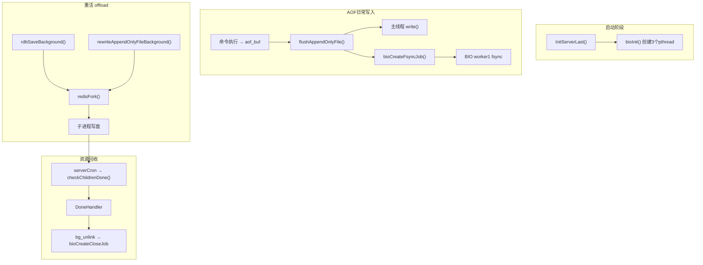
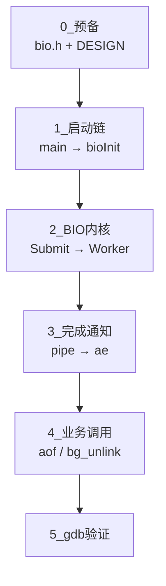
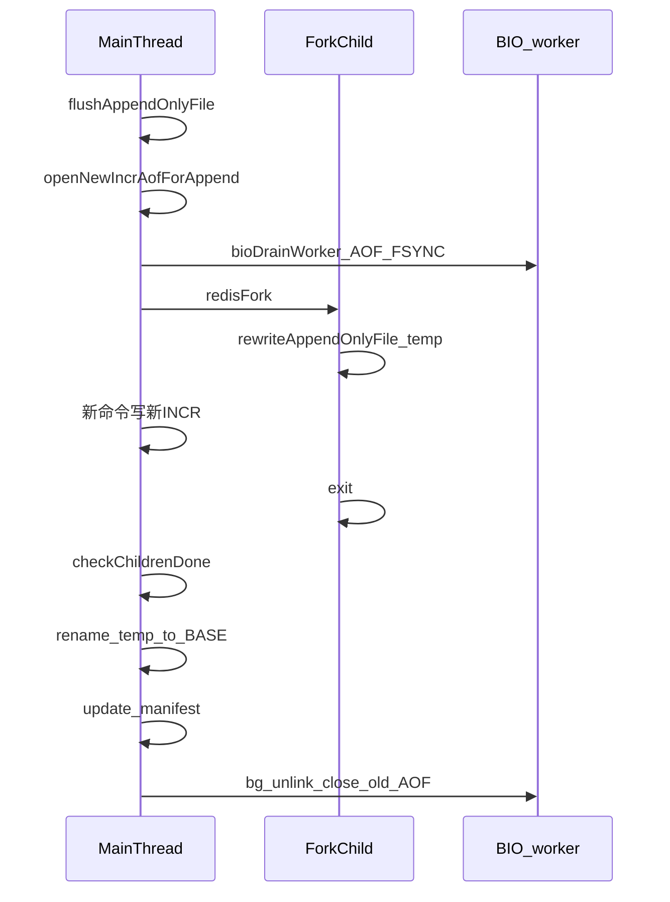

# Redis RDB/AOF 持久化：源码走读 + 动手验证计划

> 建议先阅读 [00-introduction.md](00-introduction.md)，了解 Redis 是什么、应用场景、pthread 解决的问题、学习动机与目标。

## 学习目标

读完本计划后，你应能独立回答三个问题：

1. **哪些用 pthread，哪些用 fork？** — BIO 常驻线程 vs RDB/AOF Rewrite 临时子进程
2. **谁创建、谁执行、谁回收？** — 主线程、BIO worker、fork 子进程的职责边界
3. **失败/取消时资源怎么清理？** — `waitpid`、rename、`bg_unlink`、BIO close 的触发链



---

## 阶段 0：预备知识（约 0.5 天）

**目的**：避免新人最常见混淆——「持久化后台」不是同一种机制。

| 机制 | 创建 API | 生命周期 | 核心文件 |
|------|----------|----------|----------|
| BIO pthread | `bioInit()` | 启动后常驻 | [src/bio.c](../src/bio.c) |
| fork 子进程 | `redisFork()` | 按需创建，干完 exit | [src/server.c](../src/server.c), [src/rdb.c](../src/rdb.c), [src/aof.c](../src/aof.c) |

**必读**：[src/bio.c](../src/bio.c) 第 1–36 行 DESIGN 注释 — Redis 官方对 BIO 线程模型的说明。

**对照 5W2H**：先填一张空白表（Why/What/When/Where/Who/How/Whom），后续每阶段补一行，最后合成速查表。模板见 [rdb-aof-5w2h-analysis.md](rdb-aof-5w2h-analysis.md)。

---

## 阶段 1：BIO 线程 — pthread 唯一入口（约 1–2 天）

> **详细导读（带注释 + 调用关系图）**：[bio-source-walkthrough.md](bio-source-walkthrough.md)  
> 本节为概要；完整五阶段走读、逐函数注释、时序图见该文档。

**Why**：`fsync()`、`close()` 大文件可能阻塞毫秒~秒级，不能放在主事件循环。

### 五阶段走读路线



### 走读顺序（概要表）

| 阶段 | 步骤 | 函数 | 文件:行号 | 要回答的问题 |
|------|------|------|-----------|--------------|
| 0 | 1 | `bio.h` + DESIGN | bio.c:1–36 | 几个 worker？几种 job？ |
| 1 | 2 | `main()` → `initServer()` | server.c:6909, 2592 | ae 事件循环何时创建？ |
| 1 | 3 | `InitServerLast()` → `bioInit()` | server.c:2881, bio.c:124 | BIO 为何放在最后创建？ |
| 2 | 4 | `bioSubmitJob()` | bio.c:178 | 生产者：lock→入队→signal？ |
| 2 | 5 | `bioProcessBackgroundJobs()` | bio.c:253 | 消费者：cond_wait→执行→回收？ |
| 2 | 6 | `bioCreateFsyncJob()` | bio.c:244 | AOF fsync 如何提交？ |
| 3 | 7 | `bioPipeReadJobCompList()` | bio.c:412 | pipe 如何桥接 ae 事件循环？ |
| 4 | 8 | `flushAppendOnlyFile()` → `aof_background_fsync()` | aof.c:1045, 905 | everysec 完整链路？ |
| 4 | 9 | `bioDrainWorker()` | bio.c:377, aof.c:2463 | Rewrite 前为何排空 fsync？ |
| 4 | 10 | `bg_unlink()` → `bioCreateCloseJob()` | replication.c:78 | 删文件为何还要 BIO close？ |

### 启动链关键顺序（必记）

```
initServer()           → 创建 server.el（ae）、记录 main_thread_id
    ↓
InitServerLast()
    → bioInit()        → ★ 3 个 BIO pthread + pipe 注册到 ae
    → initThreadedIO()
    ↓
aeMain()               → 主循环；pipe 可读时调用 bioPipeReadJobCompList
```

### 三个 worker 职责

- worker0 `bio_close_file`：后台 close（配合 `bg_unlink`）
- worker1 `bio_aof`：AOF fsync + close 旧 AOF fd
- worker2 `bio_lazy_free`：大对象释放（与持久化间接相关）

### 动手验证

```bash
# 编译带调试符号
make CFLAGS="-g -O0"

# 启动 Redis，观察线程
./src/redis-server --appendonly yes --appendfsync everysec
# 另一终端
ps -M <pid>          # macOS 看线程
# 或 Linux: top -H -p <pid>

# 压写入触发 fsync
./src/redis-benchmark -t set -n 50000 -q
redis-cli INFO persistence   # 看 aof_last_fsync 等字段
```

### gdb 断点建议

按此顺序下断点、跟一次完整 fsync 路径（详见 [bio-source-walkthrough.md 第七节](bio-source-walkthrough.md#七阶段-5动手验证)；**推荐 CLion 图形调试** 见该节 7.2）：

1. `bioInit` — 确认 3 个线程创建
2. `bioCreateFsyncJob` — 确认 everysec 路径提交任务
3. `bioSubmitJob` — 观察入队与 cond_signal
4. `bioProcessBackgroundJobs` — 观察 worker 取任务与 fsync
5. `bioPipeReadJobCompList` — 若有 completion job

**阶段产出**：手绘 BIO 生产者-消费者图 + 标注 mutex/cond/pipe 各自保护/通知什么；完成 [bio-source-walkthrough.md](bio-source-walkthrough.md) 第七节自检表。

---

## 阶段 2：RDB 后台保存 BGSAVE（约 2 天）

**Why**：遍历全库写 RDB 是重活；fork + COW 让子进程读快照、父进程继续服务，几乎不用锁。

### 走读顺序

| 步骤 | 函数 | 文件:行号 | 要回答的问题 |
|------|------|-----------|--------------|
| 1 | `bgsaveCommand` | rdb.c | 用户命令如何触发？ |
| 2 | `rdbSaveBackground()` | rdb.c:1636 | fork 前后父/子各做什么？ |
| 3 | `redisFork(CHILD_TYPE_RDB)` | server.c:6460 | 统一封装了哪些父子准备工作？ |
| 4 | 子进程 `rdbSave()` | rdb.c | 临时文件命名规则？ |
| 5 | `exitFromChild()` | server.c | 为什么子进程必须 `_exit` 不能 `return`？ |
| 6 | `checkChildrenDone()` | server.c:1161 | 非阻塞 `waitpid(WNOHANG)` 如何调度 handler？ |
| 7 | `backgroundSaveDoneHandler()` | rdb.c:3804 | 成功 rename / 失败删 temp 的分支？ |
| 8 | `killRDBChild()` | rdb.c | SIGUSR1 取消语义？ |

### 关键状态变量

- `server.child_pid` / `server.child_type`
- `server.lastbgsave_status` / `server.dirty_before_bgsave`

### 动手验证

```bash
redis-cli CONFIG SET save ""
redis-cli CONFIG SET dir /tmp/redis-rdb-test
redis-cli SET foo bar
redis-cli BGSAVE
redis-cli INFO persistence    # rdb_bgsave_in_progress, rdb_last_bgsave_status

# 观察子进程
ps aux | grep redis-rdb-bgsave
```

**集成测试参考**：[tests/integration/rdb.tcl](../tests/integration/rdb.tcl)

**阶段产出**：BGSAVE 时序图（触发 → fork → 子写 temp → exit → waitpid → handler → rename/清理）。

---

## 阶段 3：AOF 日常写入 + fsync 策略（约 1–2 天）

**Why**：AOF 记录每条写命令；write 在主线程，fsync 策略决定是否 offload 到 BIO。

### 走读顺序

| 步骤 | 函数 | 文件:行号 | 要回答的问题 |
|------|------|-----------|--------------|
| 1 | `feedAppendOnlyFile()` | aof.c | 命令如何进入 `aof_buf`？ |
| 2 | `flushAppendOnlyFile()` | aof.c:1045 | write / 推迟 write / 触发 fsync 三条分支？ |
| 3 | `aof_background_fsync()` | aof.c | everysec 如何调用 `bioCreateFsyncJob`？ |
| 4 | `aofFsyncInProgress()` | aof.c | 主线程如何知道 BIO fsync 还在跑？ |
| 5 | 推迟 write 逻辑 | aof.c:1084–1098 | 为何 fsync 进行中最多推迟 2 秒？ |

### 三种 appendfsync 对照实验

| 策略 | 执行 fsync 的线程 | 延迟 | 数据安全 |
|------|-------------------|------|----------|
| always | 主线程（同步） | 最高 | 最强 |
| everysec | BIO worker1 | 低 | 最多丢 1 秒 |
| no | 无（OS 刷盘） | 最低 | 最弱 |

```bash
redis-cli CONFIG SET appendfsync always   # 或 everysec / no
./src/redis-benchmark -t set -n 10000 -q
```

**阶段产出**：表格对比三种策略的 Who/When/How + gdb 调用栈差异。

---

## 阶段 4：AOF Rewrite BGREWRITEAOF（约 2–3 天）

**Why**：AOF 追加写会膨胀；Rewrite 用当前内存重新生成紧凑 BASE 文件。

### 走读顺序

| 步骤 | 函数 | 要回答的问题 |
|------|------|--------------|
| 1 | `rewriteAppendOnlyFileBackground()` (aof.c:2436) | fork 前为何 `flush` + `openNewIncrAofForAppend`？ |
| 2 | `bioDrainWorker(BIO_AOF_FSYNC)` (aof.c:2463) | 为何必须等旧 fsync 排空？ |
| 3 | 子进程 `rewriteAppendOnlyFile(temp)` | 子写什么文件？ |
| 4 | 父进程继续服务 | 新命令写哪个 INCR AOF？ |
| 5 | `backgroundRewriteDoneHandler()` (aof.c:2593) | rename BASE / INCR / 更新 manifest / 删 HISTORY 的顺序？ |
| 6 | `aofDelHistoryFiles()` → `bg_unlink()` | 为何 unlink 后还要 BIO close？ |



### 动手验证

```bash
redis-cli CONFIG SET appendonly yes
redis-cli BGREWRITEAOF
ls -la <appenddirname>/
redis-cli INFO persistence
```

**集成测试参考**：

- [tests/integration/aof.tcl](../tests/integration/aof.tcl)
- [tests/integration/aof-multi-part.tcl](../tests/integration/aof-multi-part.tcl)
- [tests/unit/aofrw.tcl](../tests/unit/aofrw.tcl)

**阶段产出**：AOF Rewrite 前后目录结构对比 + manifest 文件内容注释。

---

## 阶段 5：资源回收与异常路径（约 1–2 天）

### 回收总表

| 资源 | 创建 | 回收触发 | 回收函数 |
|------|------|----------|----------|
| fork 子进程 | `redisFork` | 子进程 exit | `checkChildrenDone` → `resetChildState` |
| temp RDB/AOF | 子进程写盘 | DoneHandler / kill | `rdbRemoveTempFile` / `aofRemoveTempFile` |
| 旧 AOF HISTORY | Rewrite 成功 | `aofDelHistoryFiles` | `bg_unlink` → `bioCreateCloseJob` |
| BIO fsync job | `bioCreateFsyncJob` | worker 执行完 | `zfree(job)` + atomic 状态更新 |
| child_info_pipe | `redisFork` | `resetChildState` | `closeChildInfoPipe` |

### 异常实验

1. **SIGUSR1 取消 BGSAVE** — 确认 `lastbgsave_status` 不因主动取消而标 C_ERR
2. **磁盘满 / 无写权限** — 观察 handler 失败分支与 temp 文件清理
3. **并发互斥** — BGSAVE 进行中再发 BGREWRITEAOF，验证 `hasActiveChildProcess()` 拒绝

---

## 阶段 6：综合验证与 5W2H 闭环（约 1 天）

### 自测清单

- [ ] BIO 是启动时创建还是每次 BGSAVE 创建？
- [ ] `appendfsync everysec` 时 fsync 在哪个线程？
- [ ] Rewrite 期间新 SET 命令写入哪个文件？
- [ ] `unlink` 后为何还要 `bioCreateCloseJob`？
- [ ] `waitpid` 为何用 `WNOHANG`？
- [ ] RDB/AOF/Module fork 为何互斥？

### 最终产出

1. 一张总架构图（fork + BIO + 主线程）
2. 一张 5W2H 速查表（见 [rdb-aof-5w2h-analysis.md](rdb-aof-5w2h-analysis.md)）
3. 三条调用链（各不超过 10 个函数名）：
   - `SET` → AOF buffer → write → BIO fsync
   - `BGSAVE` → fork → waitpid → DoneHandler
   - `BGREWRITEAOF` → fork → rename → bg_unlink → BIO close

### 可选进阶

- 跑 `./runtest --single integration/aof`
- 读 [tests/integration/aof-race.tcl](../tests/integration/aof-race.tcl)
- 用 `valgrind --tool=helgrind` 观察 BIO 路径

---

## 推荐源码阅读顺序

```
bio.c DESIGN注释
  → bioInit → bioProcessBackgroundJobs → bioCreateFsyncJob
server.c: InitServerLast → redisFork → checkChildrenDone
rdb.c: rdbSaveBackground → backgroundSaveDoneHandler
aof.c: flushAppendOnlyFile → rewriteAppendOnlyFileBackground
     → backgroundRewriteDoneHandler
replication.c: bg_unlink
tests/integration/aof.tcl
```

---

## 时间估算

| 阶段 | 内容 | 建议时间 |
|------|------|----------|
| 0 | 预备 + 5W2H 模板 | 0.5 天 |
| 1 | BIO pthread | 1–2 天 |
| 2 | RDB BGSAVE | 2 天 |
| 3 | AOF 日常 + fsync | 1–2 天 |
| 4 | AOF Rewrite | 2–3 天 |
| 5 | 回收与异常 | 1–2 天 |
| 6 | 综合验证 | 1 天 |
| **合计** | | **约 2–3 周（业余）** |
