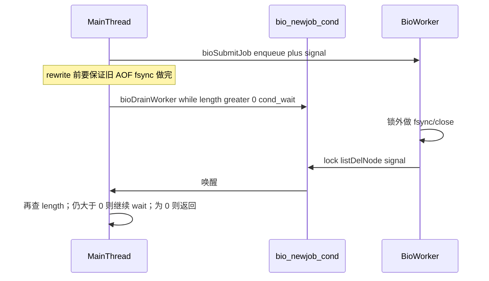
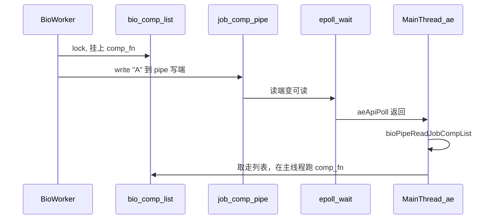

# Week3 Day7：BIO 任务队列与 pthread 生产消费对标

> **对应计划**：学习仓 `LearningPlan/week3.md` → Day7  
> **源码**：本仓库 Redis **7.4.9**（`src/bio.c` / `src/bio.h` / `src/networking.c`）  
> **本地 Demo**：`09_prod_cons_single`（mutex + while + cond + 队列）  
> **前置导读**：更完整的 BIO 启动链与业务调用见 [bio-source-walkthrough.md](bio-source-walkthrough.md)

本文只收 **Day7 要掌握的 pthread 细节**：submit / worker / drain、与本地 Demo 对照、以及 I/O threads 的 mutex 用法（了解即可）。  
动手验证见 **§7 实验：Day7 逐步验证**（D7-0～D7-G）。  
面试拷打与纠偏见 **§8**。

---

## 0. 今日要回答的 4 个问题

| # | 问题 | 结论摘要 |
|---|------|----------|
| 1 | `bioSubmitJob` 如何投递？ | 按 type 路由到固定 worker → lock → 入队 → `cond_signal` → unlock |
| 2 | worker 如何取任务？ | 外层 `while(1)`；队列空则 `cond_wait`；**慢 I/O 在锁外** |
| 3 | 为何等价于 Demo 的 `while`？ | wait 后 `continue` 回到循环顶部再查 `listLength`，不是「醒了就直接消费」 |
| 4 | `io_threads_mutex` 干嘛？ | **停/启 I/O 线程**的闸门，不是 bio 那种「任务队列 cond」 |

---

## 1. 数据结构：每 worker 一套「生产消费」

文件：[`src/bio.c`](../src/bio.c)

```text
bio_threads[i]          // pthread_t
bio_mutex[i]            // 保护该 worker 的队列
bio_newjob_cond[i]      // 「有新 job / 队列变化」条件变量
bio_jobs[i]             // list* FIFO 任务队列
bio_jobs_counter[type]  // 按 job 类型计数（查询 pending 用）
```

| Worker | 标题字符串 | 典型 job |
|--------|------------|----------|
| 0 | `bio_close_file` | `BIO_CLOSE_FILE` |
| 1 | `bio_aof` | `BIO_AOF_FSYNC`、`BIO_CLOSE_AOF`（同 worker 保序） |
| 2 | `bio_lazy_free` | `BIO_LAZY_FREE` |

路由表 `bio_job_to_worker[]`：**同 fd 的 AOF fsync/close 都进 worker1**，避免乱序 close。

额外：

- `job_comp_pipe` + `bio_comp_list`：worker 完成后写 pipe，**唤醒主线程 ae**（主线程在 `epoll_wait`，不能用 cond 叫醒）
- `bio_mutex_comp`：保护 completion 列表

---

## 2. 生产者：`bioSubmitJob`（主线程）

逻辑（见 `src/bio.c` 的 `bioSubmitJob`）：

```c
job->header.type = type;
unsigned long worker = bio_job_to_worker[type];
pthread_mutex_lock(&bio_mutex[worker]);
listAddNodeTail(bio_jobs[worker], job);
bio_jobs_counter[type]++;
pthread_cond_signal(&bio_newjob_cond[worker]);
pthread_mutex_unlock(&bio_mutex[worker]);
```

### 学习要点

1. **热路径尽量短**：主线程只做「入队 + signal」，不在锁里做 fsync/close。
2. **`signal` 即可**：每个 worker 单消费者，没有「多消费者抢一个元素」；不必 `broadcast`。
3. 对外 API 是 `bioCreateFsyncJob` / `bioCreateCloseJob` / `bioCreateLazyFreeJob` 等，内部都落到 `bioSubmitJob`。

### 与本地 `09` 对照

| 步骤 | 本地 `09` | Redis bio |
|------|-----------|-----------|
| 保护队列 | `mutex` | `bio_mutex[worker]` |
| 放入数据 | `buffer[in++]=...; count++` | `listAddNodeTail` |
| 通知消费者 | `pthread_cond_signal(&not_empty)` | `pthread_cond_signal(&bio_newjob_cond[w])` |
| 背压 / not_full | 有（环形缓冲满则 wait） | **无界链表**（依赖业务控制提交频率） |

---

## 3. 消费者：`bioProcessBackgroundJobs`

核心循环（逻辑摘要）：

```text
lock(mutex[worker])
while (1) {
    if (listLength(jobs) == 0) {
        pthread_cond_wait(cond, mutex)   // 原子：放锁并睡；醒后持锁
        continue                         // ★ 回到顶部再检查长度
    }
    ln = listFirst(jobs)
    job = ln->value
    unlock(mutex)                        // ★ 慢操作前放锁

    // fsync / close / lazyfree / completion …（锁外）

    lock(mutex)
    listDelNode(jobs, ln)
    counter--
    pthread_cond_signal(cond)            // 叫醒 bioDrainWorker
}
```

源码位置：约 `bio.c:266–376`。

### 3.1 为什么看起来是 `if`，却仍安全？

本地 Demo 标准写法：

```c
while (count == 0)
    pthread_cond_wait(&not_empty, &mutex);
```

Redis worker 写成：

```c
if (listLength(...) == 0) {
    pthread_cond_wait(...);
    continue;
}
```

**等价性**：外层是 `while(1)`，wait 后 `continue` 会再次判断 `listLength`。  
虚假唤醒或「醒了但队列又被别的逻辑掏空」时，不会直接处理空节点。

> Day7 验收：能说出「`continue` + 顶部再查」= Demo 的 `while`。

### 3.2 锁外做慢 I/O（工业级关键）

取到 `job` 后立刻 `unlock`，再 `redis_fsync` / `close` / `lazyfree`。  
否则主线程提交会被长时间挡住 → 延迟抖动。

处理完再 `lock`，`listDelNode` + `signal`（给 `bioDrainWorker`）。

### 3.3 `bioDrainWorker`：真正的 `while`

```392:399:src/bio.c
void bioDrainWorker(int job_type) {
    unsigned long worker = bio_job_to_worker[job_type];
    pthread_mutex_lock(&bio_mutex[worker]);
    while (listLength(bio_jobs[worker]) > 0) {
        pthread_cond_wait(&bio_newjob_cond[worker], &bio_mutex[worker]);
    }
    pthread_mutex_unlock(&bio_mutex[worker]);
}
```

主线程在 AOF rewrite 等场景要「等该 worker 队列排空」——这里用教科书式 **`while` + wait**。  
worker 每处理完一个 job 会 `signal` 同一把 cond，于是 drain 侧醒过来再查长度。

### 3.4 为何 worker 删节点后还要 signal

`bioProcessBackgroundJobs` 在 `listDelNode` 之后的：

```c
pthread_cond_signal(&bio_newjob_cond[worker]);
```

**不是用来叫醒自己（worker）继续干活的**，而是叫醒可能卡在 `bioDrainWorker` 里的**主线程**。

同一把 `bio_newjob_cond[worker]` 被**双向复用**：

| 谁 signal | 谁可能在 wait | 语义 |
|-----------|---------------|------|
| `bioSubmitJob`（主线程） | worker 在队列空时 `cond_wait` | 「有新任务了」 |
| worker 删完节点后（末尾这句） | 主线程在 `bioDrainWorker` 里 `cond_wait` | 「队列变短了 / 可能已空」 |

所以说「和 `bioDrainWorker` 有关」——**只有 drain 路径会主动等这把 cond 上的「队列变化」**；普通热路径里主线程提交完就走，不会 wait。



要点：

1. **Drain 用 `while (length > 0)`**：每次被 signal 后必须再查长度；可能只是「少了一个」还没空，或虚假唤醒。
2. **Worker 每删一个节点就 signal 一次**：保证主线程能逐步看到进度，直到 `listLength == 0` 退出。
3. **若不发这句 signal**：主线程会一直睡在 `cond_wait`，即使队列已经空了（典型「丢唤醒」死锁）。
4. **对空闲 worker 无害**：若没人在 wait，`signal` 是空操作；worker 自己靠循环顶部的「空则 wait」决定是否睡觉，不依赖这次 signal。

对比两处 signal：

- **Submit 侧**：生产者 → 消费者（经典 not_empty）。
- **Worker 末尾**：消费者 → 等待排空的主线程（「队列状态变了，请再检查」）。

两处共用一把 cond，靠 **wait 方各自的谓词**（worker：`length == 0`；drain：`length > 0`）区分语义。

典型场景：见下节——只在特定状态下、由**主线程**调用，且不会「永远堵死」。

### 3.5 和主线程的关系：会不会一直堵住 rewrite？

先纠正一个常见误解：

| 名字 | 实际跑在哪 |
|------|------------|
| `rewriteAppendOnlyFileBackground` | **主线程**（事件循环里同步执行到 `fork`） |
| `rewriteAppendOnlyFile`（真正写临时 AOF） | **`fork` 出来的子进程** |
| `bioProcessBackgroundJobs`（AOF worker） | BIO pthread（worker1） |
| `bioDrainWorker` | 也在**主线程**里阻塞等待 |

所以 `bioDrainWorker` 堵住的不是「另一个 rewrite 线程」，而是**主线程自己**：在 `fork` 之前卡一下，等 AOF worker 队列清空。

调用点（[`aof.c`](../src/aof.c)）：

```c
/* rewriteAppendOnlyFileBackground 内 */
flushAppendOnlyFile(1);
openNewIncrAofForAppend();
if (server.aof_state == AOF_WAIT_REWRITE) {
    bioDrainWorker(BIO_AOF_FSYNC);   /* 仅此状态才 drain */
    atomicSet(server.fsynced_reploff_pending, server.master_repl_offset);
    ...
}
/* 然后才 redisFork → 子进程去做 rewrite */
```

**会不会「任务一直存在 → 永远阻塞」？**

不会陷入「队列越等越长」的死循环，原因是：

1. **BIO AOF fsync 的生产者就是主线程**（`flushAppendOnlyFile` → `bioCreateFsyncJob`）。主线程一旦进入 `bioDrainWorker` 的 `cond_wait`，就不再跑命令、也不再提交新的 AOF fsync job。
2. 因此 drain 期间队列**只减不增**：worker 把已入队的有限个 job 做完 → `listLength == 0` → 主线程返回。
3. 等待时间 ≈「已排队的 fsync/close 做完」，通常很短；代价是这段时间内主线程不处理客户端请求（有意的同步屏障）。

**这样合理吗？**

合理，而且是刻意的：

- 只在 `AOF_WAIT_REWRITE`（全量同步等敏感路径）才 drain，不是每次 BGREWRITEAOF 都堵。
- 目的是避免 worker 仍在改旧 AOF 相关的 `fsynced_reploff_pending`，与切换后的新基准交错（注释里写的 race）。
- 真正的重活（扫库写临时 AOF）在 **drain 返回之后的子进程**里做，不在主线程里做。

另一处同类屏障：配置改成 `appendfsync always` 时，[`config.c`](../src/config.c) 的 `updateAppendFsync` 也会 `bioDrainWorker(BIO_AOF_FSYNC)`，同样是主线程短暂同步等待，防止 offset 竞态。

---

## 4. 完成通知：为何不用 cond 叫醒主线程？

先分清两件容易混在一起的事：

| 场景 | 主线程在干什么 | 用什么通知 |
|------|----------------|------------|
| `bioDrainWorker` | **主动离开**事件循环，自己 `pthread_cond_wait` | `bio_newjob_cond`（可以，因为主线程在等这把 cond） |
| BIO completion（`BIO_COMP_RQ_*`） | **留在** `aeMain` 里服务客户端，阻塞在 **`epoll_wait`** | `job_comp_pipe`（必须用 fd，不能用 cond） |

§3.4/3.5 说的是第一行；本节说的是第二行。

### 4.1 主线程平时睡在哪里？

正常运行时主线程大致是：

```text
aeMain()
  └─ aeProcessEvents()
       └─ aeApiPoll()          ← Linux 上往往是 epoll_wait
            等：客户端 socket、定时器、……以及 job_comp_pipe[0]
```

它**没有**在某个 `pthread_cond_wait` 上睡觉。  
`pthread_cond_signal` **只能叫醒正在对该 cond 做 wait 的线程**；对卡在 `epoll_wait` 里的主线程来说，signal **等于没发生**——内核不会因为 cond 而让 `epoll_wait` 返回。

### 4.2 为什么 completion 不能改用 cond？

假设 worker 做完 `BIO_COMP_RQ_*` 后只 `pthread_cond_signal`，主线程想收到通知，就必须：

1. 离开 `epoll_wait`，改去 `cond_wait` —— 那客户端连接、定时器都没人盯了；或  
2. 一边跑事件循环一边「偶尔查一下 flag」—— 轮询，延迟差、也不符合 Redis 的事件驱动模型。

这两种都不行。所以 Redis 用 **self-pipe 技巧**：把「线程间通知」变成「fd 可读事件」，让现有的 `epoll_wait` 能看见。

### 4.3 pipe 路径（实际怎么叫醒）



源码要点：

1. `bioInit`：创建 `job_comp_pipe`，把**读端**注册到 `server.el`：

```158:160:src/bio.c
    if (aeCreateFileEvent(server.el, job_comp_pipe[0], AE_READABLE,
                          bioPipeReadJobCompList, NULL) == AE_ERR) {
```

2. Worker 完成 `BIO_COMP_RQ_*`：先入 `bio_comp_list`，再 `write(job_comp_pipe[1], "A", 1)`。
3. 主线程 `bioPipeReadJobCompList`：读干 pipe → 拿走列表 → **在主线程**执行 `comp_fn`（和命令、客户端同一线程，安全碰共享状态）。

pipe 是非阻塞的；写满时 `write` 可能失败，属于 best-effort（列表里已有回调，下次再有字节可读仍会处理，或依赖后续再写）。

### 4.4 和本地 Demo / drain 的对照

| | 本地 `09` / `bioSubmitJob`↔worker | `bioDrainWorker` | completion（本节） |
|--|-----------------------------------|------------------|-------------------|
| 等待方阻塞点 | `pthread_cond_wait` | `pthread_cond_wait` | `epoll_wait`（ae） |
| 通知手段 | `cond_signal` | `cond_signal` | `write(pipe)` |
| 主线程能否继续干活 | worker 睡着；主线程可继续 | 主线程**主动停住**等排空 | 主线程**必须继续**接客户端 |

一句话：**cond 叫醒的是「在等这把锁/条件的人」；主线程平时在等的是「一堆 fd」，所以要用 pipe 把自己变成其中一个 fd。**

---

## 5. （了解）`networking.c` 中的 `io_threads_mutex`

文件：[`src/networking.c`](../src/networking.c)「Threaded I/O」一节（约 4237 行起）。

### 5.1 它不是 bio 队列

| | BIO | I/O threads |
|--|-----|-------------|
| 目的 | 后台慢 I/O（fsync/close/lazyfree） | 并行 read/write 客户端缓冲 |
| 同步 | **mutex + cond + 任务链表** | **mutex 作启停闸门** + atomic pending 计数 |
| 默认 | 始终 3 worker | `io-threads` 配置；常为 1（关闭） |

### 5.2 闸门语义（精读要点）

初始化时对每个 I/O 线程：

```c
pthread_mutex_init(&io_threads_mutex[i], NULL);
pthread_mutex_lock(&io_threads_mutex[i]);   // 线程创建后先被「锁住」
pthread_create(..., IOThreadMain, ...);
```

`IOThreadMain` 空闲时：

```c
if (getIOPendingCount(id) == 0) {
    pthread_mutex_lock(&io_threads_mutex[id]);
    pthread_mutex_unlock(&io_threads_mutex[id]);
    continue;
}
```

- `startThreadedIO`：`unlock` 各 mutex → 线程跑起来  
- `stopThreadedIO`：再次 `lock` → 线程卡在上面的 lock 上，相当于暂停  

工作量靠 `io_threads_pending` + `io_threads_op`（READ/WRITE/IDLE）分发；主线程 fan-out 后 spin 等 pending 归零（fan-in）。

### 5.3 Day7 只需记住

> I/O threads 的 mutex：**控制线程是否干活**；BIO 的 mutex+cond：**任务队列生产消费**。  
> 二者都是 pthread，模式不同，不要混用到自己的嵌入式队列设计里。

---

## 6. 工业级启示（填空答案）

1. **主线程轻量调度**：写内存 / 入队 / signal；重活进 BIO。  
2. **队列临界区极短**：lock → 改链表 → signal → unlock；慢系统调用在锁外。  
3. **按 worker 分队列**：降低锁竞争；同资源操作固定同 worker 保序。  
4. **条件变量配对要清楚**：  
   - submit：`signal` → worker 醒  
   - worker 删节点后：`signal` → drain 醒  
5. **事件循环进程**：跨「epoll 与 pthread」用 **pipe/fd**，不要妄想用 cond 唤醒主循环。

---

## 7. 实验：Day7 逐步验证

> **命令行必做**；**lldb 为加深**（macOS 用 lldb，不必硬装 gdb）。  
> **一律在仓库根目录**执行；数据目录固定 `/tmp/redis-day7`；端口固定 `6379`。  
> 本地 Demo `09_prod_cons_single` **不在本仓库**：对照用本文表格做纸面题即可。  
> 与 roadmap 重叠处：D7-A/B 复用 [rdb-aof-learning-roadmap.md](rdb-aof-learning-roadmap.md) 实验 1-A/1-B/1-C 思路，目录与验收点按 Day7 调整。

### 开场必读：如何优雅中断 / 收尾

每个小实验结束（或卡住想重来）时，**先优雅停服，再开下一轮**。优先顺序如下。

#### 推荐：用 redis-cli 正常关机（首选）

另开一个终端（不要去杀正在跑 server / lldb 的那个窗口）：

```bash
./src/redis-cli -h 127.0.0.1 -p 6379 SHUTDOWN NOSAVE
```

| 部分 | 含义 |
|------|------|
| `SHUTDOWN` | 让 Redis 自己收尾退出（关监听、停线程等） |
| `NOSAVE` | **不要**为关机再做一次落盘；实验收尾够用，更快 |

期望：终端里 server 退出；若在 lldb 里跑，进程结束后会回到 `(lldb)` 提示符，再输入 `quit` 离开调试器。

#### 前台起服时：在 server 那个终端按 Ctrl+C

若你是直接：

```bash
./src/redis-server --port 6379 --dir /tmp/redis-day7 --appendonly yes --appendfsync everysec
```

在该终端按 **Ctrl+C**，一般等价于发中断信号，Redis 会退出。  
**实验笔记里仍优先写 `SHUTDOWN NOSAVE`**（习惯与线上运维一致，且 lldb 场景更稳）。

#### 正在 lldb 里调试时

| 场景 | 做法 |
|------|------|
| server 已在跑、能连上 6379 | **另开终端**执行上面的 `SHUTDOWN NOSAVE` → 再在 lldb 里 `quit` |
| 卡在断点、命令行暂时连不上 | 在 lldb 里：`process interrupt`（打断）→ 需要的话再 `c` 或直接 `quit` |
| 只想退出调试器 | `(lldb) quit`（会结束被调试的 `redis-server`） |

```text
(lldb) process interrupt
(lldb) quit
```

注意：在 **lldb 窗口**里按 Ctrl+C，通常是打断**被调试进程**（类似 `process interrupt`），**不是**给 Redis 发 `SHUTDOWN`；能连上时仍建议用 cli 关机。

#### 不推荐（仅僵死时再用）

```bash
# 先确认 PID
PID=$(pgrep -n redis-server)
echo "PID=$PID"

# 仍应先试优雅信号（等价于请进程自行退出）
kill "$PID"

# 只有 kill / SHUTDOWN 都无效时才用（可能留下脏文件/端口短暂占用）
kill -9 "$PID"
```

Day7 **默认不要用 `kill -9`**。

#### 下一轮开始前：确认已停干净

```bash
# 应无输出（没有进程在听 6379）
lsof -iTCP:6379 -sTCP:LISTEN

# 若还有旧进程，再执行一次
./src/redis-cli -h 127.0.0.1 -p 6379 SHUTDOWN NOSAVE
```

**口诀**：能连上 → `SHUTDOWN NOSAVE`；连不上且在 lldb → `process interrupt` / `quit`；确认端口空闲 → 再开下一实验。

### 7.0 实战笔记：命令与参数一览（直接复制）

下文实验**不再省略参数**；先把会反复用到的完整命令抄进笔记。收尾命令见上方「优雅中断」。

#### redis-server（起服）

```bash
./src/redis-server \
  --port 6379 \
  --dir /tmp/redis-day7 \
  --appendonly yes \
  --appendfsync everysec
```

| 参数 | 值 | 含义 |
|------|-----|------|
| `--port` | `6379` | 监听端口 |
| `--dir` | `/tmp/redis-day7` | 工作/数据目录（AOF/RDB 写这里） |
| `--appendonly` | `yes` | 打开 AOF |
| `--appendfsync` | `everysec` | 每秒后台 fsync → 走 BIO worker1（Day7 主路径） |

#### lldb（macOS 调试：外壳命令 + 会话内命令）

**全称**：LLDB（LLVM Debugger）。macOS 上调试 Redis 用它，**不必装 gdb**。

##### 1）从 Shell 启动（进入 lldb 后再 `run`）

```bash
# 先保证已用 -O0 编过（见下方「编译」）
make OPTIMIZATION=-O0 MALLOC=libc -j

# 数据目录准备好、6379 空闲
rm -rf /tmp/redis-day7 && mkdir -p /tmp/redis-day7

# 启动 lldb，并把 redis-server 及其参数交给它（`--` 后面全是被调试程序的参数）
lldb -- ./src/redis-server \
  --port 6379 \
  --dir /tmp/redis-day7 \
  --appendonly yes \
  --appendfsync everysec
```

| Shell 写法 | 含义 |
|------------|------|
| `lldb -- ./src/redis-server …` | 启动调试器；`--` 之后是**目标程序 + 参数** |
| `--port 6379` 等 | 与直接起服相同，传给 `redis-server`，不是传给 lldb |

提示符变成 `(lldb)` 后，再敲下面的**会话内命令**。

##### 2）会话内命令一览（`(lldb)` 提示符下输入）

```text
(lldb) b bioCreateFsyncJob
(lldb) b bioSubmitJob
(lldb) b bioDrainWorker
(lldb) b bio.c:294
(lldb) b bio.c:301
(lldb) b bio.c:323
(lldb) b bio.c:375
(lldb) breakpoint list
(lldb) breakpoint disable 1
(lldb) breakpoint disable 2
(lldb) breakpoint enable 3
(lldb) run
(lldb) c
(lldb) n
(lldb) s
(lldb) bt
(lldb) p type
(lldb) p worker
(lldb) p fd
(lldb) p offset
(lldb) thread list
(lldb) thread select 2
(lldb) process interrupt
(lldb) quit
```

| 命令 | 完整示例 | 含义 |
|------|----------|------|
| `b` / `breakpoint set` | `b bioSubmitJob` | 在**函数名**上下断 |
| `b 文件:行` | `b bio.c:323` | 在**源码行**上下断（BIO fsync 必用这个） |
| `breakpoint list` | `breakpoint list` | 列出断点及编号 |
| `breakpoint disable N` | `breakpoint disable 1` | 禁用编号为 N 的断点（D7-B 关掉 Create/Submit 时用） |
| `breakpoint enable N` | `breakpoint enable 3` | 重新启用断点 N |
| `run` / `r` | `run` | **启动**（或重启）被调试的 `redis-server` |
| `c` / `continue` | `c` | 继续跑到下一个断点 |
| `n` / `next` | `n` | 单步：过函数调用（不进入） |
| `s` / `step` | `s` | 单步：进入函数 |
| `bt` / `thread backtrace` | `bt` | 打印当前线程调用栈 |
| `p` / `print` | `p type` | 打印变量（如 `type`、`worker`） |
| `thread list` | `thread list` | 列出所有线程（看是 #1 主线程还是 BIO） |
| `thread select N` | `thread select 2` | 切换到线程 N 再 `bt` / `p` |
| `process interrupt` | `process interrupt` | 打断正在运行的进程（停回 `(lldb)`） |
| `quit` / `exit` | `quit` | 退出 lldb（会结束调试中的 server） |

**行号说明**：上表 `bio.c:294/301/323/375` 以本仓库约值为准；若本地不同，用 D7-0 记下的行号替换。

##### 3）Day7 推荐：一次贴完的启动脚本（D7-B 加深）

进入 `(lldb)` 后可按顺序执行（行号按本地改）：

```text
(lldb) b bioCreateFsyncJob
(lldb) b bioSubmitJob
(lldb) b bio.c:323
(lldb) breakpoint list
(lldb) run
```

另开**终端 2**（普通 Shell，不是 lldb）：

```bash
./src/redis-cli -h 127.0.0.1 -p 6379 PING
./src/redis-benchmark -h 127.0.0.1 -p 6379 -t set -n 2000 -q
```

回到 lldb，命中 Submit 后：

```text
(lldb) bt
(lldb) p type
(lldb) n
(lldb) p worker
(lldb) breakpoint list
(lldb) breakpoint disable 1
(lldb) breakpoint disable 2
(lldb) c
```

若未停在 `bio.c:323`，终端 2 再跑一轮：

```bash
./src/redis-benchmark -h 127.0.0.1 -p 6379 -t set -n 2000 -q
```

命中后：

```text
(lldb) thread list
(lldb) bt
```

结束调试（二选一）：

```bash
# 终端 2
./src/redis-cli -h 127.0.0.1 -p 6379 SHUTDOWN NOSAVE
```

```text
(lldb) process interrupt
(lldb) quit
```

##### 4）与 gdb 对照（仅帮助记忆，Day7 用 lldb）

| 意图 | lldb | gdb（参考） |
|------|------|-------------|
| 启动 | `lldb -- ./src/redis-server …` | `gdb --args ./src/redis-server …` |
| 下断 | `b bioSubmitJob` / `b bio.c:323` | 同左 |
| 运行 | `run` | `run` |
| 继续 | `c` | `c` |
| 调用栈 | `bt` | `bt` |
| 打印 | `p type` | `p type` |
| 线程列表 | `thread list` | `info threads` |
| 打断 | `process interrupt` | `Ctrl+C` |

#### redis-cli（客户端）

```bash
./src/redis-cli -h 127.0.0.1 -p 6379 PING
./src/redis-cli -h 127.0.0.1 -p 6379 INFO persistence
./src/redis-cli -h 127.0.0.1 -p 6379 CONFIG SET appendfsync always
./src/redis-cli -h 127.0.0.1 -p 6379 CONFIG SET io-threads 2
./src/redis-cli -h 127.0.0.1 -p 6379 CONFIG GET appendfsync
./src/redis-cli -h 127.0.0.1 -p 6379 CONFIG GET io-threads
./src/redis-cli -h 127.0.0.1 -p 6379 SHUTDOWN NOSAVE
```

| 参数 / 子命令 | 值或写法 | 含义 |
|---------------|----------|------|
| `-h` | `127.0.0.1` | 连接主机 |
| `-p` | `6379` | 连接端口（与 server `--port` 一致） |
| `PING` | — | 探活，期望 `PONG` |
| `INFO persistence` | — | 看 AOF/RDB/BIO pending 等 |
| `CONFIG SET appendfsync always` | `always` | 改 fsync 策略；会触发 `bioDrainWorker`（D7-E） |
| `CONFIG SET io-threads 2` | `2` | 打开 2 个 I/O 线程（D7-G 可选观察） |
| `SHUTDOWN NOSAVE` | `NOSAVE` | 退出且**不**额外落盘，结束实验用 |

过滤 persistence 关键字段：

```bash
./src/redis-cli -h 127.0.0.1 -p 6379 INFO persistence | grep -E 'aof_last_fsync|aof_pending_bio|aof_enabled'
```

#### redis-benchmark（压测，制造 AOF 写入）

```bash
# D7-B 命令行：5000 次 SET
./src/redis-benchmark -h 127.0.0.1 -p 6379 -t set -n 5000 -q

# D7-B/C/D lldb 或短触发：2000 次 SET
./src/redis-benchmark -h 127.0.0.1 -p 6379 -t set -n 2000 -q

# D7-E：3000 次 SET
./src/redis-benchmark -h 127.0.0.1 -p 6379 -t set -n 3000 -q
```

| 参数 | 值 | 含义 |
|------|-----|------|
| `-h` | `127.0.0.1` | 目标主机 |
| `-p` | `6379` | 目标端口 |
| `-t` | `set` | 只跑 SET 测试 |
| `-n` | `5000` / `2000` / `3000` | 请求总数（实验里已写死） |
| `-q` | （开关） | quiet，只打吞吐摘要 |

#### 进程 / 线程观察

```bash
PID=$(pgrep -n redis-server)
echo "PID=$PID"
ps -M "$PID"
```

| 命令 | 含义 |
|------|------|
| `pgrep -n redis-server` | 取**最新**一个 redis-server 的 PID |
| `ps -M "$PID"` | macOS：列出该进程各线程（期望 ≥4 行：1 主 + 3 BIO） |

#### 编译

```bash
# 日常命令行实验
make -j

# lldb 加深（行号/变量可读）
make OPTIMIZATION=-O0 MALLOC=libc -j
```

| make 变量 | 值 | 含义 |
|-----------|-----|------|
| `OPTIMIZATION` | `-O0` | 关闭优化，便于按行下断 |
| `MALLOC` | `libc` | 用系统 malloc，减少调试干扰 |
| `-j` | — | 并行编译 |


### D7-0 准备（约 5 min）

| 步骤 | 操作（完整命令） | 预期 / 原因 |
|------|------------------|-------------|
| 1 | `make -j` | 生成 `./src/redis-server`、`./src/redis-cli`、`./src/redis-benchmark` |
| 1b | （做 lldb 时）`make OPTIMIZATION=-O0 MALLOC=libc -j` | `-O0` 保证行号/变量可跟 |
| 2 | `rm -rf /tmp/redis-day7 && mkdir -p /tmp/redis-day7` | 干净数据目录 |
| 3 | `lsof -iTCP:6379 -sTCP:LISTEN`（若无输出则端口空闲） | 避免旧实例占端口 |
| 4 | 打开 [`src/bio.c`](../src/bio.c)，记下下列**行号**（以本地为准） | 后面下断点用 |

建议记下的行（本仓库约）：

| 符号意图 | 约行号 | 用途 |
|----------|--------|------|
| `bioSubmitJob` 入口 | ~186 | 生产者 |
| worker 内 `pthread_cond_wait` | ~294 | 空队列睡觉 |
| 取 job 后的 `pthread_mutex_unlock` | ~301 | 锁外慢 I/O 的分界 |
| `BIO_AOF_FSYNC` 分支的 `redis_fsync(...)` | ~323 | **行断点**（macOS 上 `redis_fsync` 是宏，不能 `b redis_fsync`） |
| `listDelNode` 后的 `pthread_cond_signal` | ~375 | 叫醒 `bioDrainWorker` |
| `bioDrainWorker` | ~392 | drain 屏障 |

**lldb 易错点（必读）：**

| 易错做法 | 为什么不行 |
|----------|------------|
| 对 `bioProcessBackgroundJobs` **函数入口**下断 | 线程在 `bioInit` 时已进入该函数并卡在 `cond_wait`；之后在 `while(1)` **内部**循环，不会再次「进入」函数 |
| `b redis_fsync` | macOS 上多为宏，符号断点无效 → 必须对 `bio.c` **行号**下断 |

### D7-A 确认 BIO 三线程（命令行，必做）

**对应正文**：§1。

| 步骤 | 操作（完整命令） | 预期 |
|------|------------------|------|
| 1 | 终端 A：`./src/redis-server --port 6379 --dir /tmp/redis-day7 --appendonly yes --appendfsync everysec` | 日志出现 `Ready to accept connections` |
| 2 | 终端 B：`PID=$(pgrep -n redis-server); echo "PID=$PID"; ps -M "$PID"` | 同 PID 下至少 **4** 行（1 主 + 3 BIO） |
| 3 | `./src/redis-cli -h 127.0.0.1 -p 6379 PING` | `PONG` |

**通过标准**：能确认 BIO 三 worker 常驻（macOS 上线程名可能为空，以行数/采样为准）。server **先保持运行**，供 D7-B 使用。

### D7-B 生产者：投递与路由（命令行必做 + lldb 加深）

**对应正文**：§2。

#### 命令行

| 步骤 | 操作（完整命令） | 预期 |
|------|------------------|------|
| 1 | 保持 D7-A 已启动的 server（`--appendfsync everysec`） | — |
| 2 | `./src/redis-benchmark -h 127.0.0.1 -p 6379 -t set -n 5000 -q` | 有吞吐数字（如 `SET: ... requests per second`） |
| 3 | `./src/redis-cli -h 127.0.0.1 -p 6379 INFO persistence \| grep -E 'aof_last_fsync\|aof_pending_bio\|aof_enabled'` | `aof_enabled:1`；`aof_last_fsync` 有时间戳；可短暂看到 `aof_pending_bio_fsync` |
| 4 | 若继续做 lldb：`./src/redis-cli -h 127.0.0.1 -p 6379 SHUTDOWN NOSAVE` 后按加深步骤重启；否则保留 server 给后续实验 | 进程退出 / 或继续运行 |

**通过标准**：压测后 AOF fsync 时间前进，说明 everysec 路径在干活。

#### lldb 加深（精简自 roadmap 1-C）

目的：证明 **主线程投递**（`type=1` → `worker=1`），**BIO 线程执行** fsync。

| 步骤 | 操作（完整命令） | 原因 |
|------|------------------|------|
| 1 | `lldb -- ./src/redis-server --port 6379 --dir /tmp/redis-day7 --appendonly yes --appendfsync everysec` | everysec 才走 BIO fsync |
| 2 | `(lldb) b bioCreateFsyncJob` | 抓主线程创建 fsync job |
| 3 | `(lldb) b bioSubmitJob` | 抓入队；可 `p type` / `p worker` |
| 4 | `(lldb) b bio.c:323`（若行号不同，改成你在 D7-0 记下的 `redis_fsync` 行） | 消费者**行断点**，预先挂上 |
| 5 | `(lldb) run` | 启动被调试的 server |
| 6 | 另开终端：`./src/redis-cli -h 127.0.0.1 -p 6379 PING` | 确认可服务，期望 `PONG` |
| 7 | 另开终端跑压测（完整命令见下代码块） | 约 ≥1s 后 everysec 提交 fsync |
| 8 | 停在 Create/Submit（应是 **thread #1**）：`(lldb) p type` → **1**；单步到 `worker = bio_job_to_worker[type]` 后 `(lldb) p worker` → **1**；`(lldb) bt` 应含 `aof_background_fsync` | 路由到 `bio_aof` |
| 9 | `(lldb) breakpoint list` 记下编号；`(lldb) breakpoint disable <Create编号>`；`(lldb) breakpoint disable <Submit编号>`；保留 `bio.c:323`；`(lldb) c` | 否则会一直停在主线程 |
| 10 | 若未命中行断点：再跑一遍下方同一条 benchmark；停下后 `(lldb) thread list`；`(lldb) bt` | 当前应是 **非 #1**，且已在 `bioProcessBackgroundJobs` 循环内 |

步骤 7 / 10 完整命令（一行，不要拆开；`-h` 不是单独的 `-`）：

```bash
./src/redis-benchmark -h 127.0.0.1 -p 6379 -t set -n 2000 -q
```

| 片段 | 含义 |
|------|------|
| `-h 127.0.0.1` | 主机 |
| `-p 6379` | 端口 |
| `-t set` | 只测 SET |
| `-n 2000` | 共 2000 次请求（不可省略） |
| `-q` | quiet，只打吞吐摘要 |

**通过标准**：能口述「主线程只入队 + signal；fsync 在 worker1」。

### D7-C `if+continue` ≡ Demo `while`（纸面必做 + lldb 加深）

**对应正文**：§3.1。

#### 纸面（必做）

对照 §3.1，用自己的话写三句（建议写在笔记里）：

1. wait 返回后为何必须 `continue`，而不能直接当作「队列非空」？  
2. 若发生虚假唤醒，少了顶部的 `listLength` 检查会怎样？  
3. 外层 `while(1)` + `if` + `continue` 如何等价于 Demo 的 `while (count == 0) cond_wait`？

#### lldb（加深）

先按 §7.0 用 lldb 带齐参数起服（`--port 6379 --dir /tmp/redis-day7 --appendonly yes --appendfsync everysec`），再：

| 步骤 | 操作（完整命令） | 预期 |
|------|------------------|------|
| 1 | `(lldb) b bio.c:294`（换成你的 `pthread_cond_wait` 行号） | 挂上空队列 wait |
| 2 | `(lldb) run`；空闲时 `(lldb) thread list`，切换到停在 wait 的线程 | 某 BIO worker 在睡觉 |
| 3 | 另开终端：`./src/redis-benchmark -h 127.0.0.1 -p 6379 -t set -n 2000 -q` | 触发 everysec 投递 |
| 4 | 命中后单步：离开 wait → `continue` → 回到 `listLength` 判断 → 再取节点 | 醒了先查长度，不是直接消费 |
| 5 | 结束：`./src/redis-cli -h 127.0.0.1 -p 6379 SHUTDOWN NOSAVE` 或 `(lldb) process interrupt` | 干净退出 |

**通过标准**：能说出「`continue` + 顶部再查 = Demo 的 `while`」。

### D7-D 锁外做慢 I/O（lldb 强烈建议）

**对应正文**：§3.2。

起服（完整参数）：

```bash
lldb -- ./src/redis-server \
  --port 6379 \
  --dir /tmp/redis-day7 \
  --appendonly yes \
  --appendfsync everysec
```

| 步骤 | 操作（完整命令） | 预期 |
|------|------------------|------|
| 1 | `(lldb) b bio.c:301`（取 job 后的 `pthread_mutex_unlock`） | 断点 A |
| 2 | `(lldb) b bio.c:323`（`BIO_AOF_FSYNC` 的 `redis_fsync` 行；行号以本地为准） | 断点 B |
| 3 | `(lldb) run`；另开终端：`./src/redis-benchmark -h 127.0.0.1 -p 6379 -t set -n 2000 -q` | 先命中 A：此时**尚未**执行 fsync |
| 4 | `(lldb) c` 后命中 B | 已过 unlock；慢 I/O 在锁外 |
| 5 | 笔记一句；`./src/redis-cli -h 127.0.0.1 -p 6379 SHUTDOWN NOSAVE` | 「若 fsync 在锁内，主线程 `bioSubmitJob` 会被长时间堵住」 |

**通过标准**：能指着源码说出 unlock → fsync → 再 lock → `listDelNode` 的顺序。

### D7-E `bioDrainWorker` 与末尾 signal（命令行 + lldb 加深）

**对应正文**：§3.3–§3.5。

触发链：`CONFIG SET appendfsync always` → [`config.c`](../src/config.c) `updateAppendFsync` → `bioDrainWorker(BIO_AOF_FSYNC)`（比 `AOF_WAIT_REWRITE` 好复现）。

| 步骤 | 操作（完整命令） | 预期 / 原因 |
|------|------------------|-------------|
| 1 | `./src/redis-server --port 6379 --dir /tmp/redis-day7 --appendonly yes --appendfsync everysec` | 生产者仍是 everysec → BIO fsync |
| 2 | `./src/redis-benchmark -h 127.0.0.1 -p 6379 -t set -n 3000 -q` | 可能留下 `aof_pending_bio_fsync` |
| 3 | `./src/redis-cli -h 127.0.0.1 -p 6379 CONFIG SET appendfsync always` | `OK`；可能有**短暂**停顿（主线程在 drain） |
| 4 | `./src/redis-cli -h 127.0.0.1 -p 6379 CONFIG GET appendfsync` | 返回 `always`，确认已切换 |
| 5 | （概念确认）堵住的是**主线程自己**，不是「rewrite 线程」；drain 期间主线程不提交新 AOF fsync → 队列只减不增 | 对照 §3.5 |
| 6 | `./src/redis-cli -h 127.0.0.1 -p 6379 SHUTDOWN NOSAVE` | 干净退出 |

#### lldb（加深）

```bash
lldb -- ./src/redis-server \
  --port 6379 \
  --dir /tmp/redis-day7 \
  --appendonly yes \
  --appendfsync everysec
```

| 步骤 | 操作（完整命令） | 预期 |
|------|------------------|------|
| 1 | `(lldb) b bioDrainWorker` | 主线程进 drain |
| 2 | `(lldb) b bio.c:375`（`listDelNode` 后的 `pthread_cond_signal`；行号以本地为准） | worker 末尾 signal |
| 3 | `(lldb) run` | — |
| 4 | `./src/redis-benchmark -h 127.0.0.1 -p 6379 -t set -n 3000 -q` | 制造 pending |
| 5 | `./src/redis-cli -h 127.0.0.1 -p 6379 CONFIG SET appendfsync always` | 命中 `bioDrainWorker`（thread #1） |
| 6 | 观察 worker signal → drain 侧 `while (listLength > 0)` 再查长度 → 为 0 则返回 | 末尾 signal 是给 drain 的 |
| 7 | `./src/redis-cli -h 127.0.0.1 -p 6379 SHUTDOWN NOSAVE` | 结束 |

**通过标准**：能解释「为何 worker 删节点后还要 signal」以及「不会永远堵死」。

### D7-F completion / pipe（纸面 + 源码走读，必做）

**对应正文**：§4。  
日常 `--appendfsync everysec` **不会**走 `BIO_COMP_RQ_*`；本实验以认知为主，不强制 lldb 命中。

| 步骤 | 操作 | 预期 |
|------|------|------|
| 1 | 读 `bioInit`：`aeCreateFileEvent(server.el, job_comp_pipe[0], AE_READABLE, bioPipeReadJobCompList, …)` | pipe 读端挂进事件循环 |
| 2 | 读 worker 中 COMP_RQ 分支：`write(job_comp_pipe[1], "A", 1)` | 把通知变成 fd 可读 |
| 3 | 读 `bioPipeReadJobCompList` | 主线程批量执行 `comp_fn` |
| 4 | 书面回答 | 见下 |

**必答题（写进笔记）：**

1. 主线程平时睡在 `epoll_wait`（ae）时，为何 `pthread_cond_signal` 叫不醒它？  
2. `write(pipe)` 如何让 `epoll_wait` 返回？  
3. `bioDrainWorker` 可以用 cond，completion 却要用 pipe——差别在主线程**当时卡在哪**？

**通过标准**：能用一句话说清「cond 叫醒 cond_wait；pipe/fd 叫醒 epoll_wait」。

### D7-G `io_threads_mutex` 对照（纸面必做）

**对应正文**：§5。

> **注意（Redis 7.4）**：`io-threads` / `io-threads-do-reads` 带 `IMMUTABLE_CONFIG`，**不能** `CONFIG SET` 热改；要观察多 I/O 线程，必须在**启动参数**里写死。

| 步骤 | 操作（完整命令） | 预期 |
|------|------------------|------|
| 1 | 打开 [`src/networking.c`](../src/networking.c)，定位 `IOThreadMain` 空闲时的 `pthread_mutex_lock` / `unlock` | 闸门语义 |
| 2 | 填下表 | — |
| 3 | （默认单线程对照）`./src/redis-server --port 6379 --dir /tmp/redis-day7 --appendonly yes --appendfsync everysec` | Ready；`io-threads` 默认为 1，**不**额外建 I/O pthread |
| 4 | `./src/redis-cli -h 127.0.0.1 -p 6379 CONFIG GET io-threads` | 返回 `1` |
| 5 | `PID=$(pgrep -n redis-server); ps -M "$PID"`；然后 `SHUTDOWN NOSAVE` | 主要是主线程 + 3 BIO |
| 6 | （可选观察）带 I/O 线程起服：`./src/redis-server --port 6379 --dir /tmp/redis-day7 --appendonly yes --appendfsync everysec --io-threads 4` | Ready；会创建 `io_threads_num-1` 条 I/O pthread（此处 3 条） |
| 7 | `./src/redis-cli -h 127.0.0.1 -p 6379 CONFIG GET io-threads`；`PID=$(pgrep -n redis-server); ps -M "$PID"` | `io-threads` 为 `4`；线程行数多于步骤 5 |
| 8 | `./src/redis-cli -h 127.0.0.1 -p 6379 SHUTDOWN NOSAVE` | 退出 |

| | BIO | I/O threads |
|--|-----|-------------|
| 目的 | （自填） | （自填） |
| 同步原语 | mutex + **cond** + 任务链表 | mutex 作**启停闸门** + pending |
| Day7 一句话 | | |

参考答案见 §5.1 / §5.3。

**通过标准**：能区分「任务队列生产消费」vs「停/启线程闸门」。

### 实验 ↔ 验收对照

| 实验 | 检查项 |
|------|--------|
| D7-A | 能确认 3 个 BIO worker 常驻 |
| D7-B | 能指出 `bioSubmitJob`：入队 + `signal`；`type`/`worker` 路由 |
| D7-C | 能在 `bio.c` 指出 wait 条件；能说 while 等价 |
| D7-D | 能说出「锁外 fsync」的原因 |
| D7-E | 能解释 drain 与 worker 末尾 `signal`；主线程关系 |
| D7-F | 能解释 completion 为何用 pipe |
| D7-G | 能一句话区分 `bio_newjob_cond` 与 `io_threads_mutex` |

---

## 8. 面试拷打实录与纠偏

> 读完正文 + §7 后的口头拷打记录：原题、作答要点、判分、纠偏与标准答法。  
> 复盘时优先看「判分表」和「易错点」；能独立答出 §8.4 填空即过关。

### 8.1 第 1 轮原题（Q1–Q5）

**Q1.** `bioSubmitJob` 做完入队后为什么要 `pthread_cond_signal`？漏掉最坏怎样？谁受影响？

**Q2.** Worker 写 `if (listLength==0) { wait; continue; }`，为何等价于 Demo 的 `while (count==0) wait`？若有 `if` 无 `continue` 会怎样？

**Q3.** 为何 `redis_fsync` 必须在 `unlock(bio_mutex)` 之后？放锁内对主线程意味着什么？

**Q4.** Worker 在 `listDelNode` 后再 `signal` 同一把 `bio_newjob_cond`——叫醒谁？与 Submit 侧 signal 有何不同？为何能共用一把 cond？

**Q5.** 主线程在 `epoll_wait` 时，为何 completion 不能用 `cond_signal`，要用 `write(job_comp_pipe)`？为何 `bioDrainWorker` 反而可以用 cond？

### 8.2 作答要点与判分

| 题 | 判分 | 作答要点（当时） | 评语 |
|----|------|------------------|------|
| Q1 | 基本对 | Submit 后要通知 BIO worker，唤醒以免一直阻塞 | 方向对。可补：无人 wait 时 signal 为空操作、无害 |
| Q2 | 半对 | 外层 `while(1)` 等价等待；无 `continue` 时扯到多消费者 + broadcast | **理由偏了**。BIO 每 worker **单消费者**，用 `signal` 不是 `broadcast`。`continue` 核心是 **醒来重检谓词** |
| Q3 | 对 | 锁外 fsync 让主线程仍能入队；fsync 不碰队列共享结构 | 正确 |
| Q4 | 偏了 | 以为删节点 signal 是通知「可再取活 / 让主线程继续入队」 | **反了**。普通热路径主线程入队不依赖这句；真听众是 **`bioDrainWorker`** |
| Q5 | 未答 | — | 见 §8.5 重讲 |

### 8.3 Q2 纠偏：假唤醒与 `continue`

**不是**「队列空才会假唤醒」。  
而是：POSIX 允许 `cond_wait` **在无人 signal 时也返回**；假唤醒发生时，队列**往往仍空**——所以必须再查。

```text
worker：length==0 → wait
（无人 submit / signal）
wait 突然返回          ← 虚假唤醒（或至少：醒来后谓词仍假）
再查 length 仍为 0 → continue → 再 wait
```

- 假唤醒 **没有业务上的固定触发时刻**；代码必须当它「随时可能」。  
- 不要问「这次是不是假的」；约定是：**醒来一律重检条件**。  
- Redis BIO worker 是单消费者，「被别人抢走唯一元素」不是主因；教科书理由仍是 **while/continue 重检**。  
- drain 侧即使全是真 signal，也可能「醒了但 length 仍 >0」（只删了一个）——同一套 while 兜住。

**无 `continue` 的后果：** wait 返回后当「有活」直接 `listFirst` → 空链表翻车。

等价关系：

```text
while (1) {
  if (empty) { wait; continue; }
  消费…
}
≡
while (empty) wait;
消费…
```

### 8.4 Q4 纠偏：两处 signal + drain 的 while

同一把 `bio_newjob_cond`：

| 谁 signal | 叫醒谁 | 语义 |
|-----------|--------|------|
| `bioSubmitJob`（主线程） | worker | 「有新任务了」 |
| worker `listDelNode` 后 | **主线程 `bioDrainWorker`** | 「队列变短了 / 可能已空」 |

靠 **wait 方谓词**区分：worker 等 `length==0` 结束；drain 等 `length>0` 结束。

#### drain 里 `while (length > 0) wait` 的目的

**保证返回时队列真的空。** 每次被叫醒再查长度；不够空就继续睡。

```text
队列 3 个 → worker 做完 1 个并 signal → drain 醒 → length=2 → 再 wait
         → … → length=0 → 退出 while，返回
```

若改成 `if (length>0) wait` 只等一次：可能仍有 pending 就返回 → **假排空**，后续以为 BIO 已干净，竞态回来（屏障被穿透）。

#### 同步屏障是干什么的

主线程在做 **切换类操作** 前，先让对应 BIO worker 队列排空，防止「旧后台任务」和「新前台状态」并发打架。

**切换类操作** = 即将改变「谁负责 fsync / 按哪份 AOF·offset 记账」的约定，例如：

| 场景 | 切换了什么 |
|------|------------|
| `CONFIG SET appendfsync always` | everysec（BIO fsync）→ always（主线程路径） |
| `AOF_WAIT_REWRITE` 下 rewrite 前 | 换新 AOF / 新的 `fsynced_reploff_pending` 基准再 fork |

平时 everysec 的 `bioSubmitJob` **不是**切换：入队就走，不等 drain。

#### 追问 A 的标准答

若删掉 worker **末尾** signal、只留 Submit 的 signal：

- 普通 everysec fsync：**通常仍能工作**（Submit 仍能叫醒空闲 worker）  
- `bioDrainWorker`：**可能死等**（队列已空也无人 signal drain）

### 8.5 Q5 重讲：cond vs pipe

总纲：**叫醒方式必须匹配被叫醒的人当时睡在哪。**

| | `bioDrainWorker` | completion（`BIO_COMP_RQ_*` + pipe） |
|--|------------------|--------------------------------------|
| 主线程当时 | **主动**离开 ae，自己 `cond_wait` | **留在** `aeMain`，睡在 **`epoll_wait`** |
| 通知手段 | `pthread_cond_signal` | `write(job_comp_pipe[1],"A")` |
| 为何 | 主线程已在等这把 cond | epoll 只认 fd 就绪；cond 叫不动 epoll |

completion 路径：

```text
worker → 入 bio_comp_list → write(pipe)
      → pipe 读端可读 → epoll 返回
      → bioPipeReadJobCompList → 主线程跑 comp_fn
```

硬用 cond 只有烂路：主线程去 `cond_wait`（事件循环停摆），或轮询 flag（丑且慢）。

**面试填空（过关句）：**

> drain 能用 cond，是因为主线程 **主动在 `cond_wait`**；  
> completion 要用 pipe，是因为主线程 **常态在 `epoll_wait`，cond 叫不醒它**。

### 8.6 第 1.5 轮追问题（自测）

**A.** 删掉 worker 末尾 `signal`，只留 Submit 的：everysec 还能否工作？drain 会怎样？  
**B.** drain 为何必须 `while (length>0)` 而不能只 `if` 一次？  
**C.** drain 期间为何队列一般不会越等越长？（生产者是谁？）  
**D.** 填空：drain 用 cond 因为主线程 ____；completion 用 pipe 因为主线程 ____。

参考：A 见 §8.4；B 见 §8.4；C 生产者是主线程，睡着后不再 `bioCreateFsyncJob`；D 见 §8.5。

### 8.7 与正文锚点

| 拷打点 | 正文 |
|--------|------|
| Q1 Submit + signal | §2 |
| Q2 while 等价 / 假唤醒 | §3.1、§8.3 |
| Q3 锁外 fsync | §3.2 |
| Q4 / drain / 屏障 / 切换 | §3.3–§3.5、§8.4 |
| Q5 pipe vs cond | §4、§8.5 |
| I/O threads 闸门（第 2 轮可继续） | §5、D7-G |

---

## 9. CLion / gdb 建议断点（Day7）

| 断点 | 看什么 |
|------|--------|
| `bioSubmitJob` | `worker`、`listLength`、调用栈是否来自 `aof_background_fsync` |
| `bioProcessBackgroundJobs` 的 `cond_wait` | 空队列时阻塞；signal 后 `continue` 再查长度 |
| `listDelNode` 前的 `lock` | 确认 fsync 已在锁外跑完 |
| `bioDrainWorker` | `while (listLength > 0)`（入口断点≠已进入 wait，见 D7-E） |
| （可选）`startThreadedIO` / `IOThreadMain` | 对比闸门 mutex |

配置说明见学习仓 `03-redis源码与环境.md`。逐步操作以 **§7 实验** 为准。

---

## 10. 验收清单（对照 LearningPlan Day7）

按 **§7「实验 ↔ 验收对照」** 勾选；面试口头以 **§8** 为准：

- [ ] D7-A：能确认 BIO 三线程  
- [ ] D7-B：能指出 Submit 的 wait/signal 角色与路由  
- [ ] D7-C：能对照 `09` 说出 while 等价；能说明假唤醒与 `continue`  
- [ ] D7-D：能说出「锁外 fsync」的原因  
- [ ] D7-E：能解释 drain 与末尾 signal、while 重检、同步屏障与切换类操作  
- [ ] D7-F：能解释 completion 为何用 pipe（§8.5 填空）  
- [ ] D7-G：能一句话区分 `bio_newjob_cond` 与 `io_threads_mutex`  
- [ ] §8.6 A–D 能独立口头答出  

---

## 11. 相关文档

| 文档 | 内容 |
|------|------|
| [bio-source-walkthrough.md](bio-source-walkthrough.md) | 初始化链、AOF 时序、导读注释总览 |
| [rdb-aof-learning-roadmap.md](rdb-aof-learning-roadmap.md) | 分阶段走读；实验 1-A/1-B/1-C 可与 D7-A/B 对照 |
| [pthread-vs-embedded.md](pthread-vs-embedded.md) | pthread ↔ 嵌入式对照 |
| 学习仓 `assets/redis-notes/week03-bio-queue.md` | 课堂填空版摘要（指向本文） |
